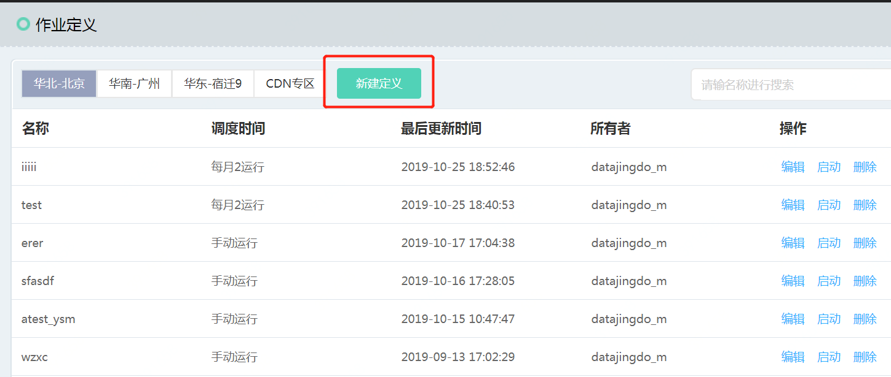
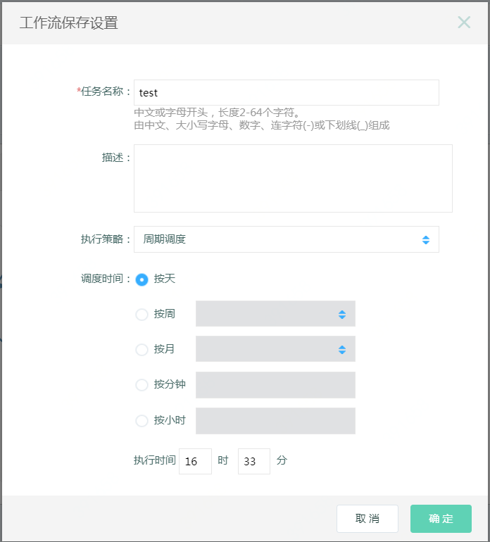
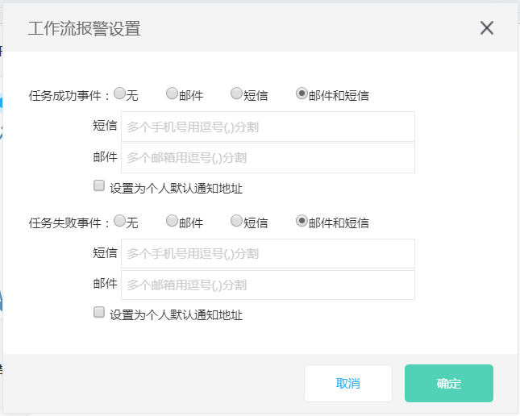

#Create Workflow

Preconditions: Make sure that you have created the data table in the ‘Data Warehouse’ of the ‘Data Compute’ and have uploaded the data. Operation results of the workflow will be output to the data warehouse. Therefore, result table should be created.

**Operation Steps:**

#### 1. Select the region of computing node;

#### 2. Click **Create Definition** to create the workflow:

#### 3. Set Spark Task:

Drag the module of SPARK to the central area, add the name and description of spark task, select the type, and finish the script. The script type supports sql, python and scala. After saving it, use mouse to connect the workflow.

Right-click the SPARK task. You can start and edit the task, view its logs, delete and retry it.

#### 4. Set the Task of Data Integration

Drag the Data Integration into the center of the screen, then edit menu will pop up. Data synchronization can be performed.

Click the ‘OK’ button to save it:

Right-click the mask of Data Integration. You can start and edit the task, view its logs, delete and retry it.

#### 5. elect **Set the** Tab page. Save the workflow and set execution policy as required:

#### 6. Set the alarm information:

