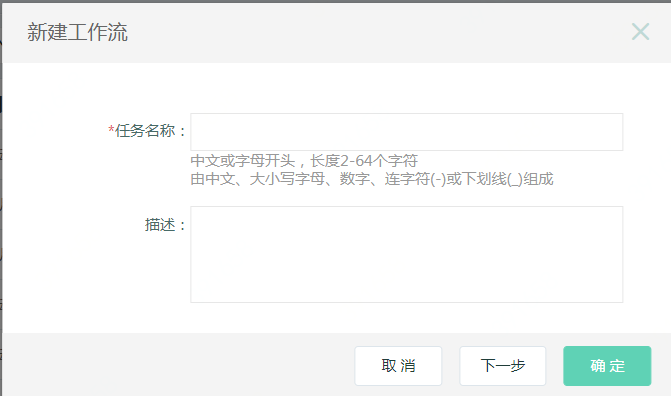
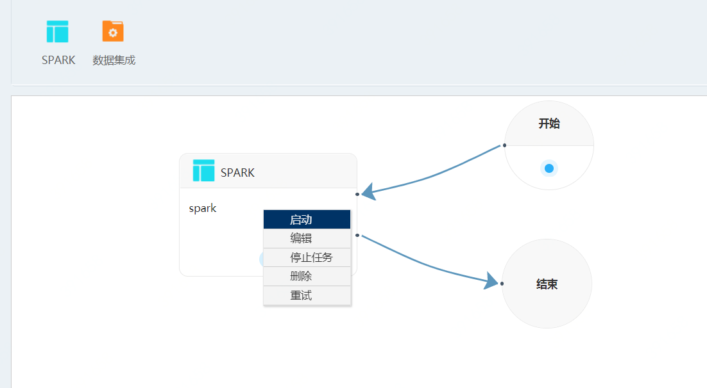
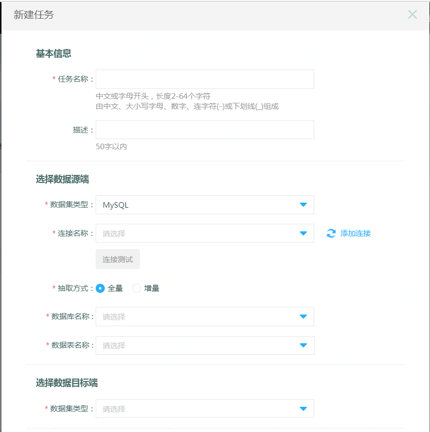
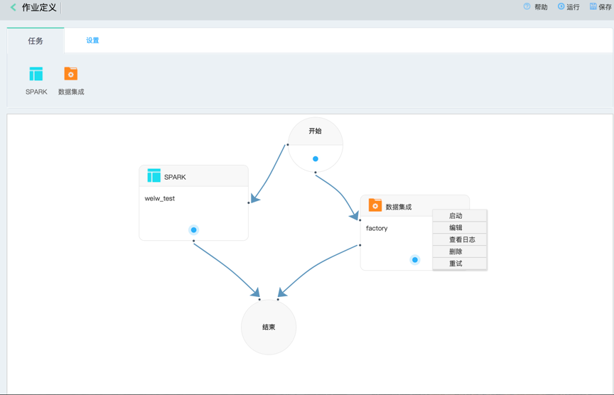

# Workflow

Precondition: You need make sure that you have created the datasheet in the ‘Data Compute’ - ‘Data Warehouse’ and uploaded data. The result list shall be created because the workflow running result is output to the data repository.

**Operation Steps:**

#### 1. Choose the computing node region;

#### 2. Click **Create definition** to create the workflow:

#### 3. Set the spark task:

Drag SPARK module to the center area; add spark task name, description, selection type and complemented script. Connect the workflow with the mouse upon saving when script type supports sql, python and scala.

Click the SPARK task with the right key to start, edit, delete and retry the task and examine the log.

#### 4. Set data integration task

Drag data integration to the center of screen; pop out the edit menu for data synchronization.

Click "OK" key for save:

Click the data integration task with the right key to start, edit, delete and retry the task and examine the log.

#### 5. Choose ‘set’ Tab page to save the workflow, and set the execution policy according to demands:

#### 6. Set alarm information:

