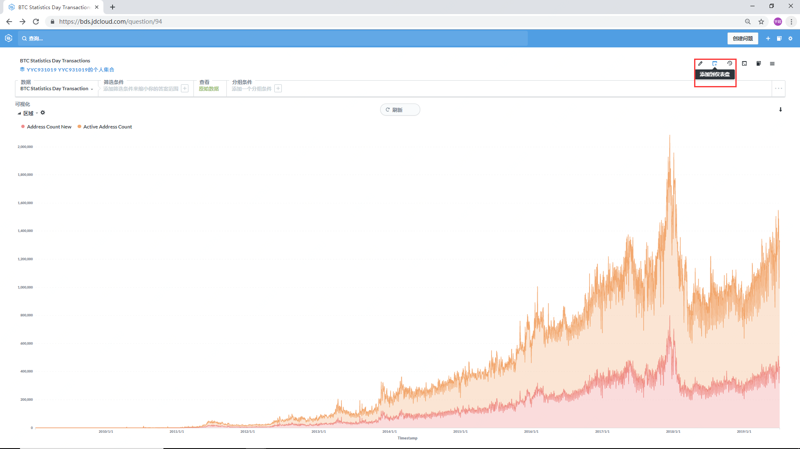
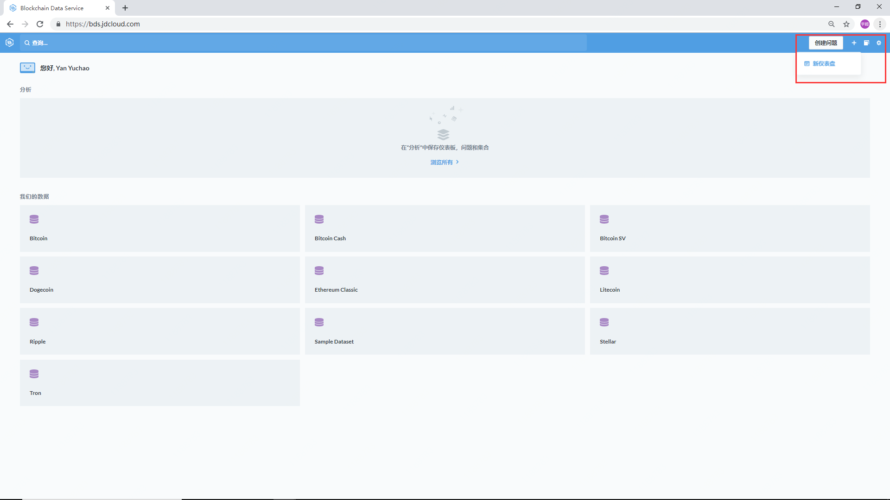
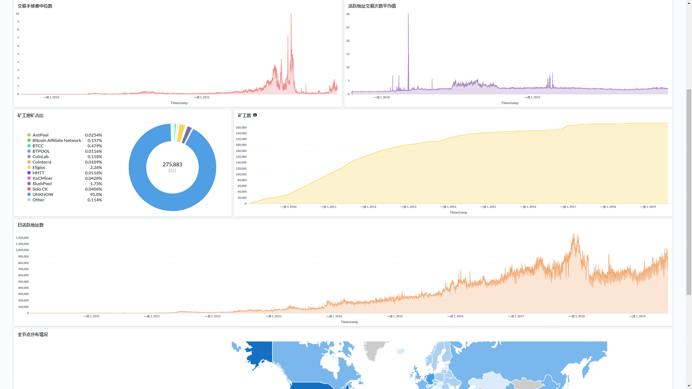
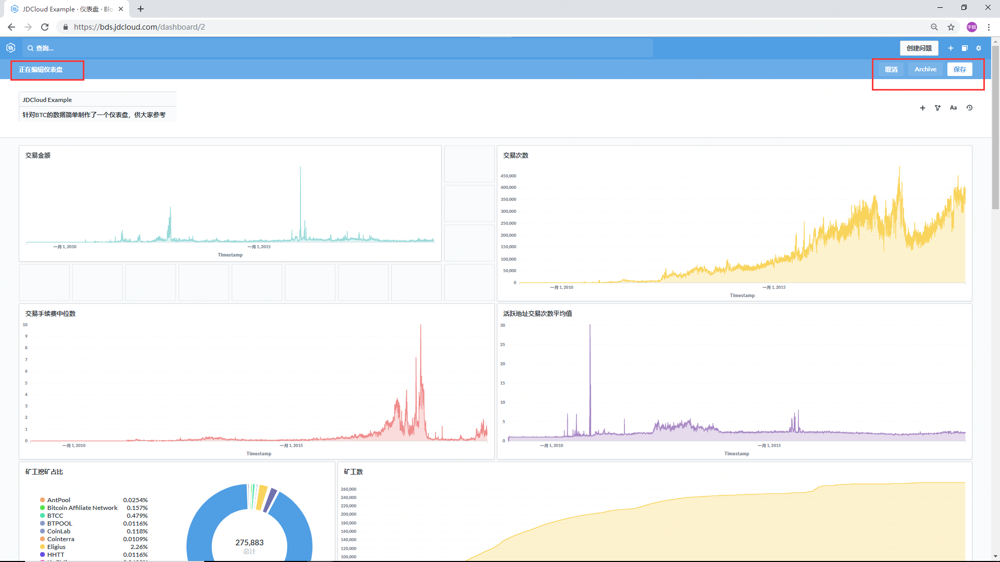
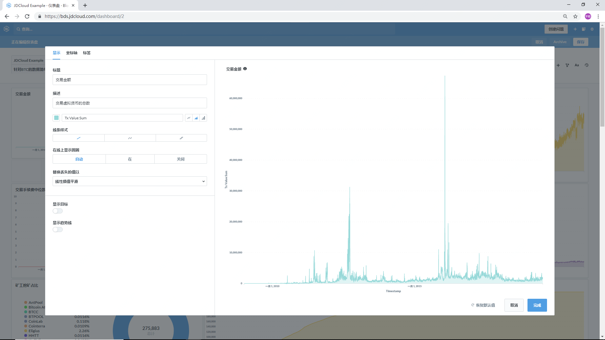
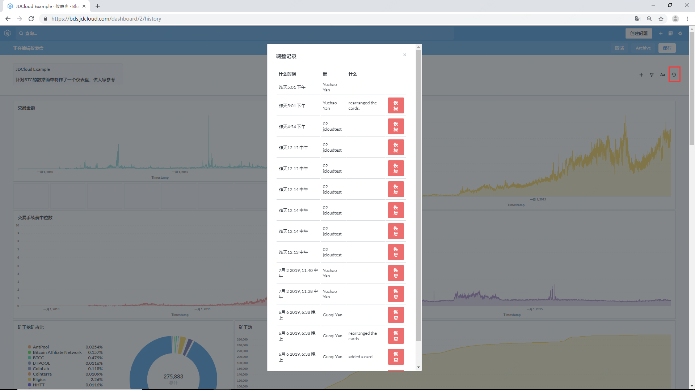

# Dashboard
## Add to the dashboard
The user can save the visual result of data in his dashboard.

## Create new dashboards

The user can select to create a new dashboard at the upper right of the main interface and place the data charts in categories.

## Dashboard Effect Display

Log in to BDS, select **JDCloud Example** at the upper left of the main interface to enter the dashboard sample display.

## Edit the dashboard

### Automatic Refresh

Select the automatic refresh interval of the dashboard

### Layout Editing

Move, zoom in and zoom out the dashboard charts to change the layout mode of the dashboard.

### Content Editing

Directly edit the chart contents in the dashboard.

### Operation Record

When editing the dashboard, the record about your operations to the dashboard can be viewed, and at the same time, you can select to restore the previous version.

