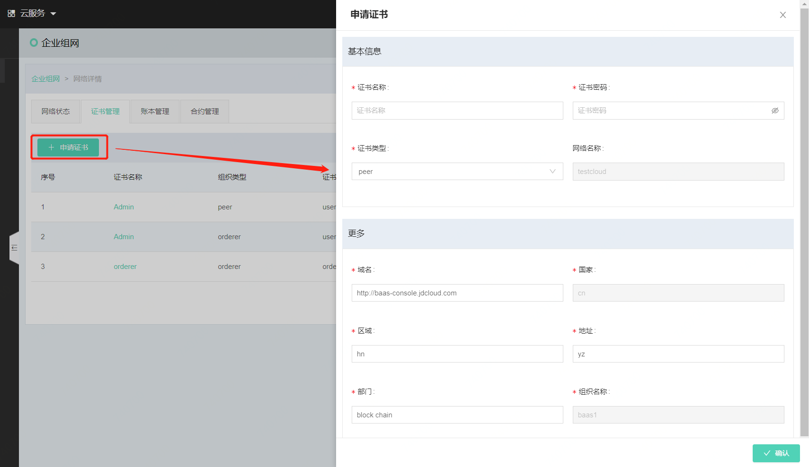
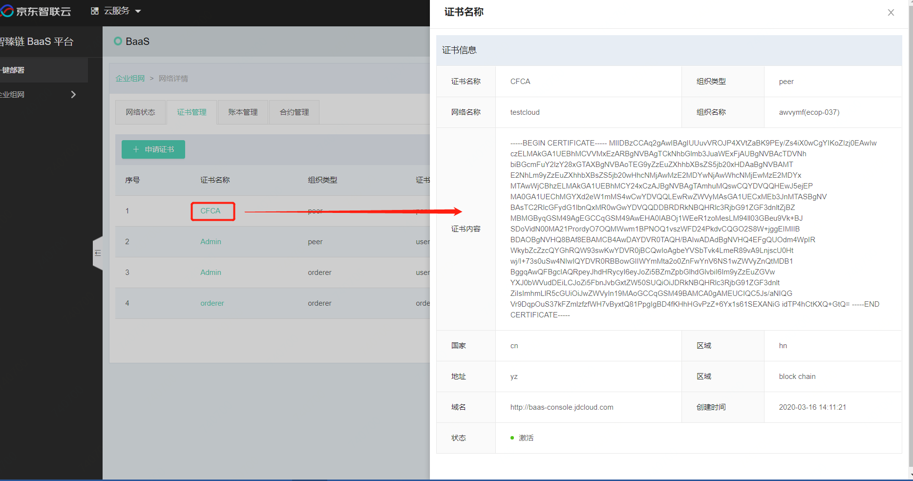

# Certificate Management
In JD Cloud Version, the system will automatically establish some certificates after completion of chain building. However, the certificates at each node shall be manually established by network creators in accordance with the quantity of nodes. The certificate name must be consistent with the node name. For example, if only one node has been selected, the node name is peer0, while if four nodes have been selected, the names of the nodes shall be peer0, peer1, peer2, peer3. The list of all certificates can be viewed upon the opening of certificate management tab page on which the details of the certificates can be viewed or downloading of the certificates can be conducted. In case that a new certificate needs to be applied, the application can be carried out by clicking **Apply Certificate** button on the certificate management tab page. Meanwhile, certificates meeting name requirements can be searched by entering the name of certificate and clicking **Search** button.

The certificate application page is divided into parts of basic information and further information, which will be specifically displayed as follows:

The descriptions of fields on this page are shown as below:

|Parameter Name | 	Required | 	Rules|
|----------|:----------:|------|
|Certificate Name |	 Yes | 	 You can enter certificate name in English (required) with no more than 20 characters|
|Certificate Password |	 Yes |	 Certificate password can be entered in figure|
|Certificate Type |	 Yes |	You can select peer or user|
|Domain 	| Yes |	Domain can be written to if there is a special requirement for domain|
|Region 	| Yes |	Region information can be entered if there is a special region requirement|
|Address |	 Yes |	Address information can be entered if there is a special address requirement|
|Department |	 Yes |	Department information can be entered if there is a special department requirement|

After the creation of certificate, the information of the certificate can be viewed on the list page on which detailed content of the certificate can be viewed by clicking the certificate name.

Similarly, there are responsive operation permissions for each certificate, and the operation permission under certificate management is only downloading. Click **Download** button and you can download the content of the certificate to local server for storage.