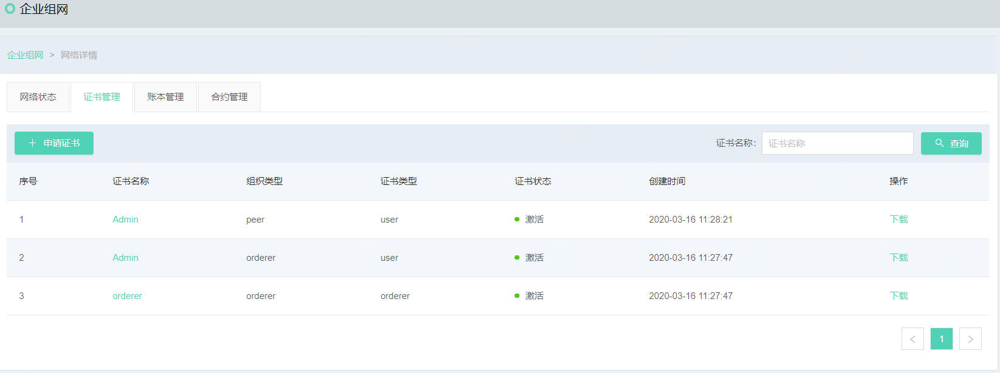

# Certificate Management
In JD Cloud Version, the system will automatically apply for the basic certificates necessary for the creation of network after the blockchain network is created. Open the Certificate Management Tab page to view the list of all certificates. You can view the certificate details or download any certificate on this page. If to apply for a new certificate, you need to click the **Apply for Certificate** button on the Certificate Management Tab page for application. Meanwhile, you can enter the certificate name and click the **Search** button to search the certificate that meets the name requirement.

The certificate application page is divided into parts of basic information and further information, which will be specifically displayed as follows:

The descriptions of fields on this page are shown as below:

|Parameter Name | 	Required | 	Rules|
|----------|:----------:|------|
|Certificate Name |	 Yes | 	 You can enter certificate name in English (required) with no more than 20 characters|
|Certificate Password |	 Yes |	 Certificate password can be entered in figure|
|Certificate Type |	 Yes |	Now only the user type is selectable for user credentials when initiating transactions through the SDK |
|Domain 	| Yes |	Domain can be written to if there is a special requirement for domain|
|Region 	| Yes |	Region information can be entered if there is a special region requirement|
|Address |	 Yes |	Address information can be entered if there is a special address requirement|
|Department |	 Yes |	Department information can be entered if there is a special department requirement|

After the certificate is created, the certificate information can be viewed on the List page. On this page, you can click **Details** to view the details of the certificate.

Similarly, there are responsive operation permissions for each certificate, and the operation permission under certificate management is only downloading. Click **Download** button and you can download the content of the certificate to local server for storage.