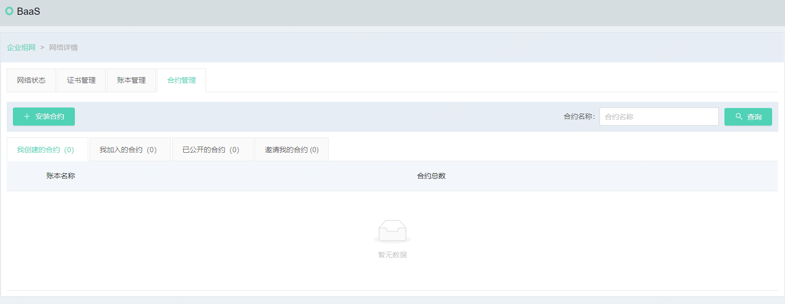
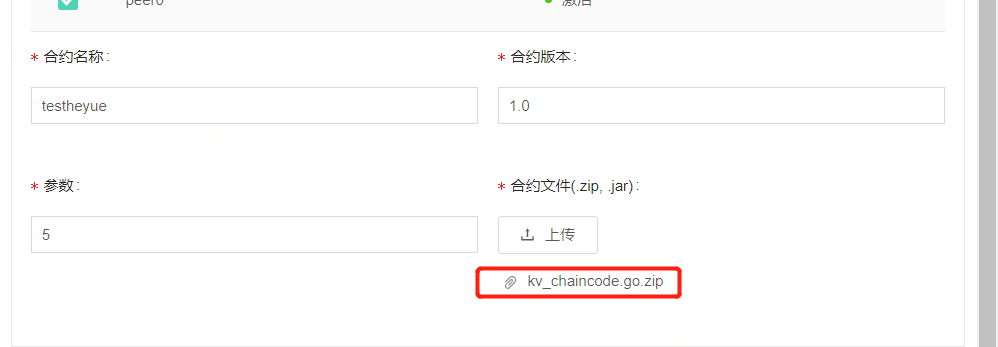
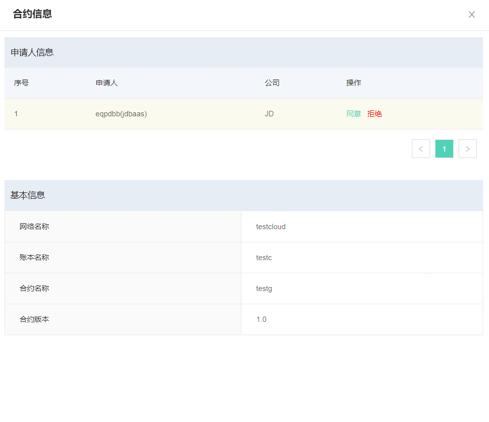
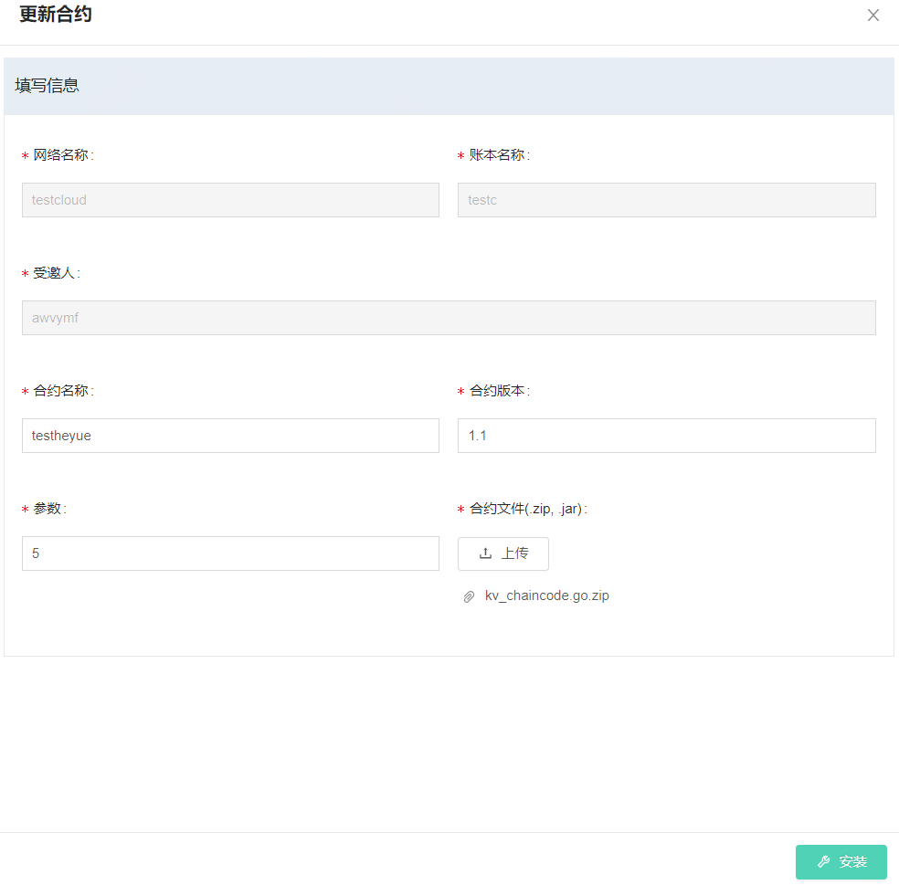
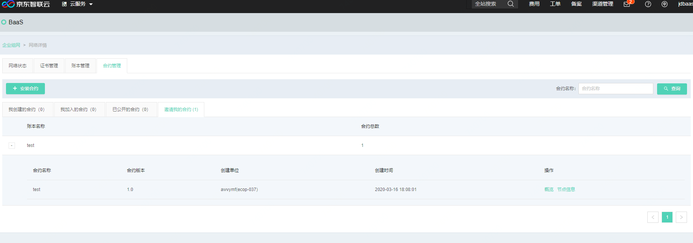
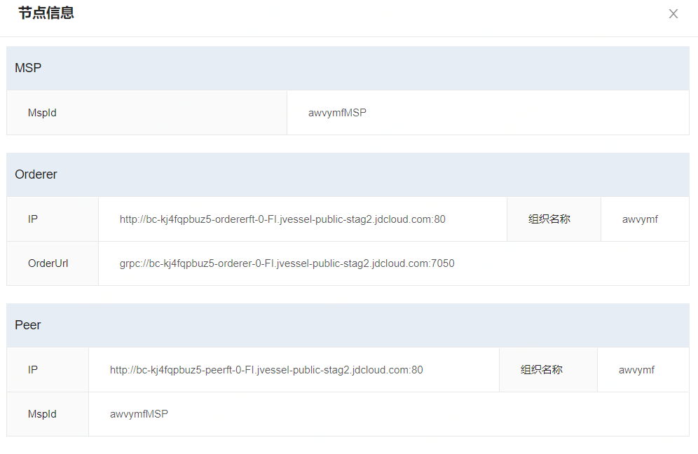

# Contract Management

As a significant bridge for interaction between application and blockchain, Intelligent Contract is also one of the cores of JDD BaaS Blockchain Technical Service. Uploading can be managed, contract can be deployed and version can be managed in an effective manner by utilization of contract management function of JDD BaaS Platform. The Contract Management List page can be viewed by clicking **Contract Management** tab and a contract needs to be manually created since the creation of blockchain network does not contain creation of contract. On the same List Page, contract searching function is provided and contract information meeting the requirements can be searched by entering the contract name and clicking **Search** button.

The page for creation of contract can be opened by clicking **Install** button. The following information shall be entered on the page:

|Parameter Name | 	Required | 	Rules|
|----------|:----------:|------|
|Invitee | 	Yes | 	Select an invitee that has been added into the ledger created for the contract.|
|Ledger Name 	| Yes | 	Optional items, select all ledger names in current network and the contract will be created in selected ledgers|
|Contract Name | 	Yes | 	Enter contract name in English only with a length of no more than 20 characters|
|Contract Version | 	Yes	 | Enter contract version in figures only with a length of no more than 5 characters|
|Parameter |	 Yes |	 Enter contract parameter|
|Contract File | 	Yes	 | Upload a contract file in local system and the format of the file is required as .zip|
|Invitee List | 	Yes | 	All nodes under the current login account and select nodes for contract to take effect|

In order to add invitees into contract, you need to click **Invitee** button and the system will capture and display in list all persons in current network.

Select invitee to be invited (including yourself) on this page and click **Add** button at the bottom of the screen to complete invitation of ledger personnel. If you have made any wrong selection, you can re-check and remove "√" mark.

.zip file is required in uploading contract; after selection of files, system will upload the files from the local system to server and the status shown in the graph below demonstrates the completion of contract uploading.

If you want to delete contract, you can move your mouse to the contract name and click ** ** button for deletion of the contract. If there is no any problem, you can turn to next installation. At this time, you can click **Delete** button for installation.

After creation of contract, you can view it on the list page. Like the blockchain network and ledger, the contract list page differentiates different permission tabs, which is convenient for users to rapidly find the contract information they need. Here we will introduce functions and operation permissions of each list in tabs.

* **Contract I Create**: The contracts created for the account can be viewed in this tab, and since you are the creator of the contracts, you are entitled more operation permissions and you can publicize/hidden, admit, update and operate node information on this page. Publicize and hidden status of operable contract to decide whether all participants in this ledger can view the contract and apply to join it. Contracts under public status can be viewed and applied to join in.

Admitting Function is used to review organization joining the contract and a contract can only be admitted and mutually executed under necessary conditions. After opening the admission page, you can view names and companies of applicants and you can choose to agree or refuse to let them join the contract.

Click button in the list to view functions of participants, enabling users to get to know information of participants joining in the contract in a rapid manner.

Contract Updating Function enables contract creators to update content of contract at any time. During this process, the creators do not need to re-select invitee but only need to update the name, version, parameter and program of contract.

Contract Operation provides system with a process for testing and calling contract during which users can enter contract method and parameter on pages and the system will run the contract and return a value.

Node Information Function enables users to conveniently view nodes under the contract. Currently, the function for searching information of order and peer is provided.

* **Contract I Joined**: After users are invited and agree to join, contract will be displayed on this page and self-created contract of this version will also be displayed on this page on which the contract can be operated, tested and called. Meanwhile, the information of nodes will be displayed to ensure that users can view the conditions of nodes in this contract. When updating contract, you need to enter the following information:

|Parameter Name | 	Required | 	Rules|
|----------|:----------:|------|
|Contract Name 	| Yes | 	Enter contract name in English only with a length of no more than 20 characters
|Contract Version | 	Yes	 | Enter contract version in figures only with a length of no more than 5 characters
|Parameter |	 Yes |	 Enter contract parameter
|Contract File | 	Yes	 | Upload a contract file in local system and the format of the file is required as .zip

A simple calling can be conducted for installed contracts and whether the calling of parameter is correct can be checked by entering corresponding contract method. Contract Operation provides system with a process for testing and calling contract during which users can enter contract method and parameter on pages and the system will run the contract and return a value.

Node Information Function enables users to conveniently view nodes under the contract. Currently, the function for searching information of order and peer is provided.

* **Contract Opened**: This tab displays all opened contract information in ledger, and you can apply to join the contracts not created by this account, while you can only view node information in contracts created by this account.

After clicking **Apply** button, you can see the details of the contract and if you have confirmed that there is no error in the information, you can click the button to apply to join the contract.

After contract creator agrees to join, you can view that the Operation button becomes into Installation button on the opened contract page, and then you can open the contract installation page by clicking the **Installation** button. You shall select nodes required for installation of contract under this account on the contract installation page, and then click **Install Contract** button to begin installation. After installation, a prompt will be popped out in the tooltip on the upper right to indicate the completion of contract installation.

The installed contract will be viewed in Contract I Joined. For specific operations, please refer to the above description.

* **Contract Where I Am Invited**: In Contract Where I Am Invited, you can see the contracts inviting you to join; you can decide whether to join after clicking **Overview** button to view information of the contracts; if you choose to join, you can select ** ** button, or otherwise you can select ** ** button; after joining, information of the contract will be shown in Installed Contract.

After the **Overview** button is clicked, the details of the contracts will be popped out on which you need to select nodes to be installed with contract under this account.

Node Information Function enables users to conveniently view nodes under the contract. Currently, the function for searching information of order and peer is provided.
