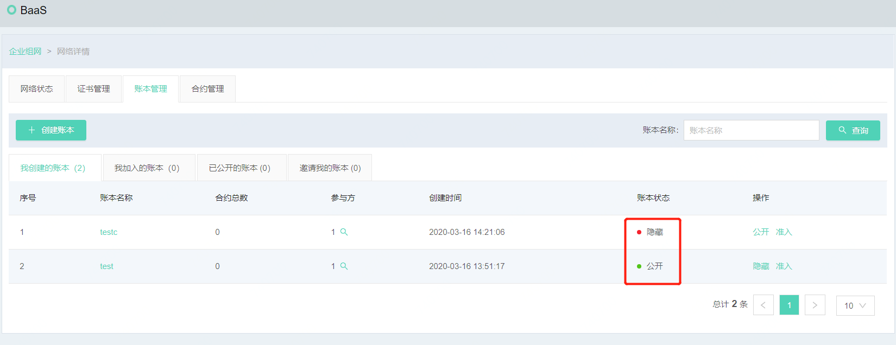
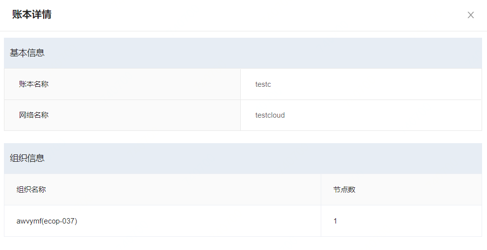
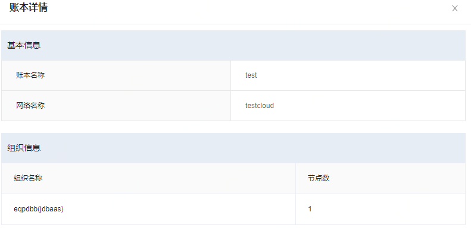
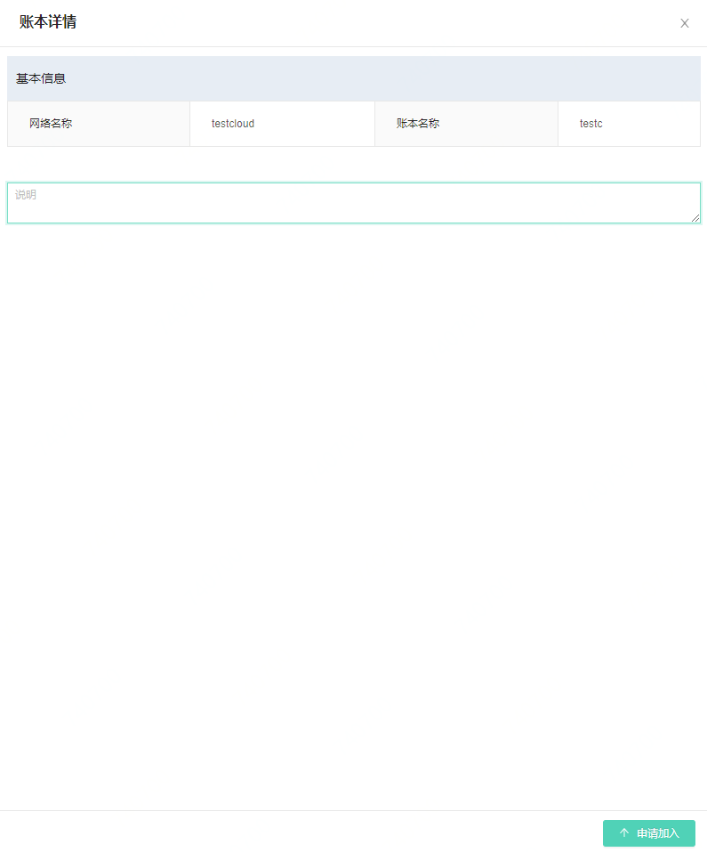

# Ledger Management

Ledger Management is a basic service in Blockchain Service and it can help users create, join, invite others to join and conduct other operations on ledger. The Ledger Management tab page exists in every blockchain network. When entering for the first time, you need to create a ledger by clicking **Create Ledger** button. During the creation, you need to enter the following information:

|Parameter Name | 	Required | 	Rules|
|----------|:----------:|------|
|Invitee 	| Yes	 | Select an invitee that has been added into the Blockchain Network for creation of a ledger.|
|Ledger Name 	| 	Yes | Enter ledger name in English only with a length of no more than 20 characters|
|Ledger Description	 | Yes 	| The ledger description shall be in Chinese or English with no more than 200 characters|
|Node List 	| Yes 	|Select nodes for synchronization of ledger in the same network|

When creating a ledger, you need to invite persons; once you click **Invitee** button, the system will capture all persons in current network and display them in list.

Select invitee to be invited (including yourself) on this page and click **Add** button at the bottom of the screen to complete invitation of ledger personnel. If you have made any wrong selection, you can re-check and remove "√" mark.

The page for creation of ledger is as follows; after you enter all information required, you can click **OK** button to complete the creation. There is a prompt on the upper right to demonstrate successful creation.

After creation of a ledger, relevant information can be searched in the Ledger List which differentiate tab page in details as that of Blockchain Network List for convenient viewing. Here we will give detailed descriptions for functions of the List in accordance with different tab pages.

* **Ledger I Create**: List of Ledger I Create can authorize ledger with some operations such as publicizing/concealing and admitting. Publicizing/concealing function can control whether the ledger can be viewed by all in the Blockchain Network. Admitting function can agree other ledgers’ application to join. Meanwhile, the nodes the current ledger has joined can be viewed by clicking the button next to the **Participant**.

The nodes the current ledger has joined can be viewed by clicking the button next to the **Participant** on the List Page.

Basic information of the ledger can be viewed by clicking **Ledger Name** on the List Page.

With admitting function, the nodes of ledgers applying to join can be reviewed and when there is a node to apply to join, you can click **Admit** button and view application information on the page popped out at right side.

On the same page, you can review the nodes of ledgers applying to join, the **Agree** button means to agree with the application, and the **Refuse** button means to refuse the application. Upon whichever button is clicked and the operation is successful, a prompt will be popped out at the right upper corner of the system.

* **Ledger I Joined**: Ledger’s information can be viewed in Ledger I Joined, and the detailed information of ledger can also be viewed by clicking the link of Ledger Name and entering the Ledger.

* **Ledger Opened**: After creation of ledger, the creator will publicize the ledger; the opened ledger can be viewed in the same network.

Under Ledger Opened, an open ledger can be applied to join, and basic information of the open ledger can be viewed in the interface popped out at the right side after the **Apply** button is clicked. After entering descriptions, click **Apply to Join** to apply to join the ledger.

Upon the approval from the corresponding party, the button will become into **Join**, click the **Join** button, select nodes to join under this account, and re-click **Join** to join the ledger.

After clicking the **Join** button, a notification indicating your successful joining will appear at the top right corner.

* **Ledger Where I am Invited**: When the account creator creates the ledger or after that, He/she can invite other members under the same network to join the ledger. The invitee can view the invitation information under the "Ledger Where I am Invited" tab. Click the **Overview** button, you can view the invitation information.
* 

For the determination of whether to join the ledger, if you decide to join, you shall click the **Overview** button to view the Ledger tab, and can click the **Agree** button or the **Disagree** button to join or not join. At the same time, you need to choose some nodes under this account into this ledger.

