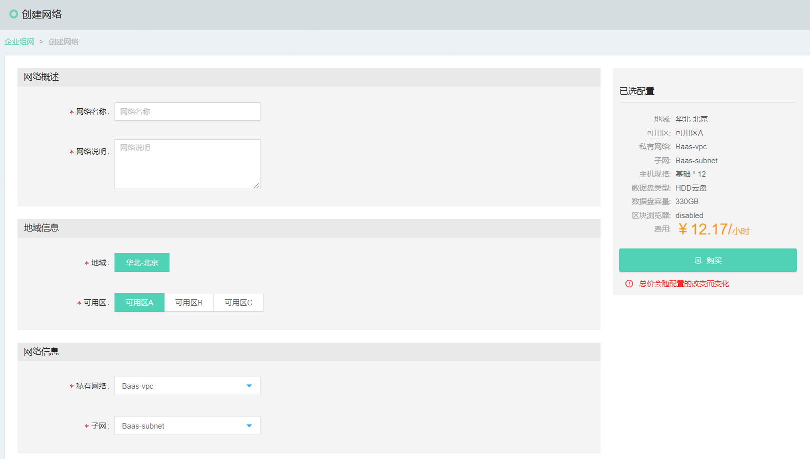
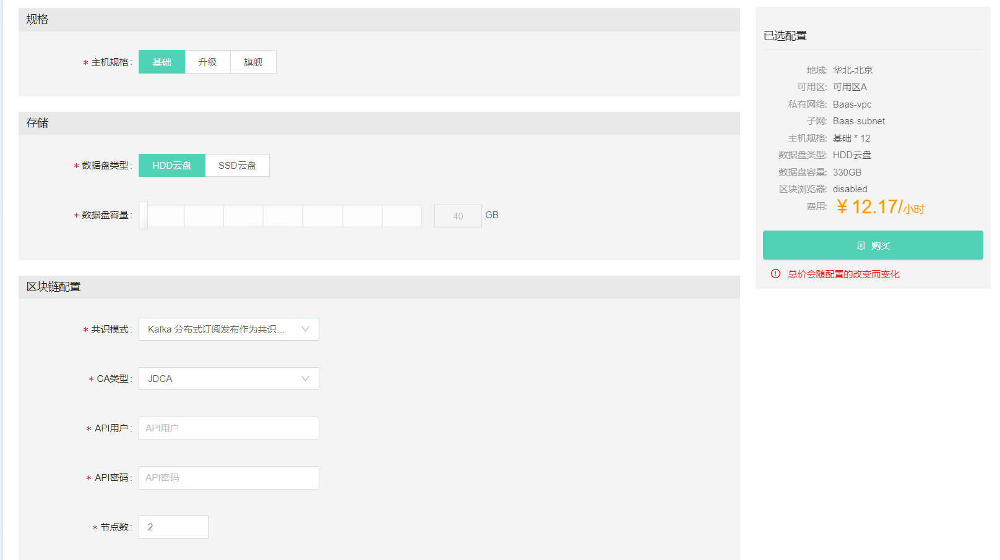
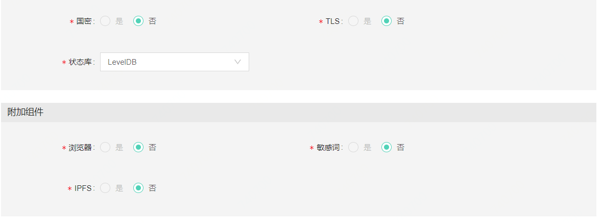
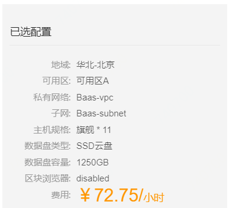
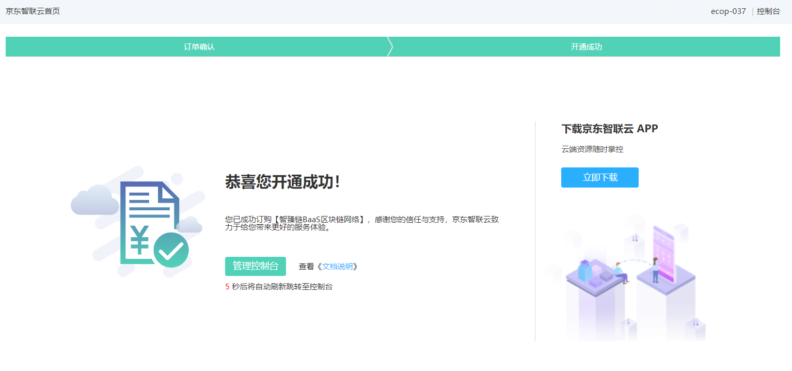
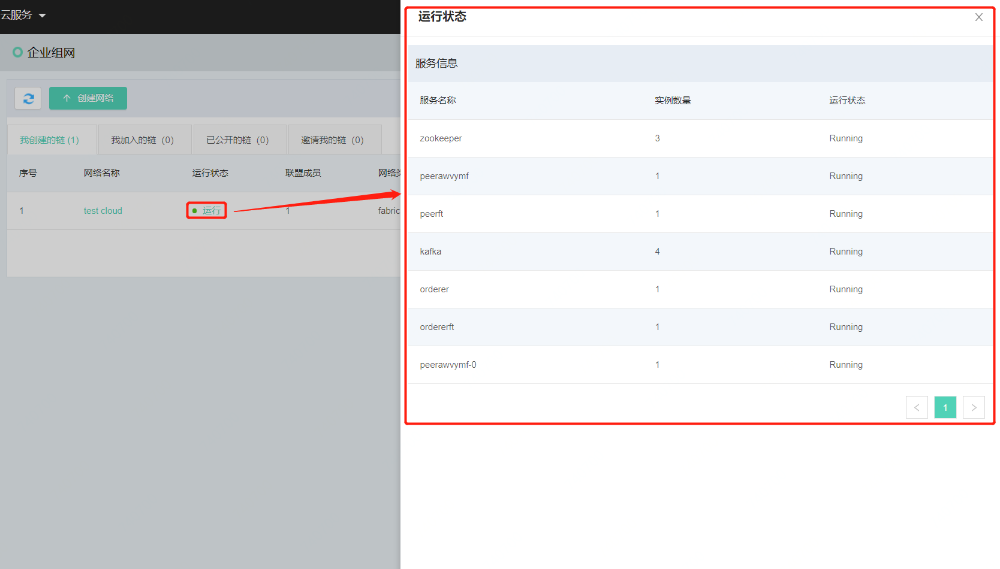

# Blockchain Network Creation
On the Enterprise Networking page, the creation of Consortium Blockchain has become one of the necessary functions of BaaS-type platform. Therefore, the more convenient and understandable networking process is also a core competitiveness of BaaS platform. The Internet operator can enter the Blockchain Management tab after logging in the system, click the **Create Network** button, and start the creation of Consortium Blockchain. The specific Creation page is shown below. After creating a network, you can invite others or be invited to join the network.

Information required for network creation consists of 7 parts, including network overview, regional information, network information, specification, storage, blockchain configuration and additional components. Inputting of different information is required for each part, so as to make the integrity of the whole information. Specific rules for inputting parameters are shown in table below:

| Category | Parameter Name | Required | Rules |
|----------|----------|:------:|--------------------------------------------------|
| Network Overview | Network Name | Yes | Network name can only contain lowercase and numbers, and cannot start with numbers |
| | Ledger Description | Yes | Ledger description shall be in Chinese or English with no more than 200 characters |
| Regional Information | Region | Yes | Choose the region at which the server is located |
| | Optional Areas | Yes | Choose available server areas under the region |
| Network Information | Private Network | Yes | |
|  | Subnet | Yes | |
| Specification | Machine Specification | Yes | Machine specification is optional. The detailed configuration based on the specification you choose will be displayed on the right. |
| Storage | Data Disk Type | Yes | HDD and SSD Cloud Disk are optional |
|  | Data Disk Capacity | Yes | Select a Data Disk Capacity between 40 (minimum) and 400 (maximum) |
| Blockchain Configuration | Consensus Mode | Yes | The Fabric-based Kafka is supported at present |
| | CA Type 	| Yes |	 JDCA and JD Digits Blockchain Certificate are supported at present|
|  |	API User	| Yes| The user whose name is used to call APIs needs to be used for calling when the application system calls.|
| |	API Password	|Yes|	The API user passwords are a combination of characters and letters|
||	Node Number|	Yes|	Number of Blockchain consensus nodes set the home terminal|
||	National Encryption	Yes|	Choose to support national encryption algorithm or not. It is not supported in this version|
||	TLS|	Yes|	Choose to support TLS or not. It is not supported in this version|
||	Status Database|	Yes|	Choose LevelDB or couchDB|
|Additional Components|	Browser|	Yes|	Choose to enable the browser function or not. It is not supported in this Version|
||	Sensitive Words|	Yes|	Choose to enable the sensitive word function or not. It is not supported in this version|
||	IPFS	Yes|Choose to enable the IPFS function or not. It is not supported in this version|

After all information is filled in, you can see the system information and prices on the right side, and click the **Purchase** button after the information is confirmed as correct for configuration next.

After clicking the button, you will log into the Information Confirmation page, which is divided into two pages for two steps, namely the Order Confirmation page and the Enabled Successfully page respectively. You can confirm the order amount in the Order Confirmation page. Confirmed as correct, you may click the **Instant Account Setup** button to complete the confirmation.

After entering the Enabled Successfully page, if there is sufficient amount in your account, the system will show you a notification congratulating for you successful enabling. Then, the page will automatically redirect back to the Networking List page after 5 seconds.

On the Networking List page, you can view the network status. When the running status changes into "running" and all backend operation buttons appear, the network is created successfully.

At the time, you can view the running status of nodes after clicking the **Run** button:

After the network is created, you can click the link of network name to enter the network Details:

