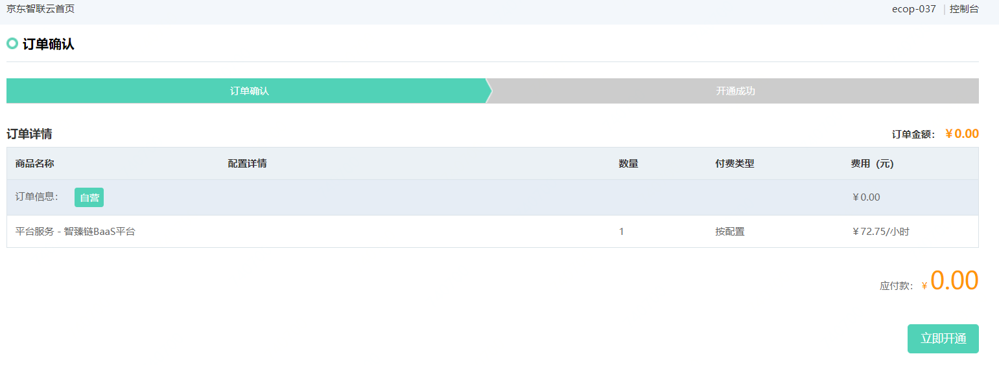
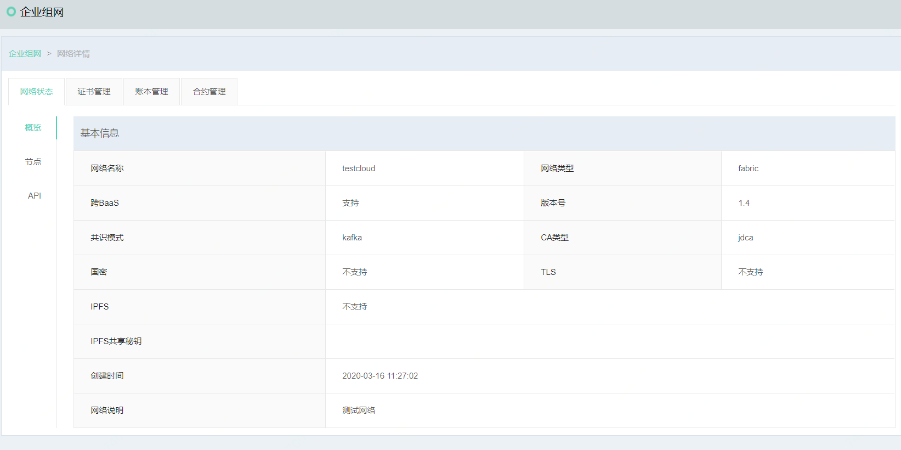

# Blockchain Network Creation
On the Enterprise Networking page, the creation of Consortium Blockchain has become one of the necessary functions of BaaS-type platform. Therefore, the more convenient and understandable networking process is also a core competitiveness of BaaS platform. The Internet operator can enter the Blockchain Management tab after logging in the system, click the **Create Network** button, and start the creation of Consortium Blockchain. The specific Creation page is shown below. After creating a network, you can invite others or be invited to join the network.

The information to be filed in for creating a network includes 4 parts, which are network overview, resource configuration, blockchain configuration and add-on components respectively from top to bottom. Different information shall be filled in for each part to ensure the integrity of the whole information. The rules for specific parameter input are shown in the table below:

| Category | Parameter Name | Required | Rules |
|----------|----------|:------:|--------------------------------------------------|
| Network Overview | Network Name | Yes | Network name can only contain lowercase and numbers, and cannot start with numbers |
| | Ledger Description | Yes | Ledger description shall be in Chinese or English with no more than 200 characters |
| Resource configuration | Region | Yes | Select the region where the server is located. Resources in different regions are not interchangeable within the intranet and cannot be changed after creation |
| | Available region | Yes | Select a server region available under this region |
|  | Virtual Private Cloud | Yes | |
|  | Subnet (IP count) | Yes | It is recommended to select a subnet with a great count of IP. If the IP count is inadequate, the creation of the blockchain network will fail.|
| | Bandwidth | Yes | Public network bandwidth, which is 5Mbs by default |
|  | Host specification | Yes | The host specification is optional, and the detailed configuration of different specifications selected is shown on the right. The basic version is applicable for low-frequency interaction or single business scenarios, and the TPS does not exceed 300; The upgraded version is applicable for high-frequency business or multi-business application scenarios, and the peak TPS can be up to 1,000+ |
|  | Data disk type | Yes | HDD Cloud Disk and SSD Cloud Disk are optional |
|  | Data disk capacity | Yes | Select the data disk capacity, the minimum and maximum of which are 40G and 400G respectively. The disk capacity selected here is the single component disk capacity, and the total usage can refer to the selected configuration on the right |
| Blockchain Configuration | Consensus Mode | Yes | The Fabric-based Kafka is supported at present |
| | CA Type 	| Yes |	 JDCA and JD Digits Blockchain Certificate are supported at present|
|  |	API User	| Yes| The user whose name is used to call APIs needs to be used for calling when the application system calls.|
| |	API password	|Yes|	The password of the API user. Please keep the password properly. If you forget the password, please open a ticket for processing |
||	Node count|	Yes|	For the count of blockchain consensus nodes set on this end, the service fee is charged as per the node count. Please make a selection as per the actual usage. 2 nodes by default |
||	National password|	Yes|	It is the collection of the national commercial password of China and applicable to business scenarios that need to meet relevant characteristics. The default is no|
||	TLS|	Yes|	Support TLS for business scenarios with higher security requirements. The default is no|
||	Status library|	Yes|Two status library engines are supported now. CouchDB is added with the function of rich text search based on the basic functions. If the function of rich text search is required, it is recommended to select CouchDB. LevelDB by default|
|Add-on components|	Browser|	Yes|	Install a blockchain browser for the current organization, which can be used to monitor the running status and data of the blockchain. This function can be added later.|
||	Sensitive word|	Yes|	Add the sensitive word monitoring function to the current network. This function is for free and cannot be added later, so it is recommended to be installed.|
||	IPFS|	Yes|Synergistically deploy the IPFS cluster. If large files are to be stored in the current blockchain network, it is recommended to install this function, and it cannot be added later.|

After all information is filled in, you can see the system information and prices on the right side, and click the **Purchase** button after the information is confirmed as correct for configuration next.

After clicking the button, you will log into the Information Confirmation page, which is divided into two pages for two steps, namely the Order Confirmation page and the Enabled Successfully page respectively. You can confirm the order amount in the Order Confirmation page. Confirmed as correct, you may click the **Instant Account Setup** button to complete the confirmation.

After entering the Enabled Successfully page, if there is sufficient amount in your account, the system will show you a notification congratulating for you successful enabling. Then, the page will automatically redirect back to the Networking List page after 5 seconds.

On the Network List page, all the blockchain networks created by the current user can be viewed. When the network running status changes to *run* and all the backend operation buttons appear, the network is successfully created.

Click the **Running Status** button, and the node running status can be viewed:

After the network is created, click the **Details** button to enter the Network Details:

