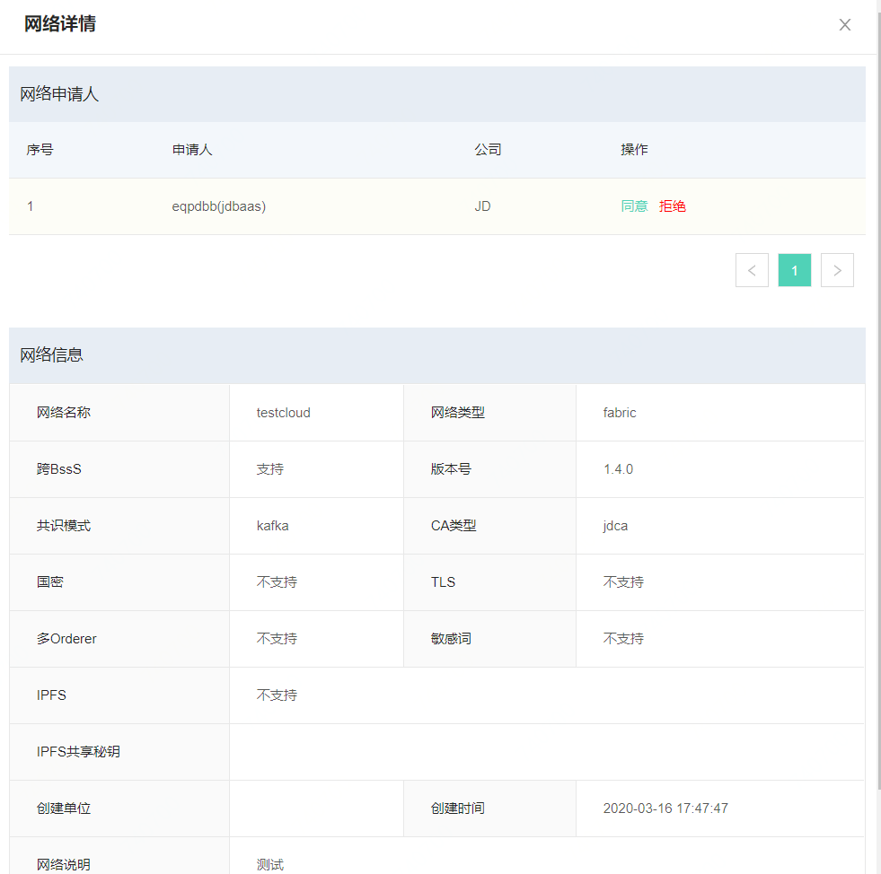
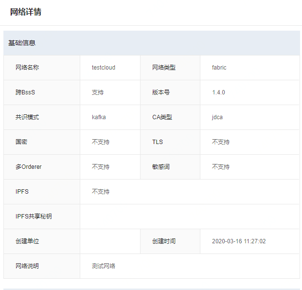
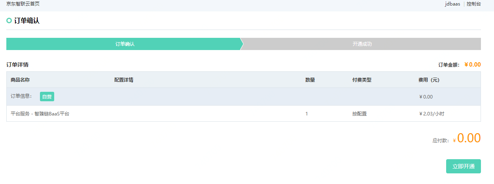

# Network List of Enterprise Networking
As mentioned above, enterprise networking can help users to create an alliance chain network in the BaaS platform of JD Cloud version. The alliance chain is now the most extensive form for the creation of the blockchain network. Through this form, multiple non-creditable nodes can be combined together to transmit credible data information under the same rules. JD Blockchain Open Platform provides users with the Alliance Chain creation and configuration page, which is convenient for users to quickly increase or decrease nodes in the blockchain network just like "creating a friend circle".

The display of the alliance chain is divided into 4 Tab pages, and the information displayed on each Tab page is different, the details of which are as follows:

* **Network I Created**: It is the interface displayed by default. All blockchain networks created by the current account are displayed under this Tab page. Under this page, different permissions are offered to operate the chain. Under this Tab page, operations such as open\hide, details, running status, to-do, invitation, alliance member and deletion can be performed to the blockchain created by yourself, and the significance of each operation is as follows
	* Open\hide: Whether to open the chain. If to open it, all enterprises using JD Blockchain Open Platform and accessing the Internet can view the basic information of this blockchain network (the basic information refers to the name and creation unit, excluding business information), and can apply to join the blockchain network
	* Details: Click **Details** to enter the network to perform in-network management
	* Running status: The running conditions of all the components of the current blockchain network nodes can be viewed in real time
	* To-do: The information for applying to join the network can be inquired on the page, and whether the applicant can be allowed to join the chain is decided based on the application information. The **Agree** button represents agree the applicant to join the network; the **Reject** button represents disagree the applicant to join the network. After either of these two buttons is successfully clicked, a prompt for successful operation will pop up in the upper right corner

	* Invitation: While the chain is running, new partners can still be invited to join the blockchain network. This function allows the creator of the chain to invite people to join the network. After clicking it, the page is shown as follows:
After entering the page, the system will automatically list out other BaaS platforms in the same domain with JD Blockchain Open Platform, and enter the recognition code of the invitee in the *User ID (Customer Recognition Code)* column. And to protect the privacy of platform customers, only the user accurate matching function is provided, so the inviter needs to inform the invitee of the customer recognition code in a specific BaaS platform. For example, in the baas-console.jdcloud.com platform, the customer recognition code is JD Cloud account PIN, which can be obtained from the Account Management in the upper right corner.
	* Alliance member: All the existing alliance members in the network can be learnt about through this operation

	* Deletion: Delete useless blockchain networks. Note that if you are the network initiator, you can start the deletion only after all participants exit the network. Otherwise, the network deletion will not succeed.
* **Network I Joined**: The blockchain networks you have applied for or been invited to join are shown under this Tab page. Compared to the network created by yourself, you have fewer privileges in the network you have joined. You can only view the running status and alliance members as well as exit from the current alliance.

* **Network Opened**: The blockchain networks with the Open button clicked can be viewed on this Tab page. On this page, the blockchain networks created by non-login accounts can be joined; the blockchain networks created by this account will not appear on this Tab page. After clicking the **Apply to Join Network**, the detailed information about the network can be viewed. After the information is confirmed to be correct, click the **Apply to Join** button to join the network.
 After clicking the **Apply to Join** button, the detailed information about the public blockchain can be viewed. After the information is confirmed to be correct, click the **Apply to Join** button, and then the application information will be sent to the blockchain network initiator.

When the blockchain network creator agrees you to join, you can enter the node start-up interface. Different from the network creation page, the node start-up interface shows the basic information about the blockchain network, and then users are required to enter details.

The following is the configuration information of the chain to be joined, and the items that need to be entered are shown in the table below:

| Category | Parameter Name | Required | Rules |
|----------|----------|:------:|--------------------------------------------------|
| Resource configuration| Region | Yes | Select the region where the server is located. Resources in different regions are not interchangeable within the intranet and cannot be changed after creation |
| | Available region | Yes | Select a server region available under this region |
|  | Virtual Private Cloud | Yes | |
|  | Subnet | Yes | It is recommended to select a subnet with a great count of IP. If the IP count is inadequate, the creation of the blockchain network will fail|
| | Bandwidth | Yes | Public network bandwidth, which is 5Mbs by default |
|  | Host specification | Yes | The host specification is optional, and the detailed configuration of different specifications selected is shown on the right. The basic version is applicable for low-frequency interaction or single business scenarios, and the TPS does not exceed 300; The upgraded version is applicable for high-frequency business or multi-business application scenarios, and the peak TPS can be up to 1,000+  |
|  | Data disk type | Yes | HDD Cloud Disk and SSD Cloud Disk are optional |
|  | Data disk capacity | Yes | Select the data disk capacity, the minimum and maximum of which are 40G and 400G respectively. The disk capacity selected here is the single component disk capacity, and the total usage can refer to the selected configuration on the right |
|Other configuration|	Browser|	Yes|	Install a blockchain browser for the current organization, which can be used to monitor the running status and data of the blockchain. This function can be added later.|
||	Node count|	Yes|	For the count of blockchain consensus nodes set on this end, the service fee is charged as per the node count. Please make a selection as per the actual usage. 1 node by default |
|  |	API user	| Yes| It is the user name to call API, which is required when calling an application system.|
| |	API password	|Yes|	The password of the API user. Please keep the password properly. If you forget the password, please open a ticket for processing |
||	Status library|	Yes|Two status library engines are supported now. CouchDB is added with the function of rich text search based on the basic functions. If the function of rich text search is required, it is recommended to select CouchDB. LevelDB by default|

Entering different information configuration, the corresponding price will be shown in the configuration item on the right in detail. After all information is entered, click the **Buy** button to start purchase operations.
After clicking the button, you will enter the information confirmation page. On this page, there are two steps, which are shown in Order Confirmation page and Successfully Opened page. On the Order Confirmation page, the order amount information can be confirmed. After the information is confirmed to be correct, click the **Instant Account Setup** to complete this confirmation step.

After entering the Successfully Opened page, if the amount in the account is adequate, the system will pop up a prompt informing you of congratulations for the successful opening. After that, the page will automatically redirect to the Network List page after 5 seconds.

On the Network I Joined page, the network status can be viewed. When the running status changes into "running" and all the backend operation buttons appear, the network is successfully created. For the specific operations to be conducted on the Chain I Joined page, please refer to the "Chain I Joined" mentioned above. Note that only if you successfully join can you click the blockchain network name to enter the Details.

* **Network I am Invited**: When being invited, the blockchain network information of the inviter will be shown in this Tab page. There is an overview about the operations workable. After you agree to join or refuse to join, the page will be cleared. The basic operations are the same as the operations applying for joining the network.