# Feature Introduction of Block Chain Page
## One-click Deployment
The one-click deployment list page is shown in the following figure:

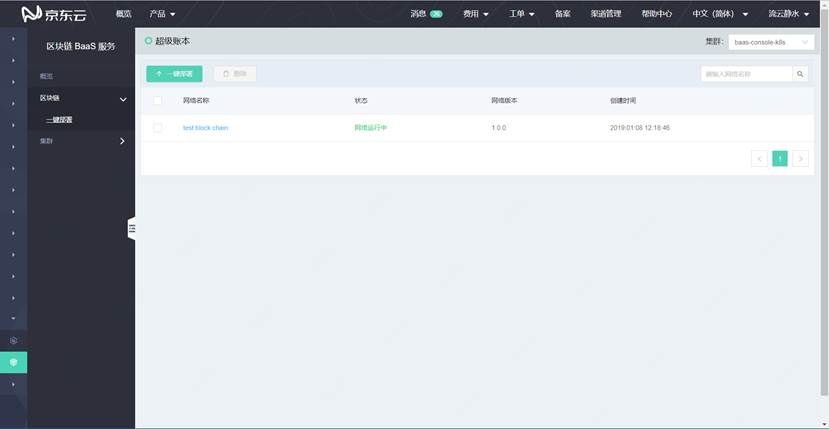
 
## Search Network
Search region and enter "Network Name"; Click **Search** button for fuzzy search of all created block chain network information.

## Create Network
Click **One-click Deployment** button to enter "One-click Deployment" page as shown in the following figure:

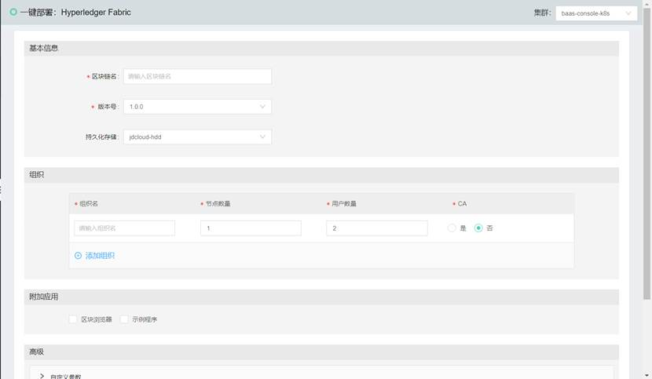
 
(1) "Basic Information" Parameter Description

| Parameter Name         | Compulsory                                                                            | Filling Rules                                               |
|----------------|-----------------------------------------------------------------------------------|--------------------------------------------------------|
| Block Chain Name       | Yes                                                                                | None                                                     |
| Organization Name         | Yes                                                                                | Organization name can only contain lowercases and numbers, and it must start with English letters. |
| Node Count       | Yes                                                                                | Value must be greater than 0                                            |
| User Count       | Yes                                                                                | Value must be greater than 0                                            |

Click **Add Organization** to dynamically add one line of organization. Fill in according to the above rules.

(2) "Additional Application" Parameter Description

| Parameter Name         | Description                                                                              |
|----------------|-----------------------------------------------------------------------------------|
| Block Browser     | Checkable, if selected, it will display in the list on the "Network Details"/"Application Program" pages. The application name is "explorer" |
| Example Program       | Checkable, if selected, it will display in the list on the "Network Details"/"Application Program" pages. The application name is "marbles"  |

(3) "Advanced" -- Customized Parameters

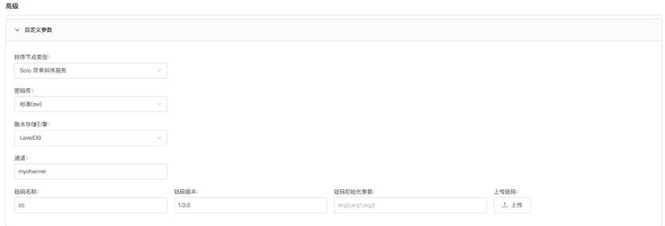
 
Description: If "Advanced" options are not unfolded, the network will be set and deployed by default; if "Advanced" options are unfolded, the network will be set and deployed by customization.

Note: If "Advanced" options are unfolded, chain codes must be uploaded. Formats of uploading chain codes support files with go and zip suffix.

| Parameter Name         | Description                                                                              |
|----------------|-----------------------------------------------------------------------------------|
| Types of Ordering Nodes   | Currently support Solo simple ordering service and kafka distributed subscription as consensus services                             |
| Password Bank         | Currently only support standard (sw)                                                              |
| Ledger Storage Engine   | You can select levedb or couchdb                                                             |
| Channel Name         | Default value is mychannel and can be modified. Note: Channel name can only contain lowercases.                             |
| Chain Code Name       | Chain code name can only contain lowercases                                                            |
| Chain Code Version       | Format of version number: start and end with numbers/characters, separated by [. or _ or -]. Such as a.10_v-v1                      |
| Chain Code Initialization Parameter | Parameter consists of letters and numbers, and parameters are separated by English comma. e.g. arg0,arg1                                 |
| Upload chain code       | Formats of uploading chain codes support files with go and zip suffix                                               |

(4) Advanced -- "Customized Parameters"
 
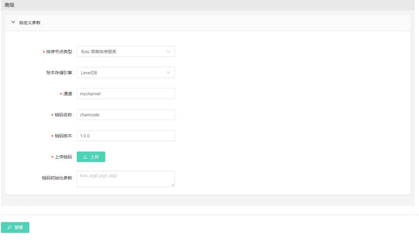

Simulating one-click deployment network, parameters shall be filled in as shown in the following figure:

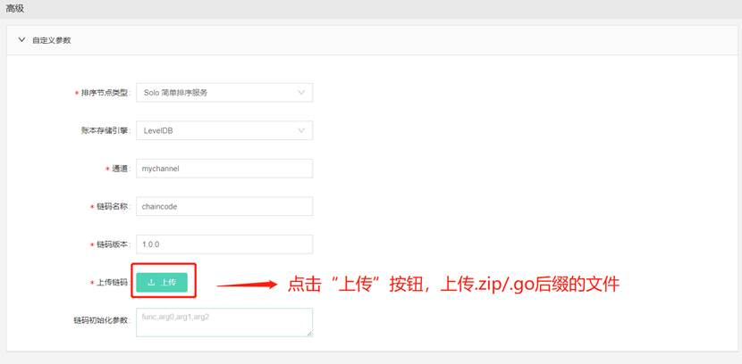
 
Click **Deployment** button and the page redirects to the network details as shown in the following figure:

 
Changes to Deployment Status:
Deploying Network -> Creating Channel -> Adding into Channel - Uploading Chain Code -> Installing Chain Code -> Installing Example Program (If Selected) -> Network Creation Succeeded

## Network Details
After one-click deployment of network, it will redirect to the "Network Details" page; select a network or click **Network Name** link to enter the "Network Details" page.

### General Layout
Display network information: Network name, network ID, Fabric version, domain;
Display organization, peer, channel and application count;
Display time information: creation time, running time.

### Consensus Management

 
Ordererer Ordering Service Consensus Node

### Channel Management

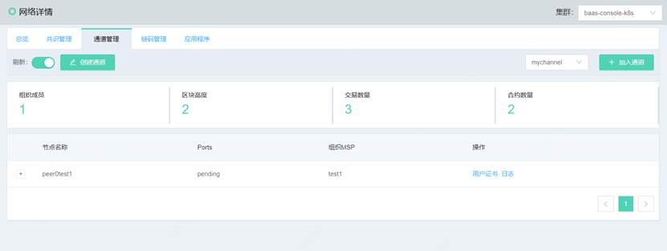
 
Display content description in the middle 4 blocks:
Organization member: Count of all organizations under the current channel. 2 organizations are added in mychannel initialization, so the count is 2.
Block height: Namely block count, the initial value is -1, representing no blocks yet. When a genesis block is generated, the block height is 0; the value will add 1 once a block is generated.
Transaction count: Count of transactions actually generated. The customized chain code (the system still has a marbles chain code by default) is selected in the one-click deployment, 2 transactions will be generated.
Contract Count: Namely count of installed chain codes (installed customized chain code + marbles chain code in the system by default)

(1) Create Channel
Click **Create Channel** button to create a new channel. The page is as shown in the following figure:

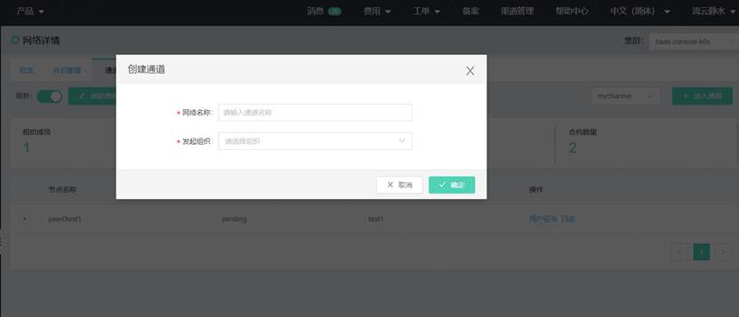
 
Description:

| Parameter Name         | Compulsory                                                                            | Rules                                                   |
|----------------|-----------------------------------------------------------------------------------|--------------------------------------------------------|
| Channel Name       | Yes                                                                                | Channel name can only contain lowercases and numbers, and cannot start with numbers.   |
| Endorsement Organization       | Yes                                                                                | Select an organization as endorsement organization in drop-down                           |

(2) Added into Channel

After channel creation succeeded, click **Added into Channel** button to select organization and peer to add into the current channel. The page is shown as below:

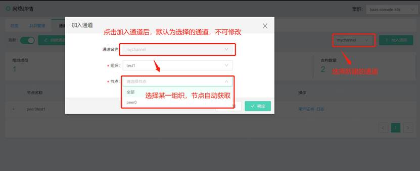
 
Before clicking **Added into Channel** button, you need to firstly select the "Channel" to be added;
On the "Added into Channel" page, the channel cannot be modified;
On the "Added into Channel" page, select an "Organization" in the drop-down to automatically get the "Peer" information.
After the "Added into Channel" succeeded, the page display is shown as below:

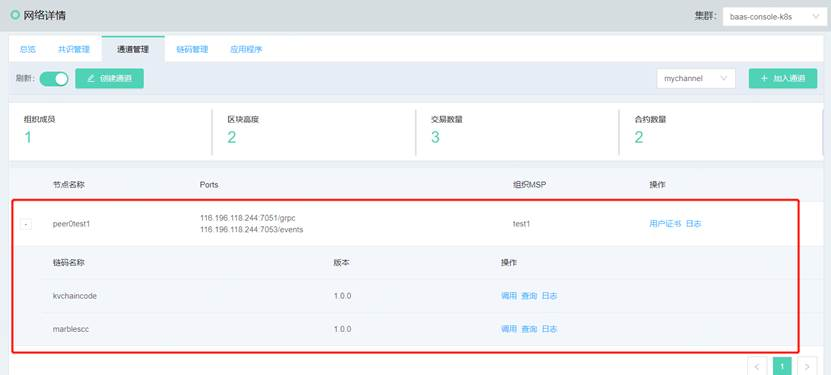
 
(3) User Certificate

 
Used by developers to download MSP certificates for SDK use.

(4) Node Log

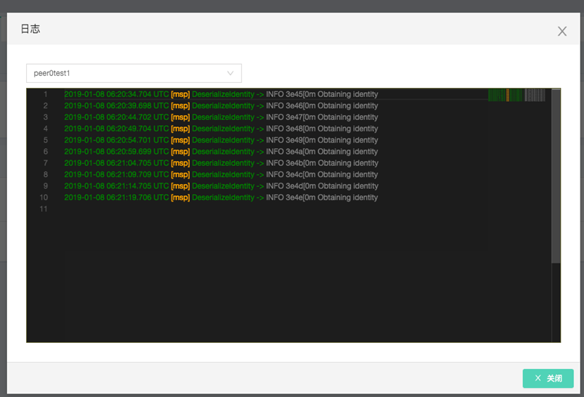
 
Developers can monitor real-time log functions.

(5) Chain Code Log

Chain code log can be viewed only when k8s management chain code is supported.
### Password Management

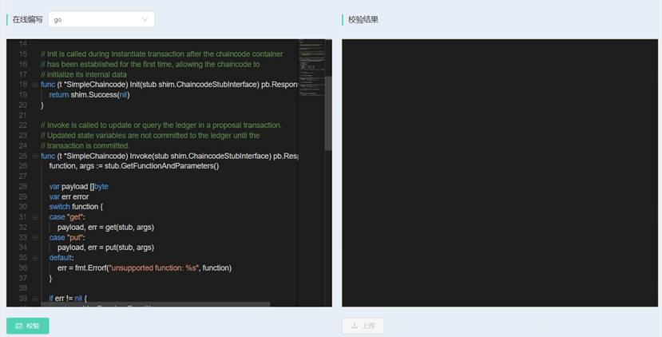
  
(1) Locally Upload Chain Code
Click **Locally Upload** and the "Upload Chain Code" page is popped up, as shown in the following figure:

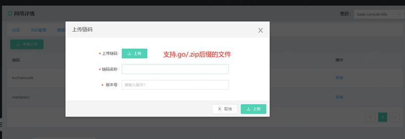
 
Click **Upload** and select chain code files with .go or .zip suffix for uploading
The parameter "Chain Code Name" is compulsory, and chain code name can only contain lowercases.
The parameter "Version Number" is compulsory, and for format of version number: start and end with numbers/characters, separated by [. or _ or -]. Such as a.10_v-v1
Click **Upload** and return to the "Chain Code Management" page, as shown in the following figure:

 
Users can also edit the chain code program online, and upload the edited chain code program by clicking **Upload** button.

(2) Install Chain Code

Click **Upload** link and the "Install Chain Code" page is popped up, as shown in the following figure:

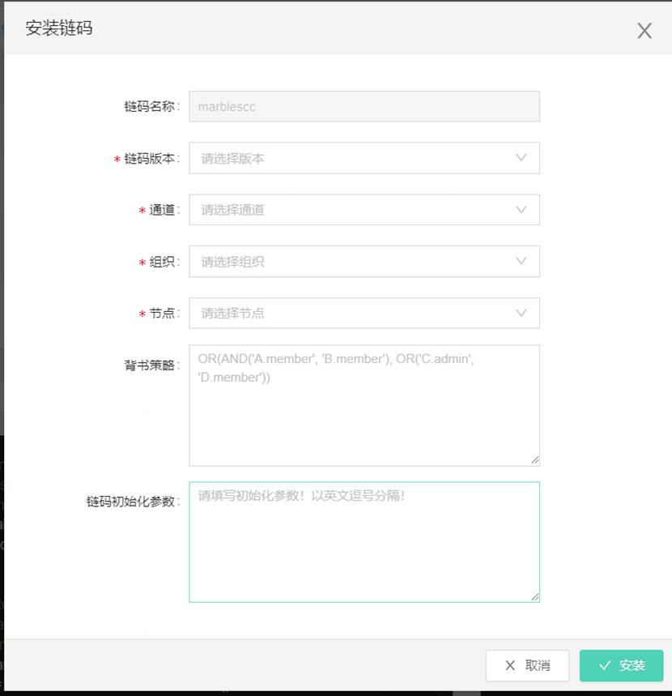
 
Description of Above Parameters:

| Parameter Name         | Compulsory                                                                            | Rules                                                   |
|----------------|-----------------------------------------------------------------------------------|--------------------------------------------------------|
| Chain Code Name       | Yes                                                                                | "Chain code name" selected when entering this page, and it cannot be modified                 |
| Chain Code Version       | Yes                                                                                | Drop down to display all version numbers of the currently selected chain code name                 |
| Initialization Parameter     | No                                                                                | Valid parameters, can be separated by ,, e.g. test1,test2               |
| Channel           | Yes                                                                                | Drop down to display all created channels                               |
| Organization           | Yes                                                                                | According to the selected "channel", display the organization currently added into this channel             |
| Peer           | Yes                                                                                | According to the selected "organization", display all peers under the current organization             |

After installed successfully, on the "Channel Management" page, you can see the information of the newly installed chain code, as shown in the following figure:

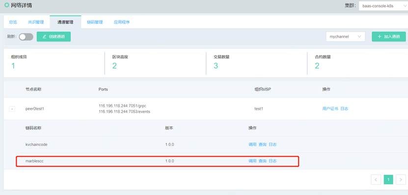
 
### Application Program

The "Application Program" page is shown in the following figure:

 
Description:
In one-click deployment of network, if the two parameters "block chain browser" and "example program" of "additional applications" are selected, they will be displayed here.

## Delete Network

 
When you enter the Hyperledger page initially, the **Delete** button is unavailable; when a network or some (batch) networks are checked, the **Delete** button is available and you can delete the checked network.
