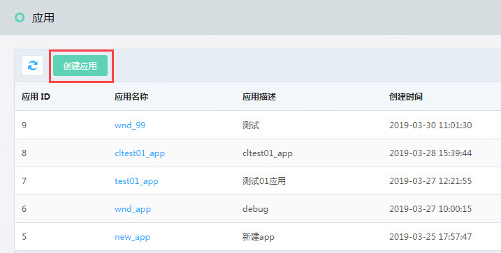
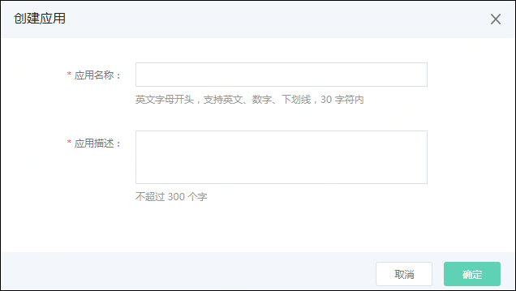
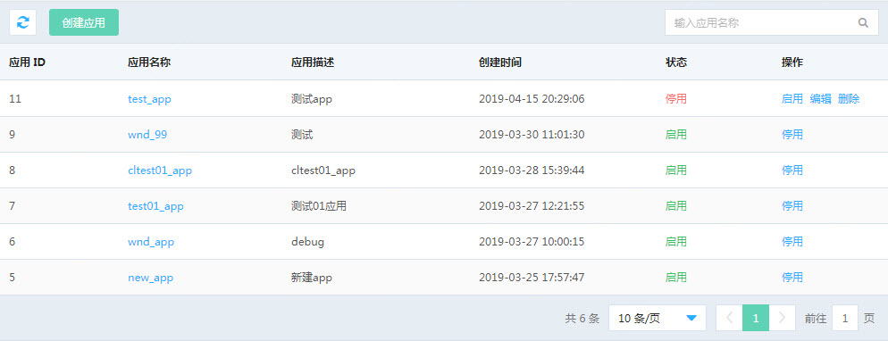

## Application Management 
Before SMS is sent with JD Cloud Rich Media SMS, the application needs to be created, and after that you can obtain the unique identification code AppID (application ID) of the application and the legal password AccessKey used to verify SMS sending request. 

**Create application:** 
After logging in the JD Cloud account, enter into Rich Media SMS, select **Application Management** in the menu on the left, click **Create Application** button in the opened page 
  
After filling the application name and description in the pop-up application creation interface, and clicking **OK** after completing information filling, you will be redirected to the application list, and you will see the application you just successfully added into the application list.  
  

**Management Application:** 
On the application list page, you can view the SMS usage of the application, disable, enable, edit or delete the application.  
   
The status is enabled after the application is created. Then you can disable the operation, and the application status in the list will be changed into ‘disabled’. After disabling, JD Cloud will stop the Rich Media SMS of the application. 
If you want to continue using the application, you can click **Enable**, and use Rich Media SMS normally after enabling  

**Application Setting** 
Enter into the setting page of the application after clicking the application name 
   
 
**Shield List** 
   
The numbers in the shield list will not receive any type of SMS.  