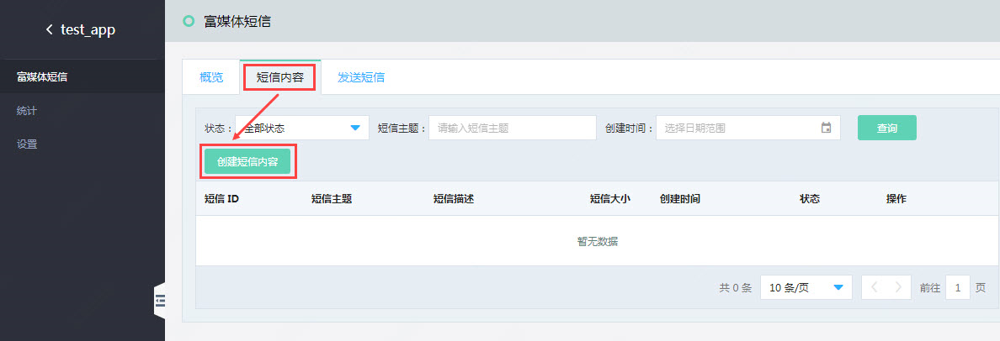
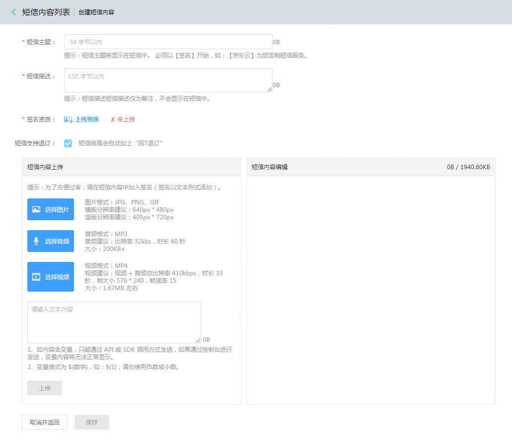
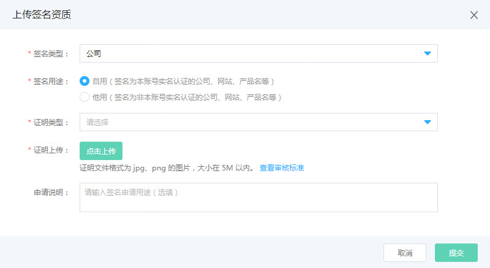
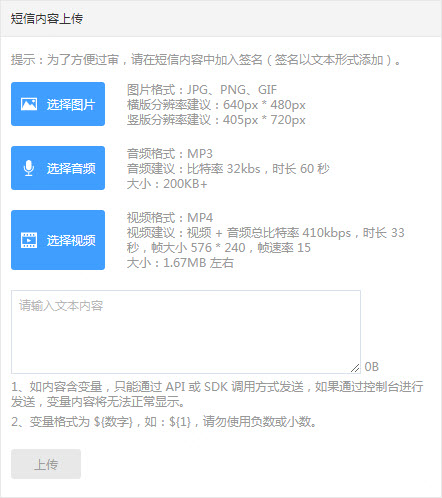
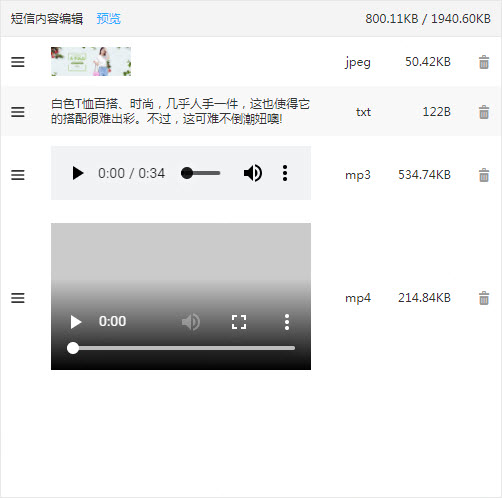
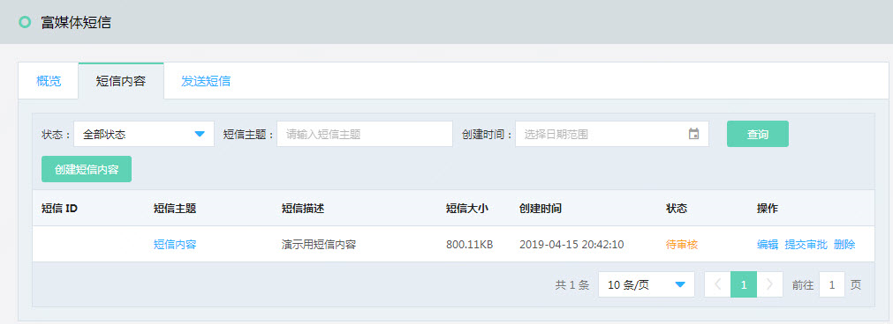

## Create Rich Media SMS  

After logging in the Rich Media SMS Service, you need to firstly create the application.   
  
After creating the application, click to choose **SMS Content** on the SMS signature TAB page as shown in the following figure  
  
Click **Create SMS Content** to enter the page for creating the content of Rich Media SMS.  
  
SMS Subject:  
As for the subject content displayed when the mobile phone user receives Rich Media SMS, the subject must begin with [Signature], for instance: 
[JD Cloud] customizes the Short Message Service for you  
SMS Description:  
The SMS description won’t appear on the SMS of a mobile phone user, but are only used as an enterprise memorandum.   
Signature Qualification: 
Filled in based on the notification content. The data certification should be uploaded 
  
Uploading of SMS Content: 
  
You can upload images, audios and videos. After download is clicked, the attachment will enter the edit area on the right. The attachment can be uploaded for multiple times, but the total number of uploaded attachments cannot exceed 1.9MB.   
The requirements for attachments shall be as follows: 
Requirement for images: 
Format: JPG, PNG, GIF 
Suggested Resolution: Horizontal Version 640px * 480px, Vertical Version 405px * 720px  
Requirement for Audios: 
Format: MP3 
Suggested audio: Bit rate 32kbs, Duration: 60s 
Size: 200K+  
Requirement for Videos: 
Format: MP4 
Suggested Videos: Total bit rate of Videos + Audios 410kbps, Duration: 33s, Frame Size 576*240, Frame Rate: 15 
Size: About 1.67M  
Text Content: 
Text Content Support Variable, its format is  &#36;{1} &#36;{2}… 
If the content contains variables, it can be sent only by calling API or SDK. If it is sent through the Console, the variable content won’t be displayed as usual.  
Edit SMS content: 
   
The uploaded attachments are displayed in the edit area of SMS content. You can conduct type setting by adjusting the upper and lower locations of the attachments.  
Note: The displays of different mobile phone models vary: 
- iOS preview is displayed on the left, with the SMS title in bold 
- Android preview is displayed on the left, with the SMS title in bold. There is a separating number between every two SMS contents 

After SMS edition, click **Save** to return to the list page, and you can view the audit status on the SMS list page after submission for approval. Only the SMS having passed such approval can be sent 
  
