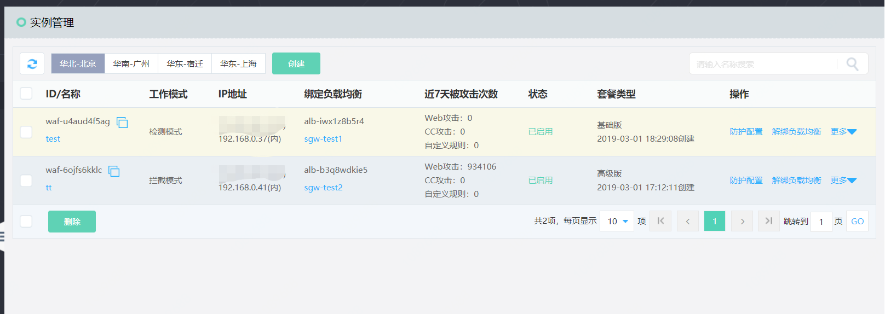
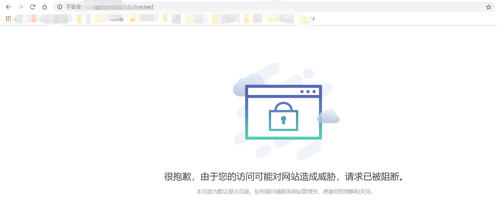
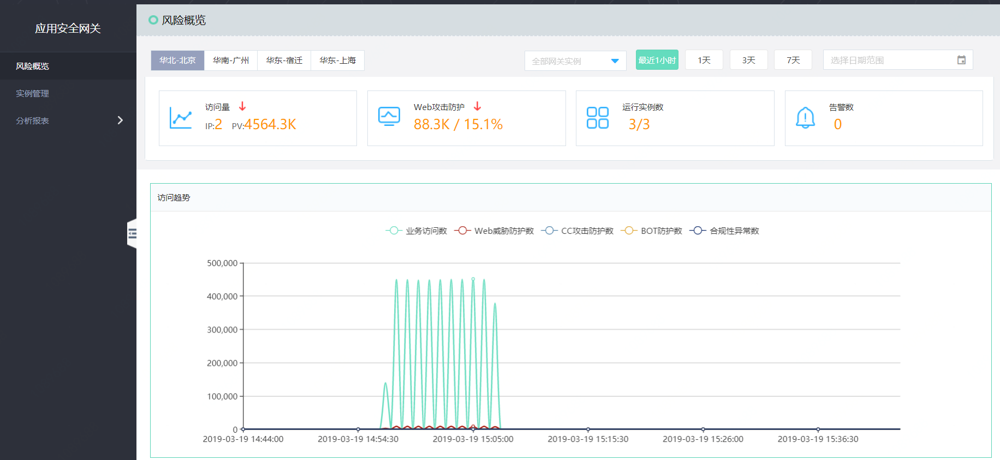

## Creation Description

Application Security Gateway (VPC-WAF) is a Web application security protection product based on JD Cloud high-performance load balancer cluster, which can create four types of instance packages: instance packages of trial version, basic version, advanced version and flagship version. A user can create multiple package instances to protect HTTP/HTTPs traffic passing through applied Load Balancer.

Currently, it supports the creation of the trial version, basic version and advanced version instances. Description on each package version can be seen in [Package Description](../Introduction/Specifications.md).

## Creation Steps

  #### 1. Create Instance
  
Enter JD Cloud **Console-Cloud Security-Application Security Gateway-Instance Management** page, and click**Create** to access the Application Security Gateway Instance Creation page:

  #### 2. Associate Application Load Balancer
  
Enter **Instance Creation** page, and fill in the name (name of Application Security Gateway); at this point, if there is an Application Load Balancer available, choose to associate it. Or, you can choose not to associate it but associate it after the instance is created successfully. Choose to associate it here.
  

 #### 3. Order Information Confirmation
  
 Confirm the purchase time. After confirmation, click **Buy Now** to purchase until the process is finished.

  #### 4. Creation Succeeded
  
 Return to **Instance Management** page; click **Refresh**, so that the Application Security Gateway instance created in the previous step can be seen.
  
   

     
  #### 5. Associate/Disassociate/Replace Application Load Balancer
  
If the Application Load Balancer is not associated in **Step 2**, click Instance List**Operate-Associate Load Balancer** and choose ALB to associate. If already associated, you can disassociate it, or replace another Application Load Balancer to associate.

 
 
If there is no available Load Balancer, it is required to go to **Console-Network-Application Load Balancer** page to create an Application Load Balancer, then perform the association operation. Detailed Application Load Balancer [Creation Process](https://docs.jdcloud.com/cn/application-load-balancer/create-instance)

   
 #### 6. Defense Mode Adjustment
 
 After the successful creation of the Application Security Gateway, it is in detection mode by default. After the instance is enabled, observe it for a while to make sure that the business is normal, then click the Instance List **Operate-More-Switch Mode** to switch the WAF protection mode as: interception mode. (The trial version does not support mode adjustment but supports detection mode only. You can see if there are exceptions or misinformation by viewing the Home Page or Analysis Report-Web Security Report)

  
  
 ## Result Confirmation
 
 #### 1. Attack Trigger
 
 After the instance has been created, enter the domain or IP corresponding to protection in the browser. Add **/etc/passwd** at the end, if following page pops up, it indicates that the protection has entered into force.
 
 
 #### 2. Protection Result View
 By viewing Home Page statistics and data on the Analysis Report page, if any data appears, it indicates that the protection has entered into force.
 
 Home Page Statistics
 
 
 
 Analysis Report Statistics
 
 

## Related References
- [Package Description](../Introduction/Specifications.md)
- [Billing Instructions](../Pricing/Price-Overview.md)
- [Creation Process of Application Load Balancer](https://docs.jdcloud.com/cn/application-load-balancer/create-instance)
