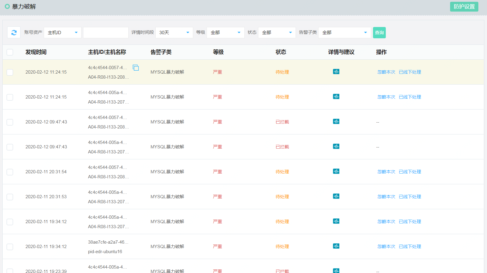
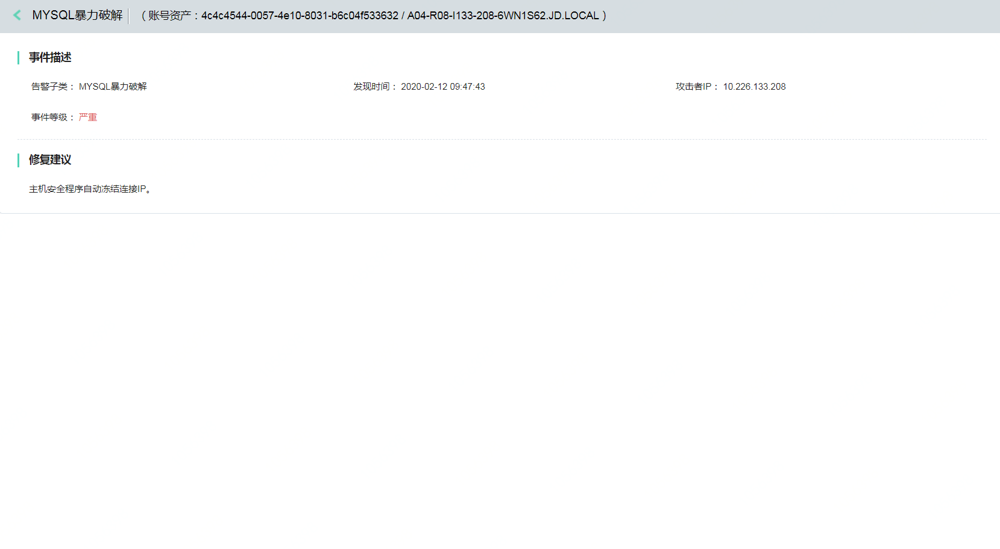
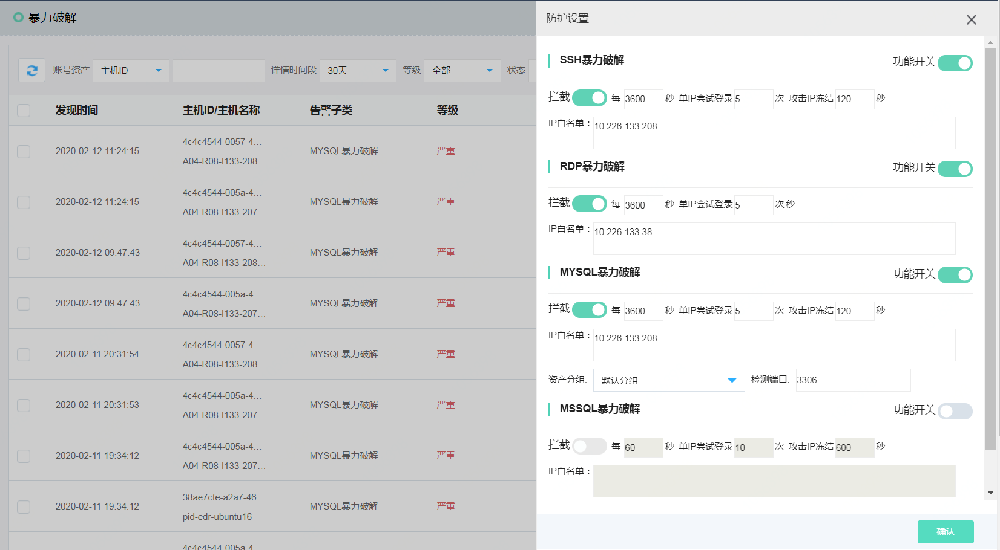

## Brute Force

#### Function Description

Include remote login brute force and database anti-brute force. Obtain IPs attempting to make brute force attacks via means such as system logs, network data package protocol analysis and ports, and judge if these IPs reach requirements of protection rules. If yes, they will be intercepted and reported to the proprietary cloud platform.
Support list:

| Main Items of Functions | Specific Items of Functions|Basic Version | Enterprise Version | 
|---- |-----|----| ----| 
| Brute Force       |   SSH Brute Force    | * | * |
|         | RDP Brute Force     | * | * |
|         | MYSQL Brute Force     | * | * |
|         | SQLServer Brute Force     | * | * |
| Brute force succeeded       |   SSH brute force succeeded    |   | * |
|         | RDP brute force succeeded     |  | * |

#### Portal of Features

Log in to Console->[Endpoint Security]->[Risk Discovery]->[Brute Force] 

#### Operation Guide

Click **Details and Suggestions** to view the details of security incidents and repair recommendations.

Click **Protection Setting** to enable/disable Brute Force and interception, and to set interception policies and IP white list.

