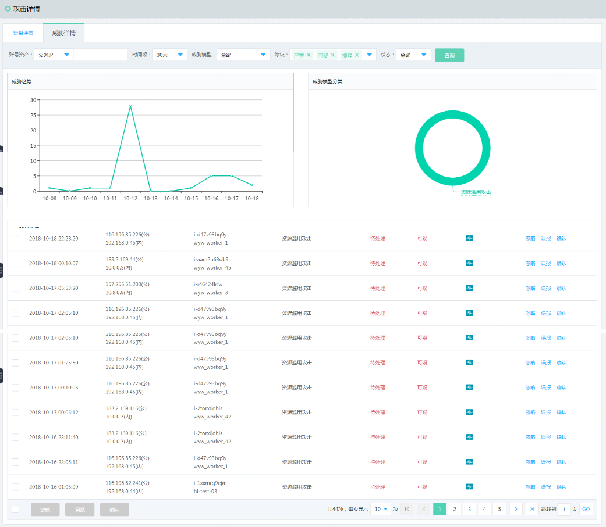

# Attack details

### Single attack event

#### Interface

#### Function description
Query based on account asset, time period of details, attack type, grade and processing status, list of event details and more details of event processing status are provided. At the same, details of specific events and fix-up suggestions are provided.

- Action steps
Cloud assets under your account of [JD Cloud]***\***@[jdcloud.com](https://jdcloud.com/) can be received via an SMS: *.win2012-bj; if the alarm event is found: The web is subject to DDoS attack, please log in JD Cloud-Situation Awareness for emergency response.

 - Quick search
Alarm events concerned can be quickly searched on the basis of account asset, time period of details and attack type. The event trend of recent period and of the same type can be conveniently viewed by the attack trend.
Click [Alarm Details] -> [Actions-> [Details and Suggestions] and the page will jump to the Details of specific attack type. View details of attack event and provide protection suggestions. Such suggestions shall cover the temporary solutions or the cloud security product.
If user deems that the problem can be solved by a temporary solution, please start the operation. If user deems that the problem solution can work, please click to purchase the solution. Or, the user can return to the home page if he/she deems that the solution can’t work.

  - Event processing
If the user makes the judgment based on details of the event feedback, please click corresponding buttons for false alarm, ignoring or confirming the event judgment. If the user attaches special focus on a certain event, the user can provide the feedback via a ticket. The backend operation and maintenance personnel of JD Cloud will analyze causes and provide answers.
Note: The event with the **Ignore** tag will not be displayed again the in the user console. The event with the **False Alarm** tag will be displayed again the in the console. Sometimes, when the user intends to search historical events, the filtration can be made on the level and status basis. The level can be divided into the emergency level and the convention level.

### Threat Analysis

#### Interface

  

#### Function description
Query based on account asset, time period of details, threat model, grade and processing status, list of event details and more details of event processing status are provided. At the same, details of specific events are provided.

- Action steps
Cloud assets under your account of **JD Cloud** ***\***@[jdcloud.com](https://jdcloud.com/) can be received via an SMS: [*.win2012-bj](https://login.xxx.com/); if the Web targeted attack threat is found, please log in JD Cloud-Situation Awareness for emergency response.

 - Quick search
Alarm events concerned can be quickly searched on the basis of account asset, time period of details and attack type. The event trend of recent period and of the same type can be conveniently viewed by the attack trend.
Click [Threat Details] -> [Actions] -> [Details and Suggestions] and the page will jump to the [Details of Threat Model]. View details of targeted attack events.
Click the attack event of each stage to jump to the Details of single attack event.
Click the backspace key to go back to the page of **Targeted Attack details**.

- Event processing
If the user makes the judgment based on details of the event feedback, please click corresponding buttons for false alarm, ignoring or confirming the event judgment. If the user attaches special focus on a certain event, the user can provide the feedback via a ticket. The backend operation and maintenance personnel of JD Cloud will analyze causes and provide answers.
        - Note: The event with the [Ignore] tag will not be displayed again the in the user console. The event with the [False Alarm] tag will be displayed again the in the console. Sometimes, when the user intends to search historical events, the filtration can be made on the level and status basis. The level can be divided into the severe level, the doubtful level and the prompting level.
