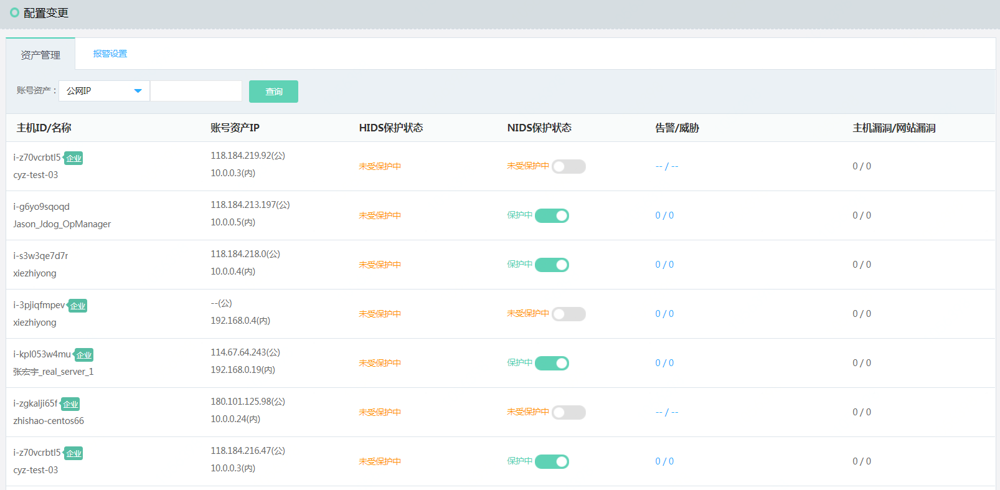

# Configuration changes

### Asset management

#### Interface 

#### Function description
As the machine-related threat events are introduced at the current stage, the concept of situation awareness asset is expanded to the combination of Internet IP and private IP. The search based on private IP and Internet IP is provided. The network detection engine on/off function is provided as well.

#### Action steps
The query based on EIP, private IP, machine IP, machine name, enterprise version and basic version is provided. Meanwhile, counts of alarms, threats, machine vulnerabilities and website vulnerabilities are associated.
Disable the network detection engine of a single EIP and click “Network Engine” to operate corresponding EIP.
Disable network detection engines of EIP in batches by using the OpenAPI function provided by the cloud situation awareness.
The installation status of the Endpoint Security software can be queried for the reported account asset IP. At the same time, click [Install Now] to jump to the security page of the machine security client.

### Event alarm
#### Interface

#### Function description
To quickly obtain threat event alarm by the user, the alarm is sent to the user via emails and SMSs.

#### Action steps
By **Configuration Changes**->**Alarm Setting**, the single event, alarm level of oriented attack event, notification method, notification time and notifier can be set. Alarm setting and sending statement: In order to improve user experience, a single virtual machine per day at most sends one SMS and a single account sends five SMSs per day. Email notification: up to 20 emails per day for a single account
