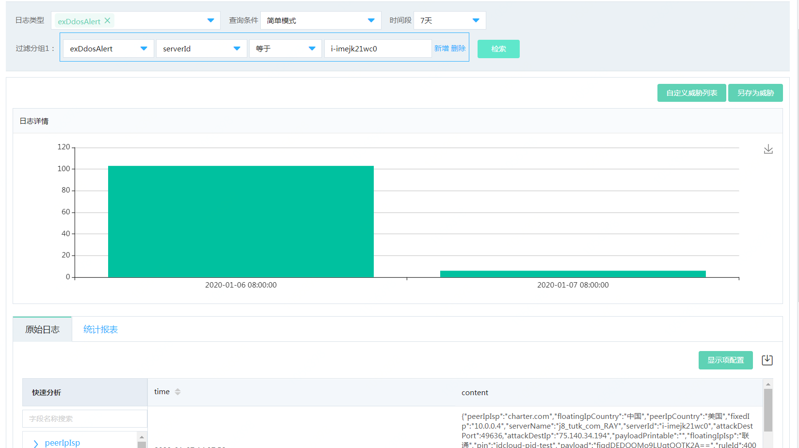
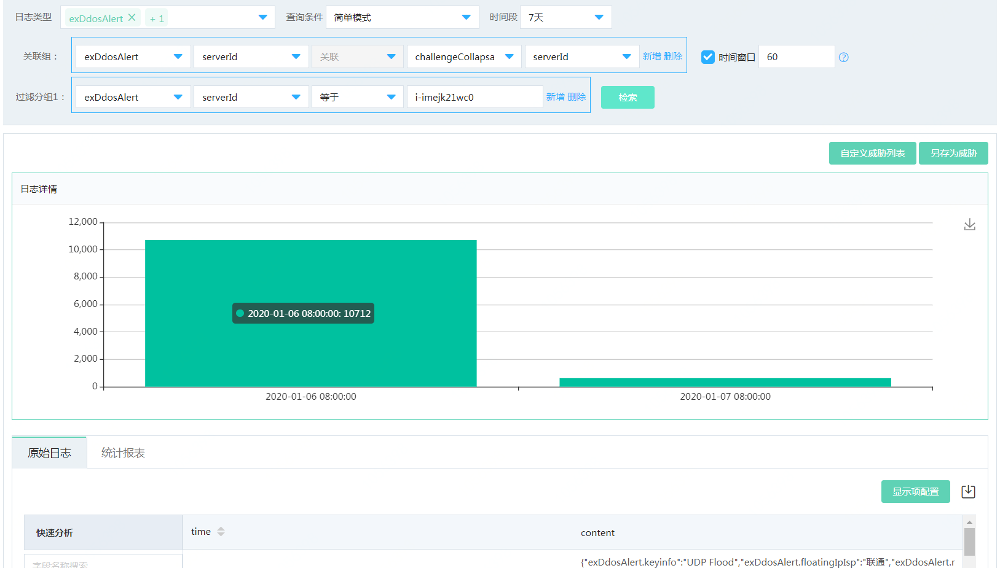

# Full Log Analysis

### Function Module Definition

Focusing on the core demands of enterprise users on management and search analysis in log set, JD Cloud Situation Awareness Team releases the full log analysis function to manage the existing basic log, alarm log and security log.
At the same time, users can apply functions such as customized threat retrieval, saving as threat alarm, log export, customized statement analysis, log status management, etc.

#### Function Description

The search methods consist of retrieval mode and real time mode.

Retrieval mode: retrieval mode is in fact to cyclically search the underlayer data, so you need to designate the search cycle. If the scheduling time is 1min. that means searching once in a minute. Currently, timed search is not support.
Real time mode: use real-time engine to process tasks in real time. Real time mode only supports processing time (proctime) currently, and does not support incident time (rowtime).

##### Simple Search Mode:

1. Simple filter search: mainly used for ETL

@1. Please first select the log type.
@2. Add a filter condition.

Detailed reference in both Chinese and English: field description

2. Association search: mainly used for real-time association of original logs

@1. Please first select the log type.
@2. Add an association condition.
@3. Add a filter condition.

Detailed reference in both Chinese and English: field description

##### Complex Search Mode:

1. Search statement standard sql92

2. Describe the substitute characters in the following searches:   

| Variable Name  |Definition |
|  ----  | ----  |
| table  |Table Name  |
| alias  | Alias |
| field  | Field |  
| relation  | Association Condition  E.g.: exDdosAlert.serverId=sufferBruteForce.serverId  |  
| condition |  Filter Condition  E.g.: serverId='i-kjewspceko' |   
| avgFunction  | Aggregate Function  E.g. count(*)  sum(age)  second refers to the seconds counted up in the window, e.g. 300 means 5 minutes; length refers to the length of the seconds counted up in the window, e.g. the counted window is 300 seconds, so the length=3   |

$avgFunction：

  | Name   |	Aggregation Algorithm    |   	Aggregation Method    |	Agreement     |
  |  ----  | ----  | ----  | ---- |
  |Count  	| count(A)    |     	A is a field in the table|	A is any type  |
  |Sum  	| sum(A)       |    	A, a field in the table| 	A is a value type  |
  |Maximize|	MAX(A)    |       	A, a field in the table |	A is a value type  |
  |Minimize	|MIN(A)     |      	A, a field in the table |	A is a value type  |
  |Average	|AVG(A)    |       	A, a field in the table |	A is a value type   |
  |Deduplication | 	count(DISTINCT A)|	A, a field in the table |	A is any type  |

3. Simple filter search: mainly used for ETL

Use Method

    select * from $table 
        [where $condition [(AND|OR) $condition]*]

Examples

    select * from exDdosAlert where serverId='i-kjewspceko'

4. Statistics search: used for aggregation statistics and filter after aggregation

Use Method

    SELECT $avgFunction FROM $table
        [WHERE $condition [(AND|OR) $condition]*]
        GROUP BY TUMBLE(proctime, INTERVAL '$second' SECOND($length))
        [, $field]*

TUMBLE refers to rolling window,
proctime refers to built-in time, fixed writing

Examples

    select * from (
        SELECT TUMBLE_END(proctime, INTERVAL '300' SECOND(3)) as     processtime
        , count(*)** as pvcount 
        FROM ccAttack 
        GROUP BY TUMBLE(proctime, INTERVAL '300' SECOND(3)), serverId
        ) where pvcount>5

The above search means the cc attack is aggregated according to serverId, in which the time window is five minutes and the number of log access >5
TUMBLE_END refers to the end time of the window

5. Association search: mainly used for real-time association of original logs

Use Method 1

    SELECT * FROM $table1 [AS $alias1], $table2 [AS $alias]
        WHERE $relation 
        AND $table1.proctime BETWEEN $table2.proctime - INTERVAL '$second' AND  SECOND($length) AND $table2.proctime + INTERVAL '$second' SECOND($length) 
        [(AND|OR) $relation]*
        [(AND|OR) $condition]*

Examples

SELECT * FROM exDdosAlert ,ccAttack where exDdosAlert.serverId = ccAttack.serverId AND exDdosAlert.proctime BETWEEN ccAttack.proctime - INTERVAL '100' SECOND(3) AND ccAttack.proctime + INTERVAL '100' SECOND(3) AND exDdosAlert.serverName='i-kjewspceko'

Use Method 2

    SELECT * FROM $table1 [AS $alias]
            [
                join $table2 [AS $alias]
                    on $relation [AND $relation]*
                    AND $table1.proctime BETWEEN $table2.proctime - INTERVAL '$second' SECOND($length) AND $table2.proctime + INTERVAL '$second' SECOND($length) 
                    [(AND|OR) $condition]*
            ]+
            [WHERE condition [(AND|OR) condition]*]

Examples

1. Dual-tables
SELECT t1., t2. FROM flowSession AS t1 
  JOIN exDdosAlert AS t2 ON t1.srcIp = t2.serverId AND t1.proctime BETWEEN t2.proctime - INTERVAL '100' SECOND(3) AND t2.proctime + INTERVAL '100' SECOND(3)
2. Multiple-tables
SELECT t1., t2. FROM flowSession AS t1 
  JOIN exDdosAlert AS t2 ON t1.srcIp = t2.serverId AND t1.proctime BETWEEN t2.proctime - INTERVAL '100' SECOND(3) AND t2.proctime + INTERVAL '100' SECOND(3)
  JOIN ccAttack as t3 ON t1.srcIP = t3.serverId and t1.proctime BETWEEN t3.proctime - INTERVAL '100' SECOND(3) AND t3.proctime + INTERVAL '100' SECOND(3)

6. Dimension table search: for association of security logs, the associated logs are offline data. If the search is based on real-time association, no result will be found in practice. For this scenario, in normal operations, the data in dimension tables should be associated through real-time data area. Currently, only two tables can be associated and the second one must be a dimension table

Use Method

    select * from $table1 as t1 
        JOIN $table2 FOR SYSTEM_TIME AS OF t1.proctime as t2 
        ON $relation [(AND|OR) $relation]* 
        [WHERE $condition [(AND|OR) condition]*]

$table2 must be a dimension table, which refers to a security log here, for instance baseline data, vulnerability data

Examples

    select * from sufferBruteForce as t1 
        join hostBaseline FOR SYSTEM_TIME AS OF t1.proctime as t2 
        on t2.serverId =t1.serverId 
        where t1.serverId ='i-kjewspceko'

7. Time sequence search: time sequence mode is applied to scenarios analyzing attack chains. The data input should be all incident data, rather than one of it. In such analysis, substitute specific alarms with alertlog for analysis

Use Method

    SELECT * FROM alertlog
    MATCH_RECOGNIZE '('
          [ PARTITION BY expression [, expression ]* ]   // Designate columns in partition, optional
          [ ORDER BY orderItem [, orderItem ]* ]      // Designate ordered fields, only support proctime currently
          [ MEASURES measureColumn [, measureColumn ]* ], equal to select, followed by fields required to be searched
          [ ONE ROW PER MATCH ]  // Every successful match will only produce one output incident;
          [ AFTER MATCH
                ( SKIP TO NEXT ROW   // After the match succeeded, the next match will begin from the next incident of the first incident in the successfully matched incident sequence
                | SKIP PAST LAST ROW // After the match succeeded, the next match will begin from the next incident of the last incident in the successfully matched incident sequence
                | SKIP TO FIRST variable // After the match succeeded, the next match will begin from the first incident corresponding to variable in the successfully matched incident sequence
                | SKIP TO LAST variable // After the match succeeded, the next match will begin from the last incident corresponding to variable in the successfully matched incident sequence
                | SKIP TO variable )
          ]
          PATTERN '(' pattern ')'    //Define rules that the incident sequence to be identified needs to meet. It needs to be defined in (), which is composed of a series of customized patternVariables: if a space is used between patternVariables, it means that incidents in consistent with these two patternVariables are next to each other and no other incidents in between; if -> is used between patternVariables, it means that other incidents can exist among incidents in consistent with these two patternVariables.
          [ WITHIN intervalLiteral ]   // Time range, which means how long does the analysis of attack chain need to be completed
          DEFINE variable AS condition [, variable AS condition ]*  // equal to where, followed by a filter condition
          ')'

Examples

    select * from alertlog 
        MATCH_RECOGNIZE(
            PARTITION BY serverId 
            ORDER BY proctime 
            MEASURES A.fixedIp AS A_FixedIp 
            ONE ROW PER MATCH AFTER MATCH SKIP PAST LAST ROW 
            PATTERN(A B) 
            DEFINE A as A.logType='exDdosAlert', B as B.logType='sufferBruteForce'

