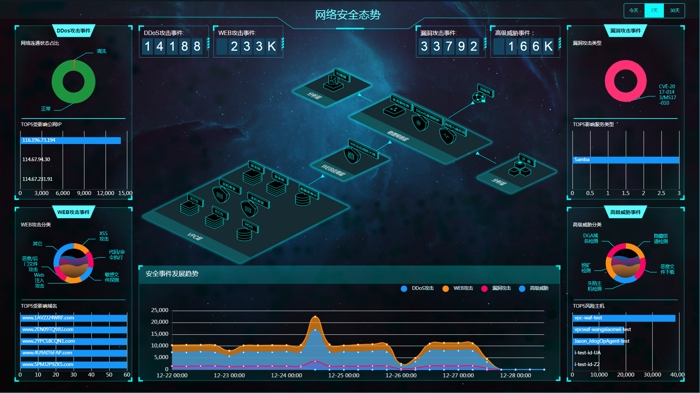

# Security Visualization Screen

### Function Module Definition

The security visualization screen is mainly used for helping the security operator make the security operation policies, visiting and inspecting by leaders of the enterprise or users of the industry as well as showing global security situation and other demands to the user. In this stage, the security visualization screen comprises: situation awareness overview and network security situation
, Endpoint Security Situation

#### Situation Awareness Overview

The visualization screen of situation awareness overview mainly specifies which security problems are confronted with the security team, which measure shall be taken by the security team and how to take the measures from the global view.

The visualization screen of situation awareness overview comprises: security indicators, visualization map of attack, Top 5 risk assets, Top 5 attackers, security incident development trend, incident statistics (warning/threat/vulnerability type distribution) and statistical status configuration (status time|alarm level setting)

Security indicator: The risk value is worked out by counting alarms, threats, vulnerability count of all Virtual Machines under the account, so as to get the security grade (high/medium/low risk), with the low risk <=40, the medium risk 40<x<=70 and the high risk 70<x<=100

Visualization map of attack: Provide a visual display of attack source, attack target and attack type, giving a sensuous perception of attack to security operators. Attack Display [Attack IP|Risk Asset|Alarm Type]

Top 5 risk assets: Provide the user with the acknowledge about the assets most likely subject to attacks, assets attached close importance by operators and possible attacks, to take rectifications according to security suggestions as soon as possible. At the same time, the proportion of affected asset shall be provided.

Top 5 attackers: Make the user focus on Top attackers, to block the IP high risk access via ACL, Security Group, JD Cloud WAF, etc., and to complete security response. Attacker calculation method: At first, the IP dimension is counted. The statistics shall be made from 4 aspects:

 * Intrusion detection (machine scanning, application scanning, application vulnerability attack	 and suffering to the brute force)
 * Web attack (Web injection attack, XSS attack, RCE, 	LFI/RFI, malicious/backdoor file attack, unauthorized access and sensitive file detection)
 * Compromised Host (external DDoS, external brute force, external suspicious connection, 	malicious software behavior, brute force succeeded and webshell detection)
 * Advanced threat (compromised host detection, DGA domain detection, malicious file download, hidden channel detection, mining detection and HTTP Anomaly Detection)

Security incident development trend: Make the user understand development trend of warning, threat and vulnerability and make a security policy planning to the JD Cloud business from the macroscopic perspective.

Incident statistics: Provide security incident distribution of warnings, threats and vulnerability of different levels

#### Network Security Situation

The visualization screen of network security situation mainly specifies which security problems are confronted with the security team, which measure shall be taken by the security team and how to take the measures from the network level.

The visualization screen of network security situation includes: the statistics of 4 aspects such as the DDoS incident, the Web attack event, the vulnerability attack event and the advanced threat incident. At the same time, the network security detection engine diagram and the network security incident development trend shall be provided.

 * DDoS incidents include: network connection status proportion (proportion of normal, black hole and clearing duration) and Top 5 affected EIPs.
 * The Web attack event includes: the Web attack type distribution and Top 5 affected domains.
 * Vulnerability attack event: vulnerability attack type and Top 5 service types affected.
 * Advanced threat incident: advanced threat type and Top 5 risk machines. 

#### Endpoint Security Situation

The visualization screen of Endpoint Security situation mainly specifies which security problems are confronted with the security team, which measure shall be taken by the security team and how to take the measures from the machine level.

The visualization screen of Endpoint Security situation comprises: the machine security description from two aspects, including the machine intrusion detection incident and the machine vulnerability.

 * The machine intrusion detection incident comprises: the attack type distribution, the real-time warning, the affected asset and the proportion of affected asset.
 * Machine vulnerability: Risk distribution, vulnerability distribution, affected asset and proportion of affected asset. 
 

