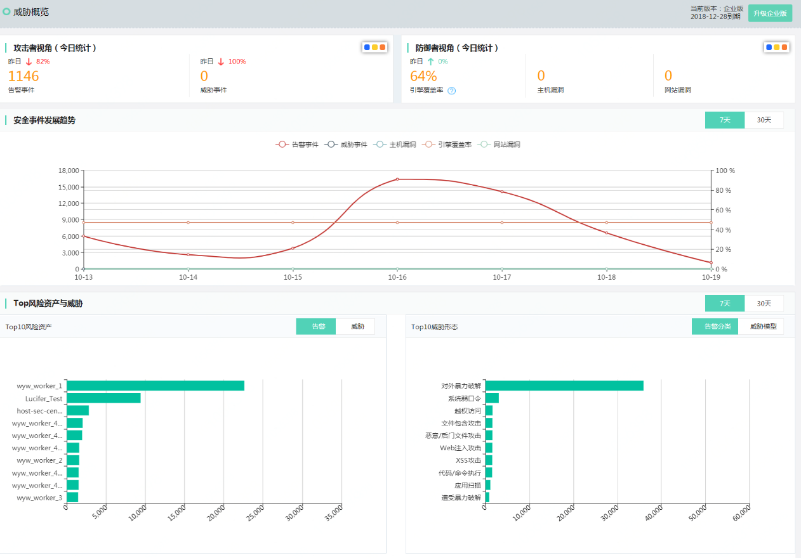

# Threat overview

### Interface

  

### Glossary

#### Alarm Event

Cover alarm events found during network invasion detection, Anti-DDoS Basic detection and Endpoint Security detection and the high-value alarm events found during adding threat intelligence, dynamic behavior analysis and machine learning.

#### Threat Event
The new attack events provided by JD Cloud and associated on the basis of big data of security threat model comprise real-time analysis events and off-line analysis events.

#### Engine Coverage Rate
It consists of starting coverage of the network invasion detection engine, the Basic Anti-DDoS detection engine, the endpoint security detection engine. The network invasion detection engine start coverage=EIP amount of enabled DIDS monitor/total amount of EIP under current use, machine security detection engine starting coverage = amount of cloud servers installed with machine security software/total amount of cloud servers under current user. The starting coverage of Basic Anti-DDoS protection is 100% by default, which can’t be adjusted manually. The weight is 1:1:1. The greater the coverage of engine starting monitor, the better the security incident capture capacity. Therefore, the security engine coverage is used for quantifying and balancing the starting rate. The best practice is 100%.

#### Weaknesses events
##### Machine Vulnerability

Self-check vulnerability of virtual machine from the perspective of the defender. Each vulnerability is called as a machine weakness event.
##### Website Vulnerability
Periodically scan the machine and the website according to the user’s asset configuration, help the user check the website health state, including opening of a high-risk port, information leakage detection, weak password, general vulnerability of web and dedicated vulnerability of web.

### Function description
Provide the lessee with the quantitative indicators about the service security status as well as alarm events and threat events from the attacker’s perspective, and indicator changes of engine coverage rate, machine vulnerability events and website vulnerability events from the defender’s perspective. At the same time, provide the 7/30d development trends of security incidents, Top10 risk assets summarized and counted as for alarm and threat events and Top10 threat forms summarized and counted as for alarm types and threat models.

The enterprise version upgrade entrance will be provided at the same time.

### Action steps
Log in the threat overview page by default, click the alarm event number of the attacker’s perspective and jump to the page of [Alarm Event Details]. Click the threat event number of the attacker’s perspective to jump to the page of the [Threat Event Details]; click the engine coverage rate of the defender's perspective to jump to [Configuration Changes]-> [Asset Management]; click the machine of the defender’s perspective to jump to the [Weakness Event]-> [Machine Vulnerability]; and click the machine of the defender’s perspective to jump to the [Weakness Event]-> [Website Vulnerability].
 *[Attack Event Development Trend] Click 7d or 30d to provide the alarm event, threat event, engine coverage rate, machine event, and website vulnerability number trend within 7 days or 30 days. The percentage is shown by the right-side coordinate, which is displayed as per the safety engine starting coverage rate. Move the mouse to “Everyday” and the alarm event, threat event, engine coverage rate, machine event and website vulnerability number will be displayed. 
 
  *Click one of the Top10 attacked assets and the system will carry IP filtration conditions of corresponding assets and jump to the page of [Alarm Event Details]. The statistic time period is 7d or 30d or is the time status selected actually.
  
  *Click one of the Top10 threat categories and the system will carry corresponding category filtration conditions and jump to the page of [Alarm Event Details]. The statistic time period is 7d or 30d or is the time status selected actually. 
