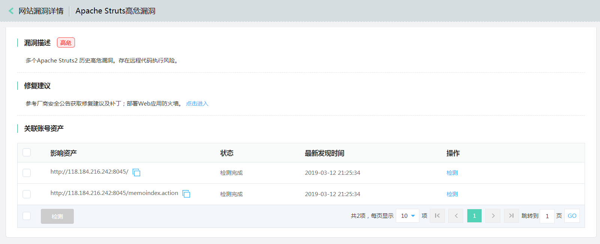
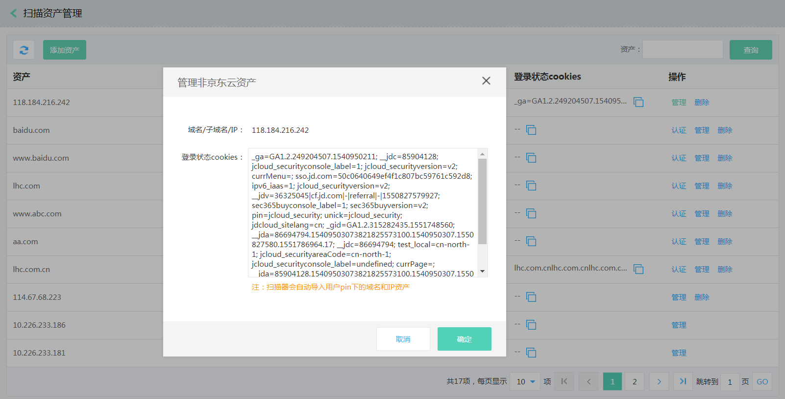
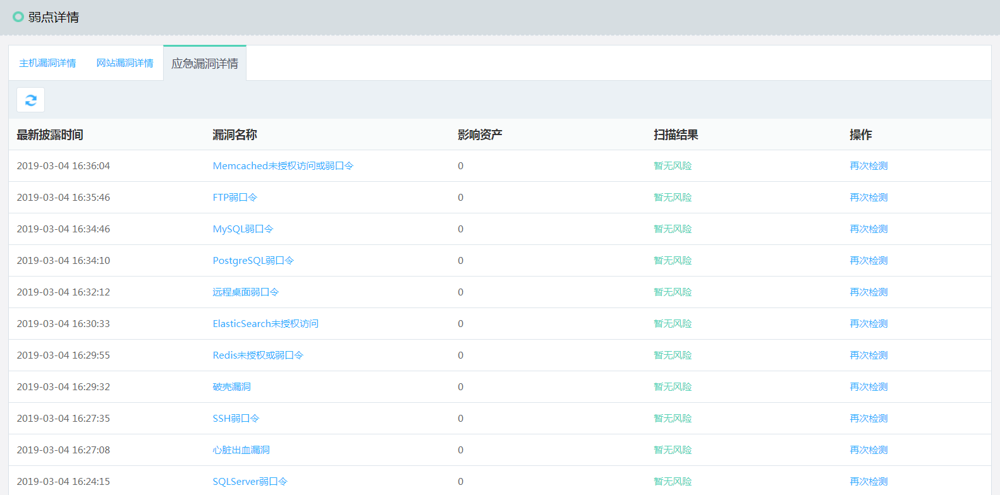

# Weakness details

### Machine Vulnerability Event

#### Interface

  
  

#### Function description
At present, the details based on machine vulnerability are provided and the machine weakness is exhibited to the user by using the vulnerability as the statistical dimensionality. Supervise and urge the user to fix up relevant vulnerability.

- Action steps
Click vulnerability name to jump to the **Vulnerability Details** and associated account asset.
Click the checkbox and fix up the vulnerability in batches.
Click fix-up action in the Windows system, Linux will provide fix-up suggestions and the user can fix up the vulnerability by itself.

### Website Vulnerability Event

#### Interface

  
  
  
  
  
   
  
#### Function Description
Combined with practical experience of white-box penetration testing, the website vulnerability module provides comprehensive website threat detection service to JD Cloud through advanced crawler and distributed technology. It can help users to shorten the time of detecting vulnerabilities in cloud assets and repair them in time to alleviate the further occurrence of hacker intrusion to a certain extent, while avoiding the loss of brand image and economy.

- Action Steps
In the Website Vulnerability List page, click the name of the specific vulnerability and enter the [Vulnerability Details Page]. Click **Detect** or **Detect Again** to start the manual detection process and observe the test results. Click **Scan Asset Management** to enter the Public IP under this account of the Scan Asset Management page. Domain resources associated to JD Cloud domain system will be automatically imported into the scanner, while the system provides import of non-JD Cloud asset domain and sub-domain, but requires verification to ensure ownership of website. Click **Verification**. Domain is process by the method of cname while sub-domain is process by uploading the verification file. Website vulnerability module also provides login account scanning. Click **Manage** and fill in the cookies to achieve its function.

### Emergency Vulnerability Event

#### Interface

  
  

#### Function Description
When a critical vulnerability occurs, the operation team of JD Cloud Security will provide an emergency vulnerability verification POC to help the user quickly check the health status of the server, shorten the time of detecting vulnerabilities in cloud assets and repair them in time.

- Operation Steps
In the Emergency Vulnerability List page, click the name of the specific vulnerability and enter the details page of the individual vulnerability. Find the asset that needs to be detected through search function. Click **Detect** or **Detect Again** to start the manual detection process. Observe the detection result.
