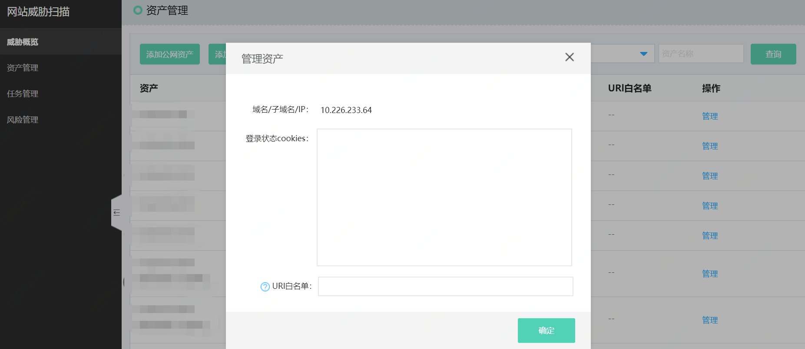
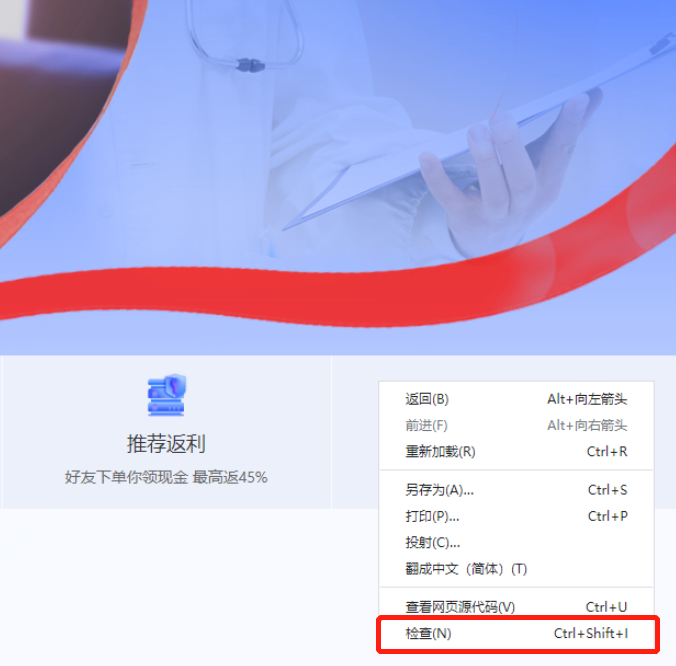

# Add Public Network Asset to Be Scanned

## 1. Support of Public Network Assets:

- Support IP and domain assets
- Support HTTP and HTTPS protocols
- Support multilevel subdomain websites
- Support multilevel subdirectory websites

## 2. Public Network Asset Addition Scenarios:

### (1) Scenario 1: Add assets registered under JD Cloud & AI Domain Resolution Service

Information on domains/subdomains registered under JD Cloud & AI Domain Resolution Service is automatically imported, without manual addition and certification.

### (2) Scenario 2: Add assets registered under the account

Public network IP addresses registered under the account are automatically imported, without manual addition and certification.

### (3) Scenario 3: Add assets registered under other domain resolution services

Information on domains/subdomains not registered under JD Cloud & AI Domain Resolution Service shall be manually added and certified.

- Domains added shall be certified by CNAME
- Subdomains added shall be certified by files

## 3. Operation Steps:

### (1) Step 1: Add public network asset

Enter the Website Threat Inspector Console, click **Asset Management** in the left navigation bar, and on the website management page, click **Add Public Network Asset

Note: You can automatically associate and find the domain and asset under the same account without manually adding them

### (2) Step 2: Fill in asset information

Domain/Subdomain/IP: Select the asset type to be added according to your website access method (e.g.: example.com, test.examlple.com, 116.196.104.180)

Asset Detection Frequency: Detect if the asset verification status is valid or not; the default frequency is 1 hour and can be modified manually

### (3) Step 3: Verify public network asset

Note: If the added asset is not an asset registered under JD Cloud & AI's domain name resolution service, you need to add and verify it manually.

- ##### Primary Domain Verification Scenario

To add a primary domain (e.g.: test.com), you need to click **Verify** to pop up the verification notification and generate the CNAME information, and then you need to add the new CNAME resolution record c443df2c1b574708bd0f398254e6e93c.test.com under your primary domain to f5ed337b81af2efc9ca0e3d6d2d504c0.verify.scanner.jdcloud.com in order to finish verification of the added asset.

- ##### IP/Subdomain Verification Scenario

To add a subdomain (e.g.: test.test.com), you need to click **Verify** to pop up the verification notification and then you need to download the verification file and add it to your website directory (http ://test.test.com/af27f275a3584c7bb53414515d2900bd.txt) in order to finish verification of the added asset.

### (4) Step 4: Configure assets required login

If some of your assets or partial contents in an asset can only be viewed after you logged in, we recommend you additionally configure such contents (cookies after logged in) before starting a scan task so as to complete an overall scan.

The product supports managing login status of assets, filling in login status information for your target asset, and can help deeply detect the vulnerability risk after an asset is found being logged in when the login status cookies of the target asset is configured.

Add the asset to be logged in, click **Management** to pop up the Manage Asset interface, and fill in the login status cookies.

> ##### How to fill in the login status cookies?
>
> 1. Please use Chrome browser to log in your website first, access a page that requires login before access continues, and use F12 key or right click on the page to select **Check**.
>
> 
>
> 2. In the Developer Tools, select **Network-All** and refresh the page.
>
> 
>
> 3. Click the first network request. Find "Cookie" in the "Headers", copy its value and paste it to the "Login Status Cookies" in the login simulation popup.
>
> 

### (5) Step 5: Configure URI white list

URI White List: Means that the Website Threat Inspector is prohibited from accessing when the page address includes these keywords to prevent logout or management background access.

By configuring URI white list, you can designate the page not to be crawled by the product, e.g.: /logout.php, fill in logout here. 

The matching mode is perfect matching, in which logout1.php will not be excluded.

