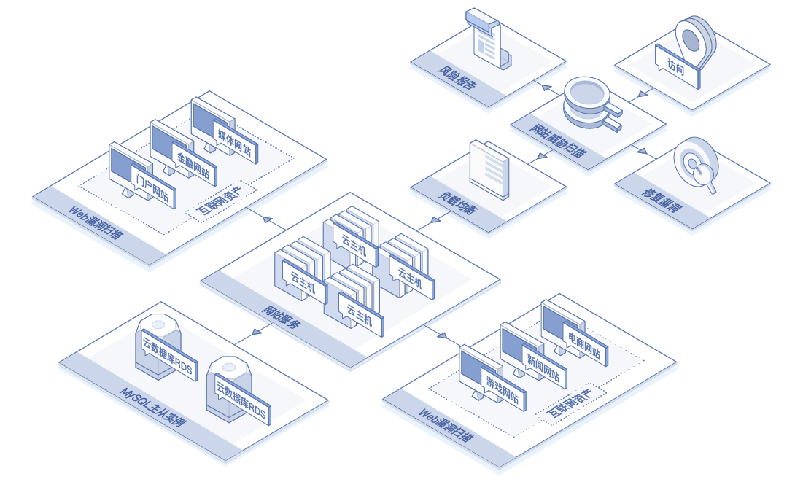
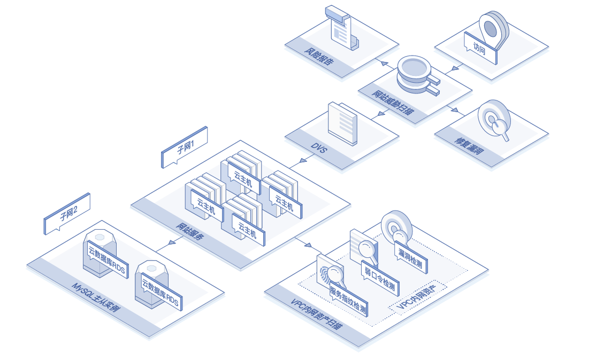
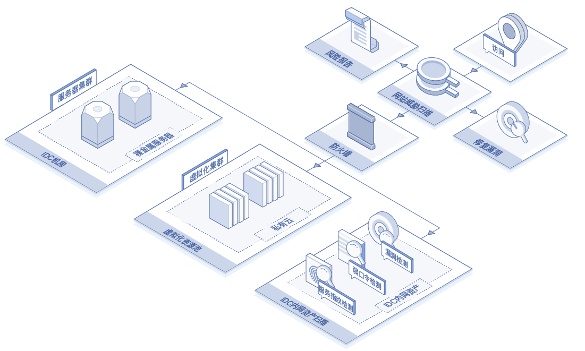

# Application Scenarios

- **Application Scenarios of Enterprise Website Scan**

  As more enterprises are facing increasing new threats and attacks, the security of Web application, which is the most important application form on the Internet, directly influences the sustainability of business development.

  Vulnerabilities and weakness will be easily utilized by the hacker and attacked, causing bad influence and economic loss. Based on data analysis and statistic model and advanced vulnerability scan engine, Website Threat Inspector can output full-scale vulnerability test report for enterprises and provide professional fix recommendations, efficiently protecting vulnerabilities from being utilized by hackers.

  The product can scan regular vulnerabilities, process abundant vulnerability rules database, provide overall and deep vulnerability scan for different kinds of websites, and produce professional and comprehensive scan reports; besides, it can scan the latest emergency vulnerabilities and the newly discovered 0-Day vulnerability, in which case, the security experts will immediately analyze the vulnerability and update the rules, and offer an instant, professional vulnerability scan plug-in.

- **Application Scenarios of Cloud VPC Intranet Scan**

  With the migration and JD Cloud Onboarding of an enterprise’s own businesses, the cloud network topology is generally divided into business access, Internet access and management access. Various application systems in the cloud are encapsulated in the VLAN of VPC. Currently, most public vulnerability scan solutions are exposed to public network IP or domain via Internet scan. The cloud network architecture is beyond the control of most enterprises.

  Considering this, JD Cloud & AI's Website Threat Inspector launched the scenario of supporting threat scan for assets of cloud VPC intranet. Further, the overall security situation in cloud can be assessed with the product in combination with Situation Awareness. In this way, the product can discover the intranet asset vulnerability ahead of the hacker, reduce attack surfaces of intranet and decrease lateral attack penetration risk of cloud intranet.

- **Application Scenarios of External IDC Asset Scan**

  In the process that an enterprise gradually migrates its businesses to JD Cloud, some of its businesses have been migrated to JD Cloud, while some are still kept in the local data center or hosted in the IDC Data Center for a long period. However, this undoubtedly increases great work load about asset vulnerability risk management, operation and maintenance to operation and maintenance personnel of such enterprise.

  Considering this, JD Cloud & AI's Website Threat Inspector launched the scenario of threat scan supported by assets of a user’s IDC Data Center. Only after the rapid deployment probe is rapidly downloaded and manual deployment is made in the external IDC link, you can intensively manage vulnerability risk statuses of externally distributed IDC assets with the Website Threat Inspector of JD Cloud & AI.

