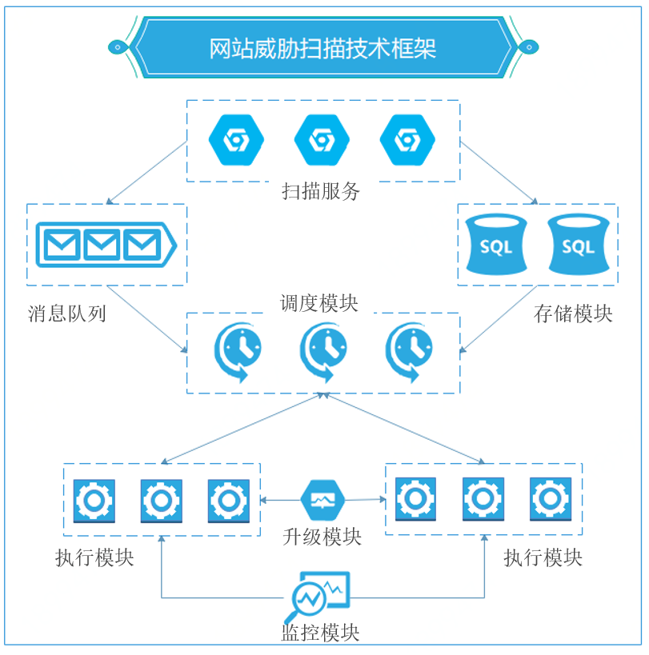

# Product Architecture

## Loose Coupling Design Concept

Website Threat Inspector is designed under the concept of loose coupling and is mainly divided into three modules, i.e., API, scheduling and execution; Redis and MySQL are used as ways of data storage. The components have the following functions:

| Module             | Function                                                         |
| ---------------- | ------------------------------------------------------------ |
| API Module          | API is used to connect to services and all requests for configuring product and getting category are carried out through APIs.  |
| Scheduling Module         | Scheduling is the "core" module of the product and used to execute works such as unit information collection, status monitoring, task acquisition and task assignment |
| Execution Module       | Execution is mainly designed to execute tasks assigned by the scheduling module and store them in the database through APIs. |
| Redis   Storage Module | Redis mainly stores some temporary information during running, for instance, when a task is running, the statuses and results of the tasks required to be read and written frequently are stored in Redis. After a task is over, the data content in Redis will be synchronized to MySQL |
| MySQL Storage Module    | MySQL stores all scan tasks and the scan result information                           |
| Component Upgrade         | POC plug-in and execution component support hot update and upgrade, with the upgrade file stored in the file center. |

## Module Execution in Steps

The execution module of Website Threat Inspector is executed in steps:

- Each of the steps can be used independently and scanned, and loose coupling happens between the steps.
- It is also supported that some execution components rely on the result of the preceding execution components.
- For example, scanning vulnerabilities in ports can rely on the results of port scan and port fingerprints, which can enhance the scan accuracy and speed.

## Distributed Architecture Design

Website Threat Inspector is provided with a distributed architecture, which coincides with the characteristics of **consistency**, **availability** and **partition tolerance** and can provide high-quality and highly stable scan service.

- The task assignment and task execution operate in separated modules. A task status monitoring mechanism is predesigned to ensure any wrong tasks will be re-assigned to guarantee business continuity.

- There is a monitoring mechanism for working resources of execution module. If the machine status of execution module is unavailable, the scheduling will exclude this machine from the availability list, and won’t assign tasks to it any more.

-  The product adopts multi-regional, active-active and multi-active deployment to effectively ensure service continuity, which means when a machine in a region breaks down, the product can still provide services normally.

-  If no scan tasks are running currently or the running scan tasks are few, the execution module will be in the sleep mode. This will reduce invalid resource consumption. When a new task is assigned, the execution module will be intelligently awakened to execute a scan task in accordance with the task conditions.
- Below is the working time sequence diagram of the product, setting out the simple working process of the execution module

