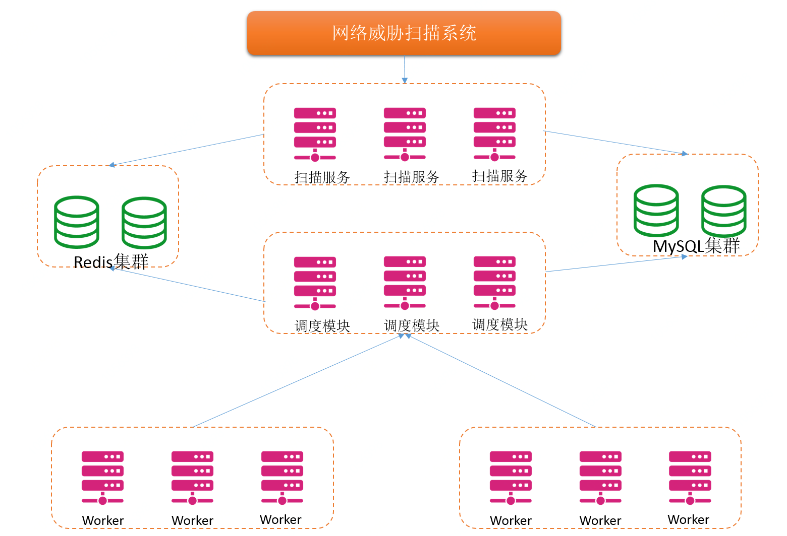
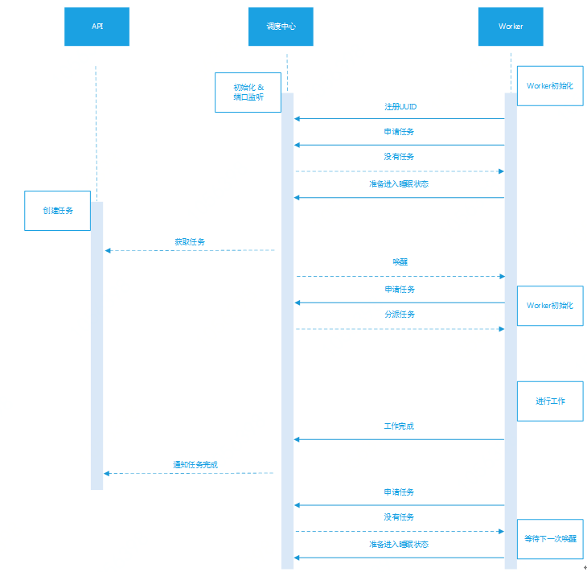

# Product Architecture

1. 	 The website threat scan product is designed under the concept of distribution and loose coupling and is mainly divided into three modules, i.e., API, scheduling and Worker, and Redis and MySQL are adopted for data storage. The components have the following functions:  
a) 	 API is in charge of all services, and all requests of the setting and acquisition categories are carried out through APIs.  
b) 	 Scheduler, as the core of "scan", is in charge of collecting and monitoring worker information and acquiring and distributing tasks.  
c) 	Worker is mainly designed to "work", i.e., execute the task assigned by scheduler and store it in the database through APIs.  
d) 	 Redis mainly stores some temporary information during running, for instance, when a task is running, the statuses and results of the tasks required to be read and written frequently are stored in Redis. After a task is over, the data content in Redis will be synchronized to MySQL.  
e) 	 MySQL stores all the task and result information.  
f) 	 The POC plug-in and worker component support hot update and upgrade, with the upgrade file stored in the file center.  
2. 	 The Worker part of the website threat scan product is executed in steps,  
a) 	 Each of the steps can be used independently and scanned, and loose coupling happens between the steps.  
b) 	 However, it is also supported that some Worker components rely on the result of the preceding Worker components. For example, the results of port scan and port fingerprints can be relied on for scanning vulnerabilities in ports, enhancing the scan accuracy and speed.   
3. 	 The product has a distributed architecture, coincides with the characteristics of consistency, availability and partition, and can provide high quality and highly stable scan service
a) 	The task assignment and execution task submodules work, and there is a task status monitoring mechanism guaranteeing any wrong tasks will be re-assigned  
b)	 There is a monitoring mechanism for working resources of Worker. If the machine status of Worker is unavailable, scheduler will exclude the machine from the availability list, and won’t assign tasks to it any more.  
c)	 Multi-regional, active-active and multi-active deployment is adopted, ensuring that service can still be provided normally in case a machine in any of the regions breaks down  
d)	 If no tasks are running currently or the running tasks are few, Worker will enter the sleep status. Meaningless utilization of resources is reduced. Worker will be awakened to work as the case may be, when a task is assigned.  
e)	 The working time sequence diagram of the product is set below. It clarifies the simple working process of worker  

