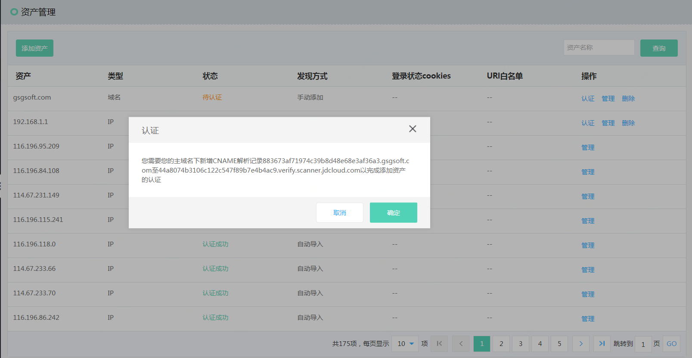
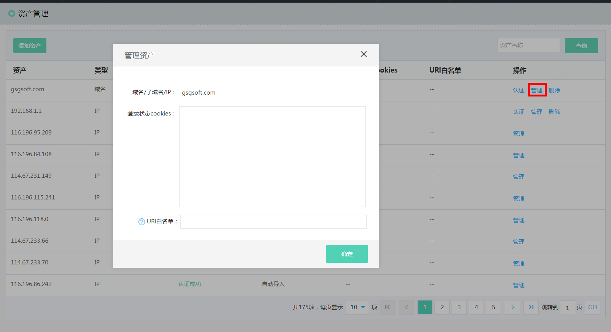

# Asset Management

### Interface

  

### Add Public Network Asset to Be Scanned

[Scenario 1]: Website Threat Inspector will automatically import the information about the domain/sub-domain registered under JD Cloud & AI's domain resolution service, requiring no verification. At the same time, adding asset cookies is supported (after an asset is added, click **Management** to add cookies information).

[Scenario 2]: Website Threat Inspector will automatically import the public IP address registered under your user PIN account, requiring no verification. At the same time, adding asset cookies is supported (after an asset is added, click **Management** to add cookies information).

[Scenario 3]: You need to manually add the information about the domain/sub-domain registered under JD Cloud & AI's domain resolution service (it is verified by CNAME if a primary domain is added or by files if a subdomain is added), requiring verification. At the same time, adding asset cookies is supported (after an asset is added, click **Management** to add cookies information).

### Verification Management

First, add the relevant verification information based on the verification scenario, and then manually click **Verify**.

[Domain verification scenario], click **Verify** to generate cname information, with one cname record generated by one PIN, and you need to log in your domain resolution service to add the relevant generated cname information.  

  

[IP/Subdomain verification scenario], click **Verify** to generate the asset verification file. One PIN generates one verification file, and you need to log in your website to add it to the root directory of the website.  

  

 ### Add the cookies login status & URI whitelist

 Click **Manage** to enter the URI whitelist and cookies login status management

   

 
