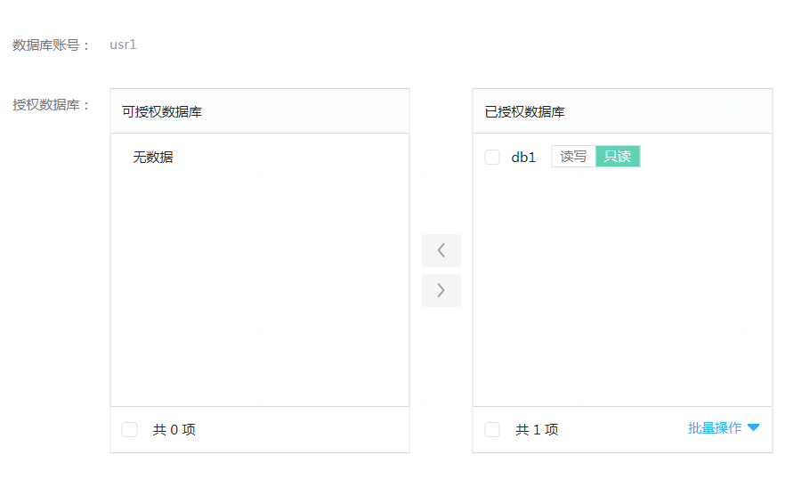

# Set Permissions

## Permission Description
DRDS has added two new account permissions to set operations related to read-write separation. The account permission is specified as follows:
- rw: It has read-write permission to the database primary node and all SQLs are sent to RDS MySQL primary node.
- ro: It has read permission to the database primary node and all SQLs are sent to RDS MySQL primary node.
- rws: It has read-write permission to the database primary node and read permission to the read-only nodes; in accordance with the [Automatic Read-write Separation Rules] (users may refer to relevant parts in DRDS Read-write Separation Overview), some SQLs are forwarded to the read-only nodes of RDS MySQL and the remaining SQLs will be sent to RDS MySQL primary node.
- ros: It has read permission to the database read-only node and all SQLs are forwarded to the read-only nodes of RDS MySQL. If a RDS MySQL has no read-only node, an error will be reported when SQLs are executed.
rws and ros are related to read-write separation. If a user needs to use read-write separation function, he or she needs to grant permissions to the corresponding database account.

## Operations
**1. Enter **Account Management** page**

Click the instance name to enter Instance page, select **Account Management** page, click **Modify Permission****

**2. Set Permissions**

Set Permission Information of Account

