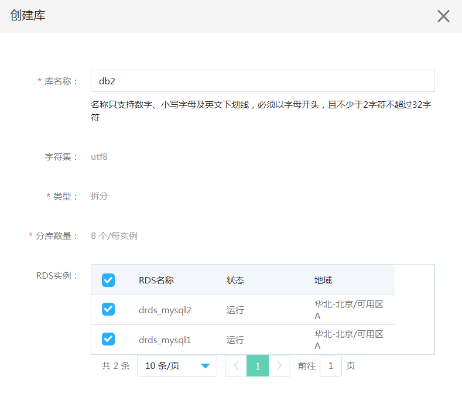

# Create Database

**1. Enter **Database Management** page**

Click the instance name to enter Instance page, select **Database Management** page, and click **Create Database****

**2. Enter relevant information of database**

**Database name: ** database name, the rules of database name are prompted on the console

**Character Set: ** The following character set is supported at present:
- utf8
- utf8mb4
- gbk
- latin1

**Type: ** only supports "split", i.e., the database will be corresponded to multiple databases of multiple JCS for MySQL instance

**Number of Sub-library Per Instance: The number of sub-libraries to be created on each RDS MySQL can be customized. Currently, each RDS Instance supports 8~64 sub-libraries.

**Select backend JCS for MySQL instance**

All MySQL instances under VPC in the DRDS will be listed; DRDS will automatically create databases of corresponding count on each MySQL instance and save the corresponding relations. For example, if 4 instances have been selected and there are 8 sub-databases on each instance, then DRDS will create 8 databases on each of these instances, totally 32; if 10 instances have been selected, then 80 databases will be created in total.

Users need not to create each sub-database on MySQL by manual

