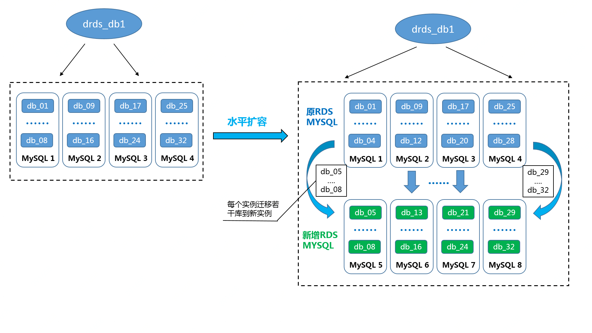

# Overview of Horizontal Expansion of Database

The database of DRDS is a logical database, and the data is actually stored in the physical database of multiple RDS MySQL at the backend of the logical database. By default, DRDS database will create 8 MySQL databases on each RDS MySQL corresponded. 

For example, if a user creates 1 DRDS: drds_db1, and 4 RDS MySQL instances are selected while creating; then the DRDS will create 8 databases on each instance, with a total of 32 MySQL databases.

As the database and business volume of the user grow, the original 4 RDS MySQL instances are gradually unable to afford the user's business, which requires a ** horizontal expansion of the database: i.e., adding a new RDS MySQL instance and
migrating part of the original MySQL databases to a new RDS MySQL instance, to achieve a dual enhancement of storage capacity and processing capacity **.  

For example: In the above example, add additional 4 RDS MySQL instances and migrate 4 of the 8 sub-databases on the original RDS to the new RDS MySQL instance.
Finally, the architecture of the DRDS database backend for 8 RDS MySQL instances with 4 sub-databases on each instance is formed. In this way, the load that was borne by 4 RDS instances previously changed to be borne by 8 RDS instances, so the processing capacity of the whole system gets enhanced.

