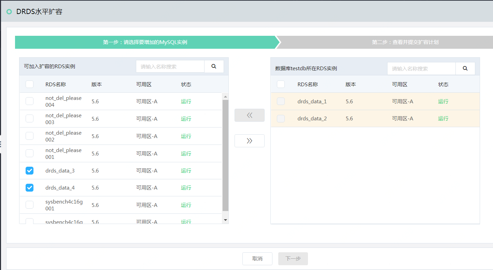
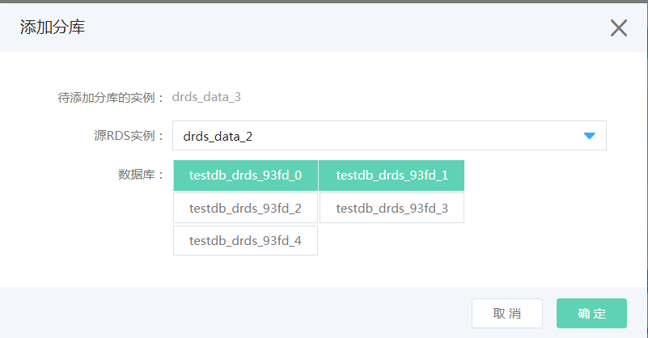

# Horizontal Expansion of Database

**1. Operation entry**

- In the database list, click **Horizontal Expansion** link on the right of the database

- Or click **Horizontal Expansion** in the database details page

**2. Add new RDS instance**

Select the newly added instances from the RDS MySQL instance on the left. The system will generate a capacity expansion plan based on the quantity and specifications of the newly added instances. When there are many instances, it will take a few seconds to generate the expansion plan. Please wait for a while.
If the generation of expansion plan fails, please view the [FAQ](https://docs.jdcloud.com/en/drds/faq)

**Note: For the stability of the system, the RDS MySQL version where the database is located must be consistent**

**3. View the expansion plan**

The system will generate the recommended expansion plan, showing the database distribution after the expansion, as shown in the following figure.

**4. Adjust the expansion plan**

The user can adjust the expansion plan according to the actual business specifications.

- Click **"X"** at the top right of the database in the "Add New Instance", then this database can be removed from the expansion plan of this instance. The removed database will be returned to its original instance.

-  Click **"Add Sub-database"** link in the right table in the "Add New Instance" line, then the sub-databases on other original instances can be added to the this instance.

**5. Execute the expansion plan**

When the adjustment is complete, click **Confirm** to execute the expansion plan. The execution of the expansion can be viewed in the **"Expansion Task"** page
