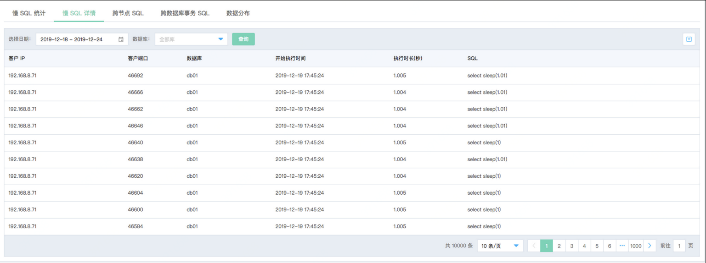
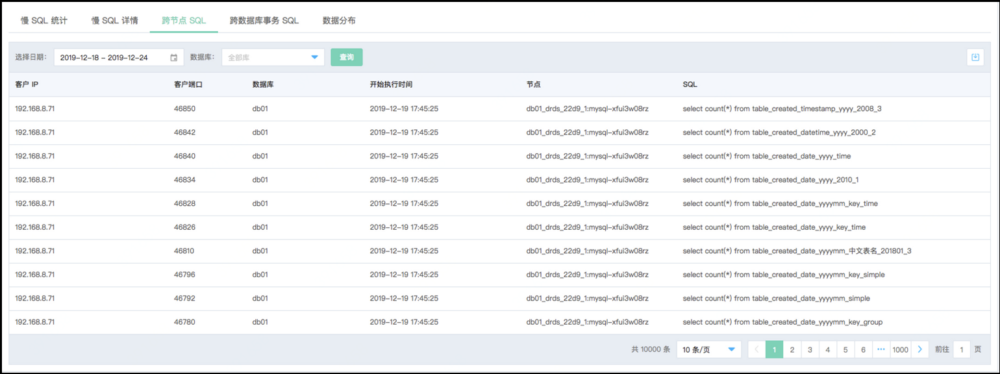

# Feature Introduction
Implementations of SQL can be counted from several perspectives to help users find problematic SQL and potential performance bottlenecks for targeted optimization.  
Currently, JD Cloud DRDS can provide the implementations of SQL of the following types and data statistics.
- Low SQL Statistics
- Low SQL Detail
- Cross-node SQL
- Cross-database Transaction SQL
- Data Analysis

Can search data within 7 days, and all searched results can be downloaded as csv files. For performance reasons, file downloads currently support up to the first 100 records.

#### Definition of Low SQL
Low SQL means SQL with executive time >=1 second, namely, the time that DRDS receives the client's SQL and returns the result to the client, including the processing time of DRDS and execution time of RDS MySQL.

## I. Low SQL Statistics
Count the number of times that each slow SQL occurs in the specified time period to help extract the TOP SQL that occurs most frequently and deserves the most attention

## II. Low SQL Detail
It provides details of slow SQL execution, including information such as customer's IP, SQL execution time and execution time. You can optimize the SQL accordingly based on the information.

## III. Cross-node SQL
This is a potential SQL optimization point. In theory, SQL sent by the client is most efficient when executed on a single node at the backend. If the SQL execution requires access to multiple RDS nodes at the backend, DRDS is required to merge, sort data, and there will be some performance degradation. Therefore, this feature can help find which SQL accesses multiple RDS MySQL nodes upon actual execution.

## IV. Cross-database Transaction SQL
Similarly, an SQL sent by a client may be split into several SQLs in the backend and forwarded to different RDS MySQL nodes for execution; if those SQLs are in the same transaction, some potential problems may be caused, such as deadlock diffusion.

## V. Data Analysis
The data of the same table is split and put into different RDS MySQL databases at the backend so the numbers of data in different databases are different. The feature can visually show the data distribution of certain table in different databases so as to effectively find data skew and severity.
 
 
