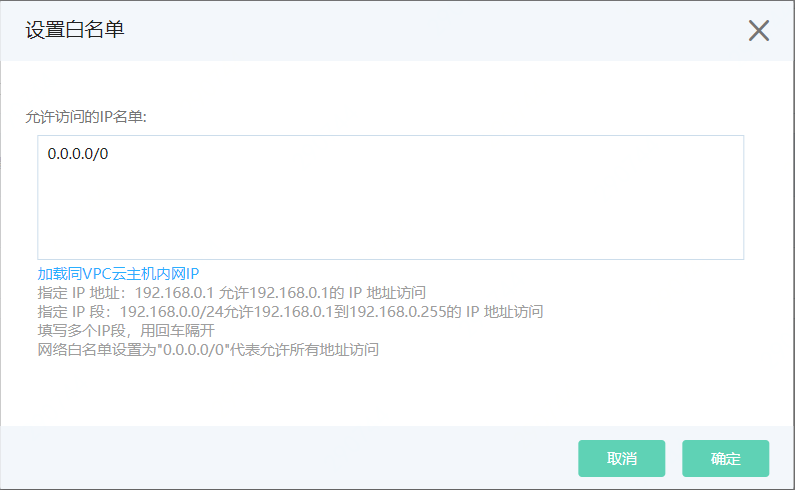
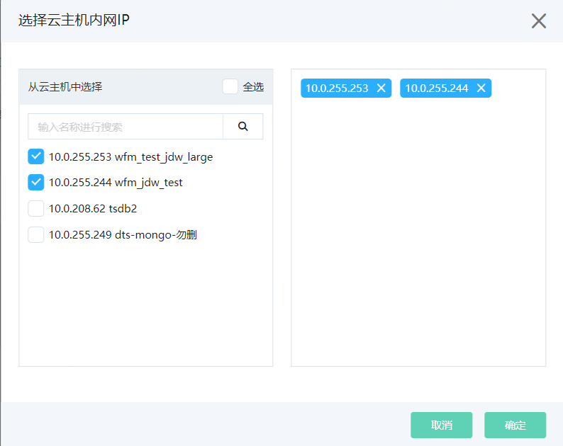

# Set whitelist

JCS for InfluxDB supports whitelist setting and you can precisely control access source through the whitelist.

After the InfluxDB instance is created, 0.0.0.0/0 will be added in the whitelist by default. This means that there is no restriction to IP access. For database safety, you can add the IP address of access source or IP segments to the whitelist after the instance is created.

## Use Restrictions

- Now, maximum 100 IP addresses and IP segments can be added to each InfluxDB instance.

## Preconditions

- The InfluxDB instance is in the state of running and normal billing status.

## Operation Steps

1. Log in [InfluxDB Console](http://tsds-console.jdcloud.com/list).

2. On the "Instance List" page, select the target instance and click ** Instance Name** to go to the "Instance Details" page.

3. On the "Instance Details" page, click **Security Management** to go to the whitelist setting page.

   

4. Click **Set Whitelist** to open the setting popup.

   You can manually complete IP or IP segments or directly load Private IP of Virtual Machines.

   - Manually fill in IP or IP segments

     

     - Assigned IP address: 192.168.0.1 access of IP address 192.168.0.1 is allowed
     - Assigned IP segment: 192.168.0.0/24 (access of 192.168.0.1 to 192.168.0.255 is allowed)
     - Please separate multiple IP segments with enter key.
     - The setting of network whitelist "0.0.0.0/0" means access to any address is permitted.

   - Upload private IP of virtual machine 

     - Click **Load Private IP of Virtual Machines** on the left bottom of the popup to enter the "IP Selection Popup".
     - The Virtual Machines IP which is currently in the same VPC of InfluxDB instance is displayed at the left side of the popup. You can realize quick selection with **All** and the search box. The selected IP will be displayed at the preview area at the right side.
     - After selection, click **OK**.
     - The selected Private IP of Virtual Machines will be automatically loaded to a textbox.

5. After edition, click **OK** to finish setting.

6. The set whitelist will take effect in 1 minute. Then, you can view the current IP setting on the whitelist setting page and adjust the setting at any time according to business changes.