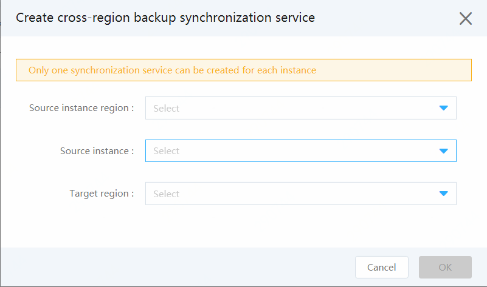

# Create Cross-Region Backup Synchronization Service

Cross-region backup synchronization service is a cross-regional data synchronization solution provided by JD Cloud. It can synchronize the full backup and incremental backup of the instance to the geographic area you specify, and support the rapid creation of new database instances based on backup data. With this service, you can easily achieve data offsite disaster recovery.

This article describes how to create a geography backup synchronization service through the console.

## Precautions

- An instance can only create a cross-region backup synchronization service.
- The backup data of the target region is retained for 7 days, and you can select a data time point within 7 days to create a new instance.
- If the source instance is deleted, its corresponding cross-region backup synchronization service will be deleted.
- After the cross-region backup synchronization service is deleted, the backup of the target region will also be deleted.

## Precondition

- The instance status is "Running" and the billing status is normal.

## Operation Steps

1. Login [MongoDB Console](https://mongodb-console.jdcloud.com/mongodb).
1. Enter the "Cross-Region Backup Synchronization Service" page and click the button **Create Synchronization Service** to open the Creation Popup.

    

1. Fill in the service information in "Creation Popup".

    

    - Region of Source Instance: Select the region where the instance is located.
    - Source Instance ID: Select the instance for which you want to create a backup synchronization service. Instances that currently have a backup synchronization service will not be shown here.
    - Target region: Select the region to which the backup file will be synchronized. The target region cannot be the same as that of the source instance.

1. Confirm that the information is correct. Click **OK** to create a synchronization service.
2. After the synchronization service is created, you can view the "status" and "latest data time point" of the current service on the "Cross-Region Backup Synchronization Service" page.

## Related Reference

- [Create an instance based on backup data](Create-Instance-by-Backup-Sync.md)
