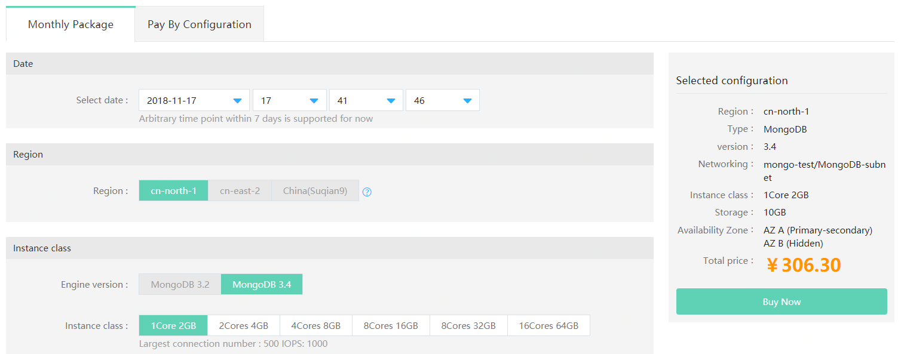

# Create an Instance based on Backup Data

Based on full-size and incremental backups of cross-regional backup services, you can quickly create A new MongoDB instance by selecting any time point within 7 days.

## Precautions
- The storage space of the new instance shall not be smaller than the source instance, otherwise the creation may fail.
- The creation completion time is related to the amount of data of the source instance, usually within minutes to hours.

## Operation Steps
1. Login [MongoDB Console](https://mongodb-console.jdcloud.com/mongodb).
1. Enter the "Cross-Region Backup Synchronization Service" page, select the target service, click **Create Instance based on Backup Data**, and open the "Create Instance" page.

   

1. Select the data time point and instance configuration information on the creation page.

   

   - Region: The current backup data location region, that is, the target region set by the backup synchronization service, which cannot be modified.
   - Time: Select the time point for backup data, and any time within 7 days is supported.
   - Storage Space: not be less than the source instance, otherwise the creation may fail.
   - Other configuration information is the same as [Create Instance](../../Getting-Started/Create-Instance.md).

1. Click **Buy Now** and enter into "Order Confirmation" page.
1. On the "Order Confirmation" page, confirm the instance information and read the Terms of Service for JCS for MongoDB.
	- If the billing type is pay by configuration, please click **Instant Account Setup**.
	- If the billing type is monthly package, please click **Pay Now** to enter the "Order Payment" page to complete the payment process.
1. After the payment process is completed, the page will automatically jump to the JCS for MongoDB "Instance List" page, please wait for the instance creation to complete. You can view the newly created instance on the "Instance List" page.

# Relevant Reference
- [Create Cross-Region Backup Synchronization Service](Create-Backup-Sync.md)
