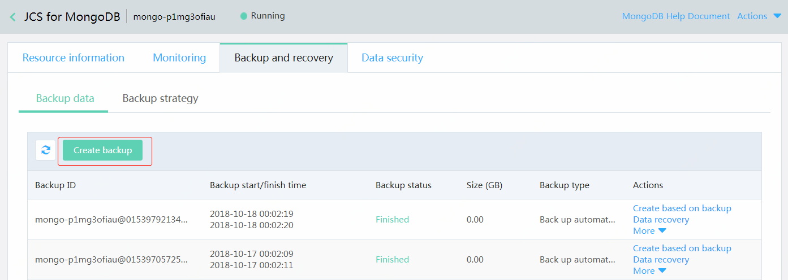

# Create Backup Manually

Up to 3 backups can be created manually for each MongoDB instance. The backup files are stored in JD Cloud Object Storage Service for a long time, and no fees are charged at present.

## Precautions

- If there are currently 3 manual backups, the oldest one will be deleted automatically when the backup is manually created again.
- If there is a backup task in progress, the backup task cannot be initiated again at this time.

## Operation Steps

1. Login [MongoDB Console](https://mongodb-console.jdcloud.com/mongodb).

2. On the "Instance List" page, select the target instance, then click **Instance Name** to enter the "Instance Details" page.

3. On the "Instance Details" page, click **Backup and Recovery** > **Backup Data** to enter the "Backup Data" page.

   

4. On the "Backup Data" page, click **Create Backup** to open the "Create Backup Confirmation Popup".

5. 选择备份方式，支持物理备份和逻辑备份。

6. Click **OK** to confirm the execution of the backup.

7. You can view the backup status in the "Backup List". If the backup status changes to "Completed", the backup is created successfully.

## Related Reference

- [Download Backup File](Download-Bckup.md)
- [Create Instance based on Backup](Create-Instance-by-Backup.md)
- [Create Instance based on Time Point](Create-Instance-by-Point-in-Time.md)
- [Set Auto Backup](Modify-Backup-Policy.md)
- [Data Recovery](Restore-Instance.md)
