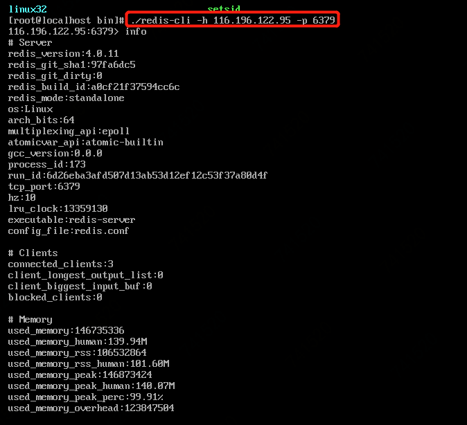

# Public connects JCS for Redis instance

## Forward connected instances (Window) via Virtual Machines

If you need a local computer to connect it to JCS for Redis, you can use SSH's port forwarding function. Here is an example of Xshell to explain how to set it up.

Prerequisite: A JD Virtual Machine with Linux system, associate EIP which is in the same virtual private cloud as JCS for Redis.

## Action Steps

1. Install Xshell on local computer and remote connect to the virtual machines with Public IP by SSH protocol.

- Select "connect", enter name, and select protocol as SSH;

- Machine IP: fill in the public IP of JD Cloud Virtual Machines


2. User Identification Login

- Method: Password;

- User Name: fill in the login user name of JD Cloud Virtual Machines, and it is "root" by default;

- Password: password used to log in to JD Cloud Virtual Machines.


3. Set port forwarding rules

- Select **Tunnel** under **SSH** and click **Add**


4. Fill in the transferring rules

- Source machine: localhost or 127.0.0.1;

- Listen port: fill in local listen port when forwarding Xshell setting port;

- Target machine: fill in the domain of Redis; see JCS for Redis console for details; click the instance name to enter the instance details, **Resource Information** –> **Access Domain**;

- Target port: fill in the port of JCS for Redis; see JCS for Redis console for details; click **Instance Name** to enter the details of the instance page, **Resource Information** –> **Port**, and it is 6379 by default.


5. Connection Test (window client)


## Forward connected instances (Linux) via Virtual Machines

1. Log in Virtual Machines (with public network) under the same VPC, install iptables and set powerboot

```
yum install iptables-services
```

```
systemctl enable iptables.service
```

2. Enable forwarding function:

     #Edit the configuration file
     
```
vi /etc/sysctl.conf
```

    #Add or modify contents below
    
```
net.ipv4.ip_forward = 1
```

    #The modification will take into effect after being saved
    
```
sysctl –p
```


3. Add iptables forwarding rules

```
iptables -t nat -A PREROUTING -p tcp --dport [Port Number to Be Forwarded] -j DNAT --to-destination [Server IP to Be Forwarded] 
``` 
   
``` 
iptables -t nat -A POSTROUTING -p tcp -d [Server IP to Be Forwarded] --dport [Port Number to Be Forwarded] -j SNAT --to-source [Native IP]
```
    
For example, if private ip of Virtual Machines is 10.0.7.186 and redis domain is redis-xxxxxxxx.cn-north-1.redis.jdcloud.com, ip can be contained by ping redis domain. If such ip is 10.0.5.252, the forwarding rules to be added are:
    
```
iptables -t nat -A PREROUTING -p tcp --dport 6379 -j DNAT --to-destination 10.0.5.252:6379
```
    
```
iptables -t nat -A POSTROUTING -p tcp -d 10.0.5.252 --dport 6379 -j SNAT --to-source 10.0.7.186
```
    


4. Save and restart iptables service

```
service iptables save
```

```
service iptables restart
```

5. Connection Test (Linux)



## Note

1. Users shall preferably set port forwarded by iptables nat as the port 6379;

2. Associate host to public ip of Virtual Machines at the customer side.
