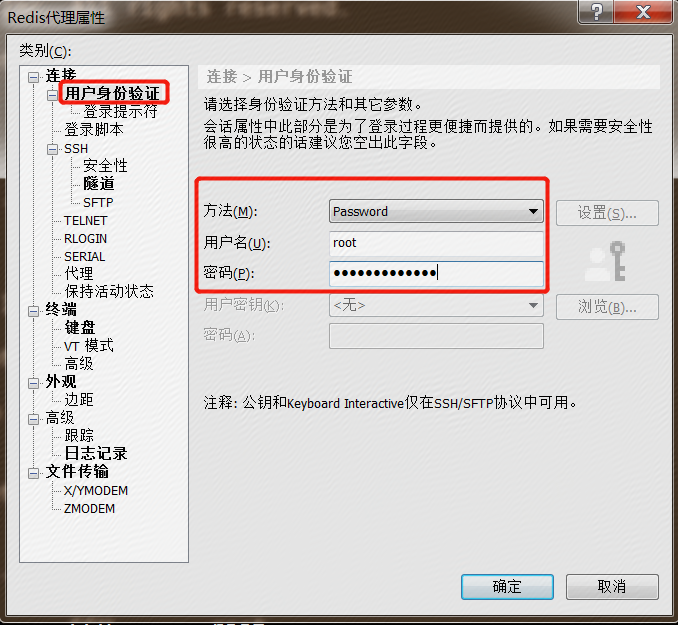
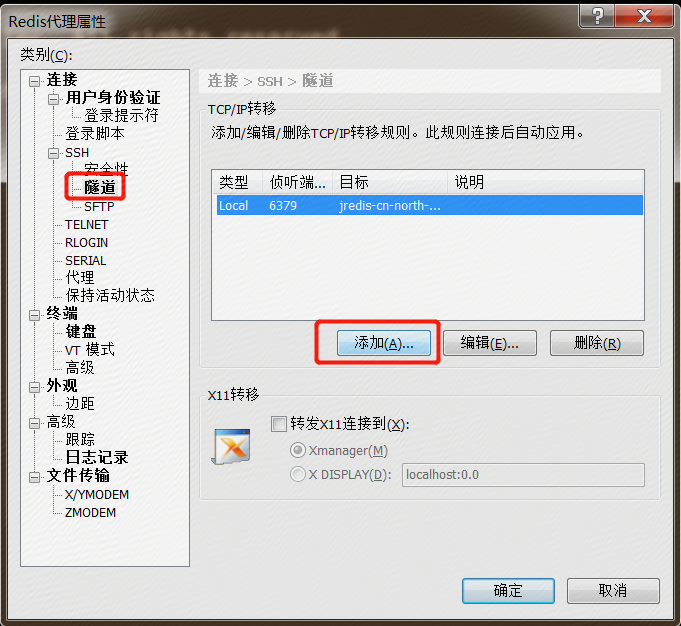

# Public connects JCS for Redis instance

If you need a local computer to connect it to JCS for Redis, you can use SSH's port forwarding function. Here is an example of Xshell to explain how to set it up.

Prerequisite: A JD Virtual Machine with Linux system, associate EIP which is in the same virtual private cloud as JCS for Redis.

## Action Steps

1.  Install Xshell on local computer and remote connect to the virtual machines with Public IP by SSH protocol.

- Select "connect", enter name, and select protocol as SSH;

- Machine IP: fill in the public IP of JD Cloud Virtual Machines

2. User Identification Login

- Method: Password;

- User Name: fill in the login user name of JD Cloud Virtual Machines, and it is "root" by default;

- Password: password used to log in to JD Cloud Virtual Machines.

3. Set port forwarding rules

- Select **Tunnel** under **SSH** and click **Add**

4. Fill in the transferring rules

- Source machine: localhost or 127.0.0.1;

- Listen port: fill in local listen port when forwarding Xshell setting port;

- Target machine: fill in the domain of Redis; see JCS for Redis console for details; click the instance name to enter the instance details, **Resource Information** –> **Access Domain**;

- Target port: fill in the port of JCS for Redis; see JCS for Redis console for details; click **Instance Name** to enter the details of the instance page, **Resource Information** –> **Port**, and it is 6379 by default.

5. Connection Test (window client)

