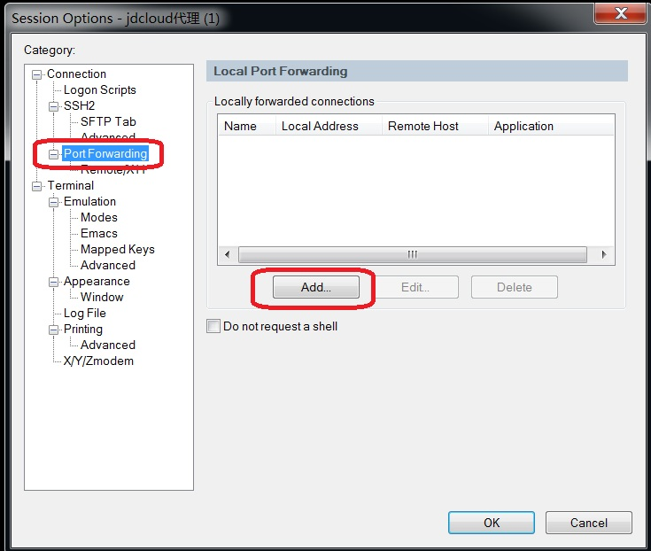
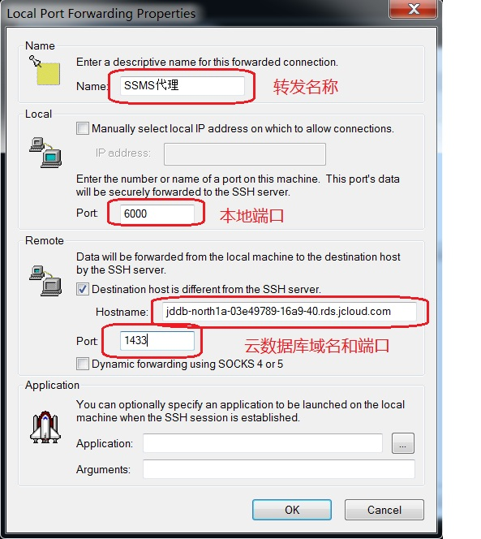
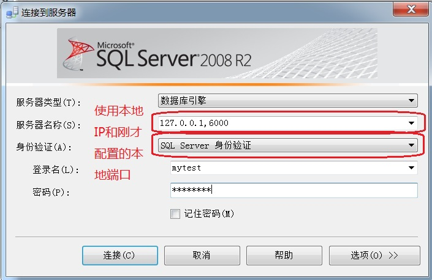
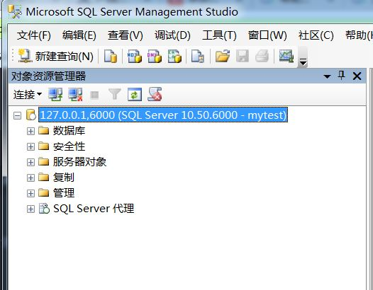

# Connection Instance of Client to JCS for SQL Server

## Microsoft Client Download Address
Download SQL Server Management Studio (SSMS) first, official address:>
http://download.microsoft.com/download/0/9/9/099E0C83-072B-42A5-83A0-9BB3D2E6E2A3/SQLManagementStudio_x64_CHS.exe

## Connection Method for Disabled Internet Access
It is recommended to disable the internet access in production environment for database security. Users can connect to the JCS for SQL Server database locally through the port forwarding function of SSH2 if to temporarily access the database locally through the client, and specific steps are as follows: (take SecureCRT as an example)

1. Prepare a VM with an EIP and Linux operating system, such as 64-bit CentOS 7.3. The machine shares one VPC and subnet with cloud data.
2. Choose "SSH2" for the connection protocol of SecureCRT and configure the IP of VM in public network

3. Select ***Port Forwarding*** and click ***Add***.

4. Configure forwarding parameters

5. Connect the public network VM with SecureCRT

6. Run SSMS locally and connect to the database

7. Input connection information
Input the local IP "127.0. 0.1" and the local port 6000 configured in the server name column, separated by a comma;

Selects ***SQL Server Authentication*** for authentication

8. Database can be connected for operation after authentication succeed.

