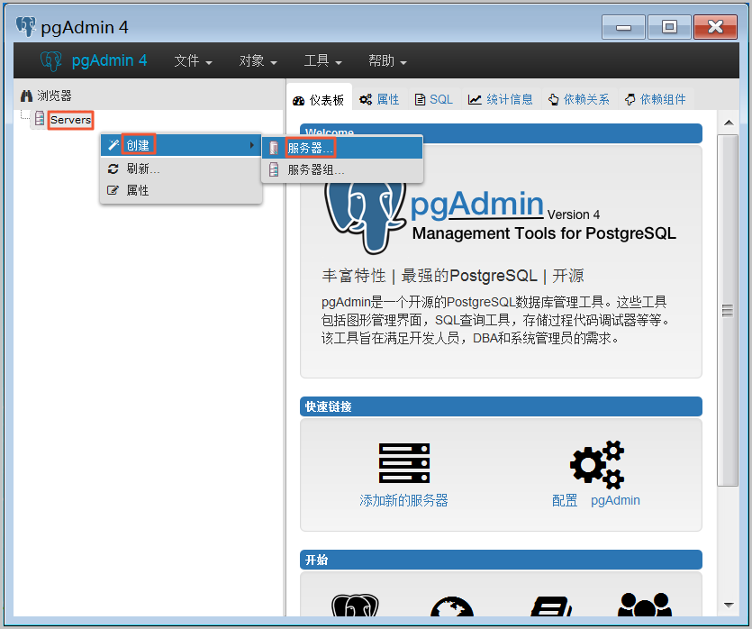
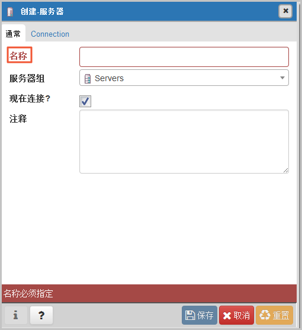
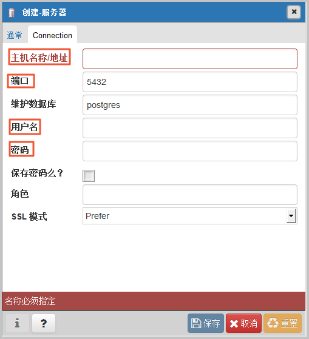
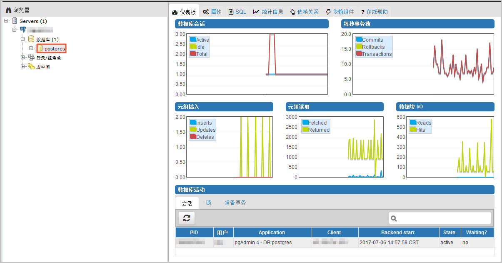

# Connect PostgreSQL instance
The instance of JCS for PostgreSQL supports connection via a local client. By default, Internet access is not supported and you need manually enable the access. For operation details, please refer to "Enable Internet Access".
Two connection methods, connection via command lines and via the pgAdmin client, are specified below.

## Preparation
1. Connect the instance of JCS for PostgreSQL via Virtual Machines;
2. Install the pgAdmin client;

## Connection Method
## 1. Connect via a command line
1. Log in Cloud ECS or the device which can access JCS for PostgreSQL;
2. Create a PostgreSQL instance user in JD Cloud RDS Console;
3. Execute the commands below to connect JCS for PostgreSQL:

 *psql  -U\<user\> -h\<host\> -p\<port\> -d\<database\> -W*
    
### Parameter Description

 \<user\> User name, account of JCS for PostgreSQL
 
 \<host\> Domain of the Cloud Database to be accessed will be shown in the Details of Cloud Database
 
 \<port\> Port number, 5432 by default, will be displayed in the Details of the Cloud Database
 
 \<database\> Name of database to be connected, the default management database is postgres
 
 -W is an option which forces the user to enter the access password. After the above commands are run, please enter the password according to the notification
    
### Example
The user name test_user is connected to the postgres database instance:

*psql  -U test_user -h 192.168.0.44 -p 5432 -d postgres -W*

## 2. Log in to JCS for PostgreSQL via the client pgAdmin
 1. Add the IP address of the RDS instance to be accessed to the RDS white list.
 
 2. Start the pgAdmin 4 client.
 
 3. Right click Servers and select **Create** > **Server**.
 

4. Enter the server name on the common tab page of Create - Server page.

5. Select the Connection tab and enter information of the instance to be connected.

### Parameter Description

 Host Name/Address: If Intranet connection is adopted, it is necessary to enter the Intranet address of RDS instance. If Internet connection is adopted, it is necessary to enter the Internet of RDS instance. Please follow the steps below for viewing Intranet and Internet addresses and port information of RDS instance:
 
    1. Log in to RDS Management Console.
    2. Select the region of the instance on the upper right corner of the page.
    3. Find the target instance and click **Instance ID**.
    4. Addresses and port information of Intranet and Internet can be viewed in the basic information bar.
    
 Port: If Intranet connection is adopted, it is necessary to enter the Intranet port of RDS instance. If Internet connection is adopted, it is necessary to enter the Internet port of RDS instance.
 
 User name: Name of RDS instance account with high permission.
 
 Password: Password corresponding to RDS instance account with high permission.
      
6. Click **Save**.

7. If the connection information is correct, please select **Servers > Server Name > Database > postgres**. If the following interface is popped up, it means connection succeeds.

