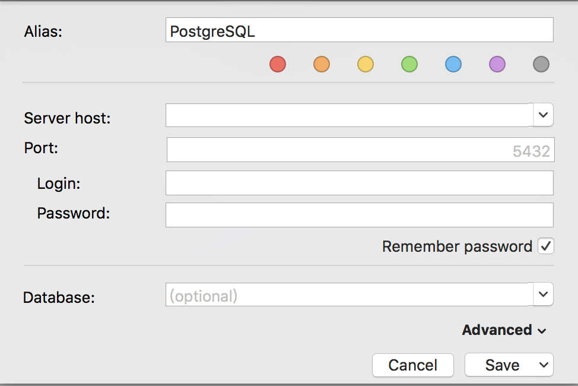

# Connect PostgreSQL instance
If you have purchased the Cloud Database PostgreSQL instance, you can connect the instance via JD Cloud Virtual Machines Intranet and the local client can remotely connect the instance via Internet access domain. But when you remotely connect the instance via Internet access domain, please complete the access permission control in advance to guarantee the security of database.

## Connect database via JD Cloud Virtual Machines
After PostgreSQL client is installed on JD Cloud Virtual Machines, you can enter command line mode to connect database.

1. Command format: mysql -h domain -P port -U user name -d database name.
2. Domain: The domain of Cloud Database PostgreSQL to be accessed and is displayed on the details of the instance.
3. Port: The link port number is 5432 by default.
4. User name: The user name created in account management.
5. Database name: The database name to be accessed.

## Connect the instance via local database management software
If local database management software is required for connecting Cloud Database PostgreSQL and the Cloud Database PostgreSQL doesn't support Internet access by default, you need to manually enable it. For specific operations, please refer to [Enable Internet Access](../../Operation-Guide/Instance/Internet-Access.md).
We take the SQLPro for Postgres software for example to introduce how to connect Cloud Database PostgreSQL 

### Operation Steps
1. Enable the local database management software and the parameters are described as below:
    * Server Host: Fill in the Internet access domain of Cloud Database PostgreSQL.
    * Port: 5432 by default and no need to modify it.
    * Login: Fill in the account name of Cloud Database PostgreSQL.
    * Password: Fill in the password corresponding to the account name of Cloud Database PostgreSQL.
    * Database: Optional field, refers to the database name to be accessed

    

2. Click ***Save and Connect*** button to connect the Cloud Database instance. 
