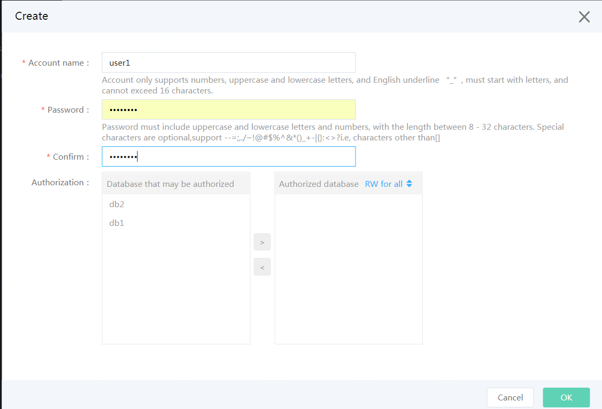

# SQL Server Create Account
SQL Server supports two account types
- Ordinary account
- High-permission account

The difference between the two accounts is as follows:
|Account Type|Permission|Number of Accounts|
|-|-|-|
|Ordinary Account|There are only two account permissions, "read-write" and "read only"|One instance can have multiple ordinary accounts|
|High-permission Account|Can create database and ordinary account, and grant authorization through SQL|One instance can only have one high-permission account|

Description:
1. After a high-permission account is created, the account list on the Console will only show the high-permission account and will no more show the ordinary accounts;
2. After a high-permission account is created, to avoid management conflicts, users cannot create a database on the Console, and can only use SQL to create the database through the high-permission account;
3. Accounts with high permission cannot be deleted

## 1. Operation Entrance
Enter the instance list page, click the instance name, enter the instance page, select ***Account Management*** page, and click ***Create Account***.  

## 2. Enter Account Information
- Enter "Database Account", "Password", and select the database to be authorized, and click ***OK***after authorization.
  - Users may refer to the account name and password rules prompt on the console, or refer to the document [name and password limit](https://docs.jdcloud.com/en/rds/sqlserver-restrictions)
  - The database may not be authorized temporarily when an account is created for the first time without any database. The authorization steps can be completed in "Create Database".
- Batch Operation
  - Select the bottom check box from the list box and then options in this list box can be selected
  - Move the mouse to **Batch Operations**, select an option in the drop-down list, then the database permission in the authorized database list will all be modified to corresponding options.

