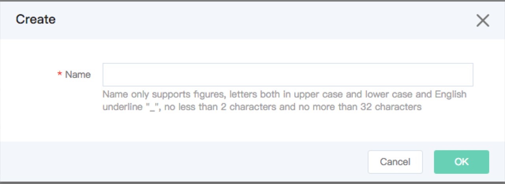

# JCS for MySQL Create Backup
JCS for MySQL service instance supports both automatic backup and manual backup. You can modify the backup strategy to set the time when the automatic backup is triggered. See details in [Backup Policy](./Backup Policy.md).
The backup instance will be stored in the cloud storage service of JD Cloud. At present, JD Cloud does not charge for the backup space.

## Precautions
* Manual Backup: 5 instances at most can be created in each region, and the manual backup will be automatically released as the instance is deleted.
* Please manually back up the instance in advance to ensure that the database of database instances can be restored to the original normal state after the test and verification if to test and modify the data of the database instance.

## Create Manual Backup
1. Login [RDS Console](https://rds-console.jdcloud.com/database).
2. Select the instance to be manually backed up, click the name of the instance, and enter the instance detailed page.
3. Select the tag of ***Backup Management*** and click ***Create Backup***. Then a backup creation box will be popped up, and the parameters are as follows:
    * Backup Name: It is allowed to repeat, while the length and characters of the name have certain limits, which shall be subject to the console.
    * Click ***OK*** to complete the backup.
    * Click ***Cancel*** to cancel the backup creation.

    

4. Click ***OK*** to return to the backup list page and start the manual backup.
