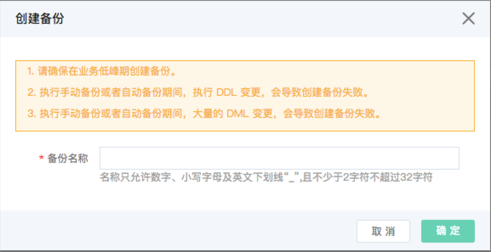

# PostgreSQL Create Backup
Cloud Database PostgreSQL instance supports automatic backup and manual backup; you may view the trigger time point for automatic backup via backup policy. For specific operations, see [Backup Policy](../Backup-Policy/PostgreSQL-Backup-Policy.md).
The backup of instance will be stored on cloud storage server of JD Cloud. At present, JD Cloud does not charge the space occupancy fee generated by backup.

## Note
* Please ensure to create backup in the business off-peak season.
* 备份文件不会占用数据库实例的本地磁盘空间。
* During implementing manual backup or automatic backup, implementing DDL modification will cause the failure of creating backup.
* During implementing manual backup or automatic backup, large amount of DML modification will cause the failure of creating backup.
* Manual backup: each region supports to create 5 backups at most. Manual backup will be automatically released as instances are deleted.
* If you need to test the modification for data of database instance, please perform manual backup for the instance in advance. After ensuring the test validation, the database of database instance may be restored to the original normal status.

## Create Manual Backup
1. Login [Cloud Database RDS Console](https://rds-console.jdcloud.com/database).
2. Select the target instance that needs to be set as manual backup, click target instance name to enter Instance Details page.
3. Select ***Backup Management*** tag, click ***Create Backup*** button, Parameters of Create Backup pop-up box are described as below:
    * Backup name: duplication is allowed but the length and characters of the name have some limits which are subject to the console.
    * Click **OK** button to complete backup operation.
    * Click **Cancel** button to abandon backup operation.

    

4. Click ***OK*** to return Backup Policy Details page.
