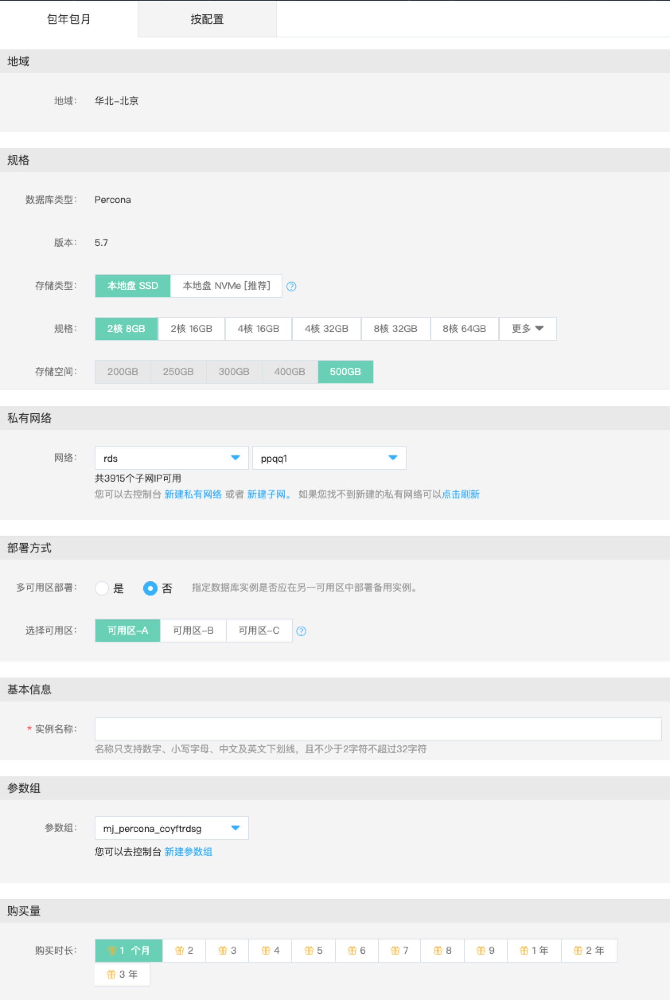

# Creation by Percona Based on Backup
JCS for Percona instances can create one new instance in the same region according to instance backup.

## Note 
* The specification of new instances cannot be smaller than that of the instance of the source of backup

## Operation Steps
1. Login [Cloud Database RDS Console](https://rds-console.jdcloud.com/database).
2. Select the target instance of the instance to be created based on backup and click the target instance name to enter the details page of the instance.
3. Click the ***Backup Management*** tag, select the target backup file, click the operation column and ***Conduct Creation Based on Backup*** and click the button to enter the creation page:
4. Parameters configured by instance are described as below:

* Region: Cannot be modified. It is the region of the backup source instance by default.
* Database type: The database type of the created instance. The type cannot be modified here. By default, the database type of the target instance is used.
* Version: The database version of the created instance. The version cannot be modified. By default, the database version of the target instance is used.
* Storage type: The maximum IOPSs of the instance types corresponding to different storage classes are different. Please refer to the [Percona Specifications](../../../Introduction/Specifications/Percona-Specifications.md).
* Specification: Different specifications correspond to different maximum connection counts and maximum IOPSs for the CPU and memory of instances, please refer to [Percona Specifications](../../../Introduction/Specifications/Percona-Specifications.md) for the detailed descriptions about specifications.
* Bucket: The bucket includes the data space, system file space and log file space.
* VPC: Only creation in VPC is supported. If the user has no VPC and subnets, he can create VPC and subnets through the links of [Create VPC] and [Create Subnets]. After creation completion, click ** Refresh** to view the created VPC and subnets.
   * When selecting VPC, please ensure that the Virtual Machines required to be connected to a database instance is in the same VPC with the database instance.
   * Due to management needs, instance creation is allowed only when several remaining IPs are retained in the selected subnet.
      - MySQL, Percona, MariaDB: More than 4 remaining IPs are needed
* Deployment mode: Currently, two deployment methods, i.e., single availability zone deployment and multiple availability zone deployment are supported.
   * Multiple availability zone deployment: The master and slave databases are located in different availability zones respectively, and the availability is higher: When one availability zone fails, the entire instance can still provide services.
   * Single availability zone deployment: The master and slave databases are located in the same availability zone. If the availability zone fails, the entire instance cannot provide external services.
* Basic Information
   * Instance name: Duplication is allowed but the length and characters of the name have some limits which are subject to the Console.
* Parameter set: Only the parameter set with the database type can be selected. If there is no parameter set under the current account, the system will automatically create a default parameter set by default. 
* Purchase duration: It is required to select the purchase duration if the billing method is monthly package, and 1 month to 3 years can be selected; the longer duration you purchase, the more discounts you will enjoy, which is subject to the Console.

5. Click **Buy Now** to enter the "Order Confirmation" page.
6. After reading the Cloud Database RDS service terms, complete further actions according to the notification
    * Monthly package instance: click **Pay Now** to enter the Payment Confirmation page; you can select several payment methods, such as using coupons, balances, bank cards, etc.
    * Pay-by-configuration instance: Click **Instant Account Setup**, start creating an instance, and go to the Instance List page.
