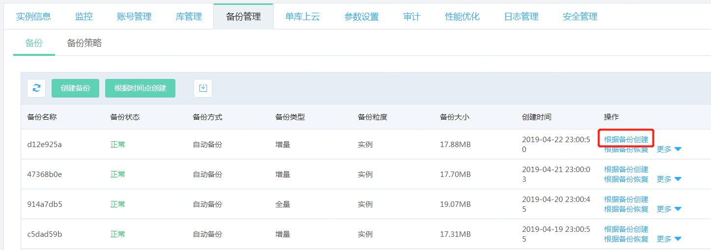

# Creation by SQL Server Based on Backup
SQL Server can create one new instance in the same region according to instance backup.

When it needs to recover the failed instance, we suggest that one new instance shall be created with the method **Create Based on Backup** or **Create Based on Time Point** with priority, then the row data shall be checked and finally the recovered data shall be confirmed to be correct or not. When data verification is passed, use the **Domain Switch** function to switch the domain of original instance to the new instance.

**Note:**
Backup for the function of creating based on backup must meet the following conditions. Otherwise, the operation will fail
1. The backup refers to the instance-level backup and the “Create Based on Backup” is not applicable to the single-library level backup
2. The backup may be the full backup or the incremental backup, and the full backup relied by the incremental backup must exist (the full backup must be found in the backup list)
3. It is suggested the bucket of new instance shall be greater than or equal to that of the original instance

## 1. Operation entry
Log in the backup management page of instance details and click **Build According to Backup**

## 2. Enter relevant information about new instances
The selected backup name, backup creation time and region information can be viewed in the pop-up page.

Select specification of new instances, VPC availability zone, instance name and other information. For specific steps, please refer to [Create Instance](https://docs.jdcloud.com/en/rds/create-instance)
