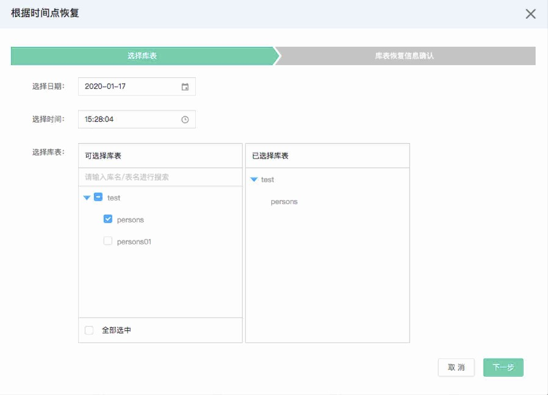
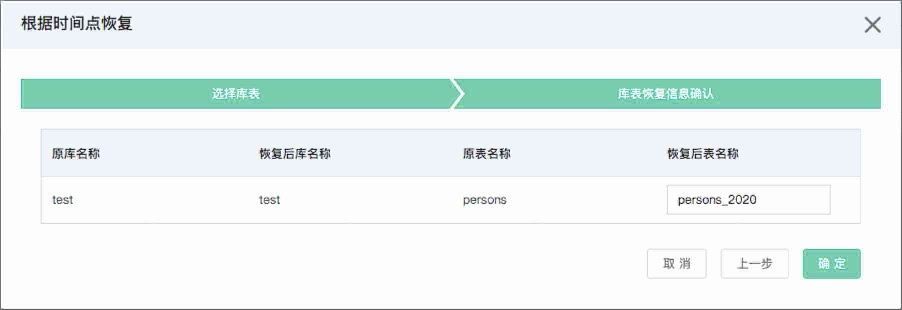

# MySQL creates instances based on time points
In the process of using a cloud database instance, if the data in the cloud database instance contain dirty data due to a software exception or some unexpected situation, and then you want to restore to the data of a certain previous moment, you can use recovery based on time points to recover a new cloud database instance and recover real-time data of database or table.

## Preconditions
* The Cloud Database RDS permission has been enabled.
* The instance status is running.

## Notes 
* The data recovery should be based on data backup and log backup (binlog).
* In data recovery, a new database or table will be added to the instance while the data of the original database and table will remain the same and visible.

## Operation Steps
1. Login [Cloud Database RDS Console](https://rds-console.jdcloud.com/database).
2. On the instance list page, select the recovery based on time point needed, and go to the popup of recovery based on time point.
3. Parameters configured by instance are described as below:

* Select date: You can select any day of the last 7 days, but it cannot be earlier than the creation date of the target instance, and the specific day is subject to the Console.
* Select time: If the date and the creation time of the target instance are the same, you can only select the time point after the creation time, and the specific time is subject to the Console.
* Select database and table: Select one or all databases and tables in the optional databases and tables.

4. Click Next to go to the database and table recovery information confirmation page, you can modify the table name recovered.

* Note: The table name only supports numbers, lowercase letters, English line-through and underline

5. Click **OK** and the popup will be automatically closed and the instance will be recovering. After the recovery is completed, you can log in the database to search the information on database and table recovered.