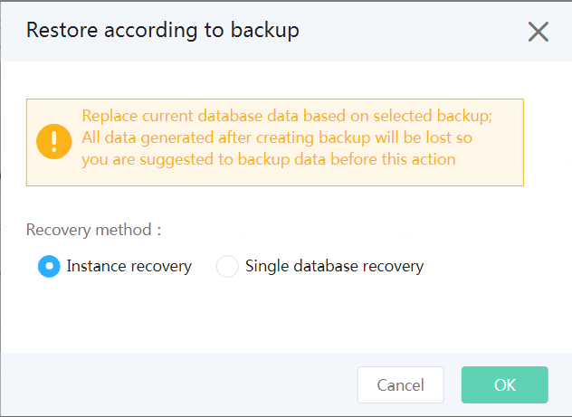
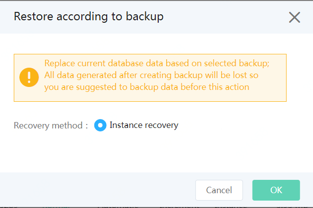
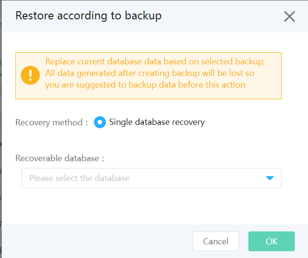

# Restore Instance

## 1. Operation Entrance
Click ***Restore based on Backup*** on the right side of the backup list.

## 2. Choose Restoring Method
**Remarks: This operation is only supported by the JCS for SQL Server. Other databases can skip this step** 
1) If the backup granularity of the backup is "instance" and the backup type is "Full", users can choose "Restore Instance" or "Restore Single Database". 

2) If the backup granularity is "instance" but the backup type is "incremental", users can only select "Restore Instance".

3) If the backup granularity is "multi-database", users can only select "Restore Single Database". Select the database to be restored from the pull-down menu.

## 4. Restore Confirmation
The following dialog box will pop up according to different restoration types. click ***OK*** and restore.
### The confirmation dialog of SQL Server
**Restore Instance** 

**Restore Single Database** 

## 5. Instance Status
The instance status is displayed as "**Recovering**" (Restore Instance)

  or "**Single database backup recovering" (SQL Server only)

