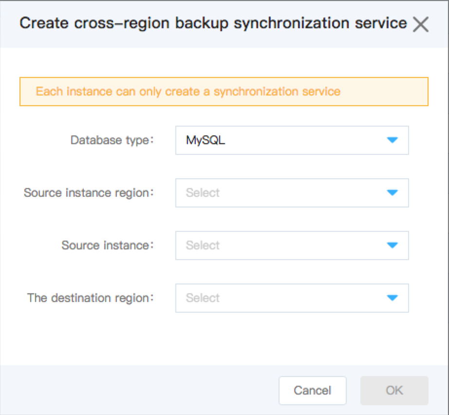

# Create New Cross-Region Backup Synchronization Service
The RDS service instance supports high availability deployment across availability zones, so that RDS service instances can still be served normally if a single AZ (availability zone) fails to provide services. However, if the Region (region) where RDS instance is located cannot provide proper services, then the services that depend on RDS instance will be collapsed.

Cross-region backup synchronization service provides higher availability for RDS service and service disaster tolerance across the regions (availability zones). Cross-region backup synchronization service synchronizes the backup files of RDS service instances to different Regions (regions), to ensure that a new RDS service instance can be created in a region where the RDS service backup has been synchronized rapidly when the original Region (region) is unavailable. Since backup synchronization is an asynchronous operation and data transfer is also a time consuming process, the cross-region backup synchronization service can only ensure that the latest data of the new RDS service instance is delayed by no more than 12 hours.

Enabling the cross-region backup service does not have any impact on the usage and performance of the RDS source instance.

At present, the cross-region backup synchronization service is in the promotion period, so it is free for the time being, and the charge will be requested later.

## Precautions
* A RDS instance can only create a cross-region backup synchronization service.
* If the source instance configured in the cross-region backup synchronization service is deleted, the service will be deleted automatically.
* After the cross-region backup synchronization service is deleted, the data in the service will also be deleted automatically.

## Operation Steps
1. Login [Cross-region Backup Service Management Console](https://rds-console.jdcloud.com/acrossRegionList).
2. Click ***Create Synchronization Service***, and the pop-up window box appears on the service list page. The pop-up box parameters are as follows
    * Database Type: Select the RDS service instance type that requires to enable cross-region synchronization service. Currently, JCS for MySQL,  Percona, MariaDB and JCS for SQL Server are supported.
    * Source Database Location: Select the domain of the RDS service instance that requires to enable cross-region synchronization service. Currently, all regions are supported, and the specific optional regions is subject to the console.
    * Source Instance: Select the RDS service source instance ID that needs to enable the cross-region synchronization service. The instance of the cross-region backup synchronization service will not be displayed.
    * Target Region: Select the target region to be saved in the backup. It cannot be in the same region as the source instance.

    

3. Confirm that the information is correct. Click ***OK***, and the cross-region backup synchronization service is created.
4. After the cross-region backup synchronization service is created, the full backup and incremental backup of the source instance will continue to be synchronized to the target region. ***The latest data time point*** field in the service list page represents the latest backup data synchronization time point.
