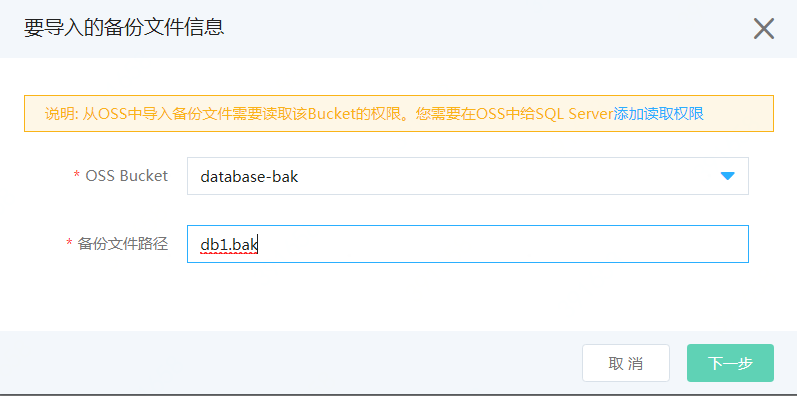
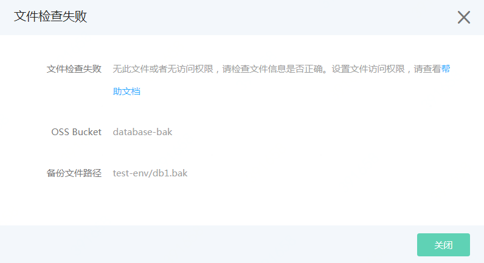
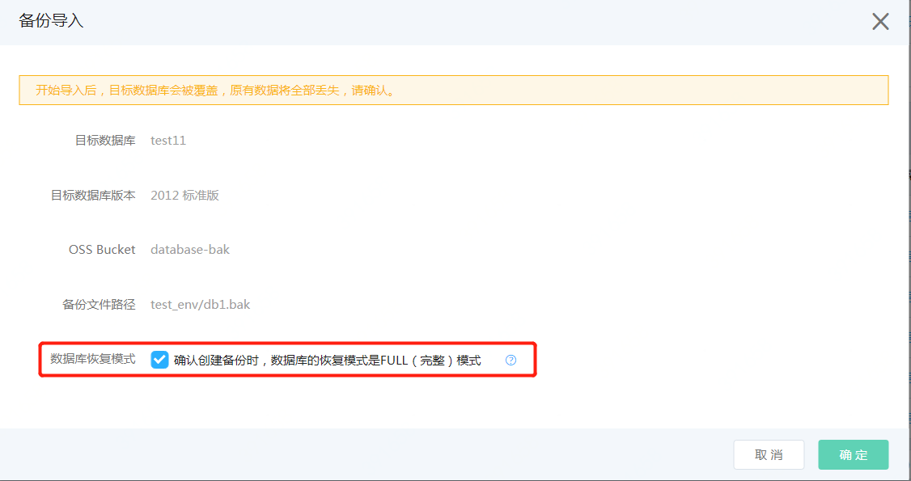

# Import backup

1. Enter Import page
- Click **Cloud on Single Database** page in Instance Details to select **Import from OSS** page
- Click **Import** after databases to be imported

2. Enter import information

Select the Bucket of Object Storage Service and enter the path of imported backup files in the Bucket. E.g., if the backup file is stored in the Bucket named Bdatabae-bak in the Object Storage Service and the path in the Bucket is test-env/db1.bak, then select the interface of Bucket **database-bak** and enter the path of **test-env/db1.bak**

If the file is absent or does not have sufficient permissions, an error information notification will be given. You need to check if the file path is correct and if the permission for Bucket or file is granted correctly. For permission setting, you can view [Document](https://docs.jdcloud.com/cn/rds/grant-file-privilege-v2)

3. Confirm the information and start to import
- View that the operation information is correct. 
Note: Backup of Cloud on Single Database only supports backups in FULL mode. Therefore, please verify if the backup method is correct. You can view the [Document](https://docs.jdcloud.com/cn/rds/backup-local-database-v2)
- After information is confirmed to be correct, check the option box and start to import

4. View import status
- Wait for a while, until the status of the instance is changed to “Single Database Backup Recovering” 
- Database status will change as per the following order: “Deleting”-->“Creating" --> “Running”.
