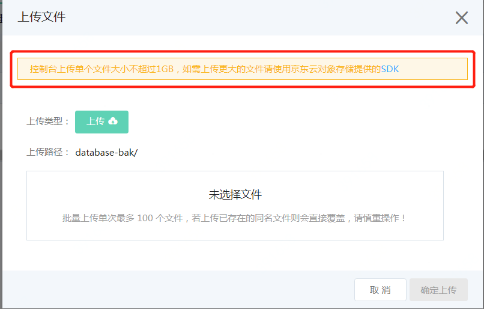
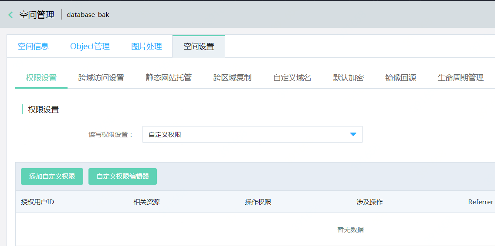
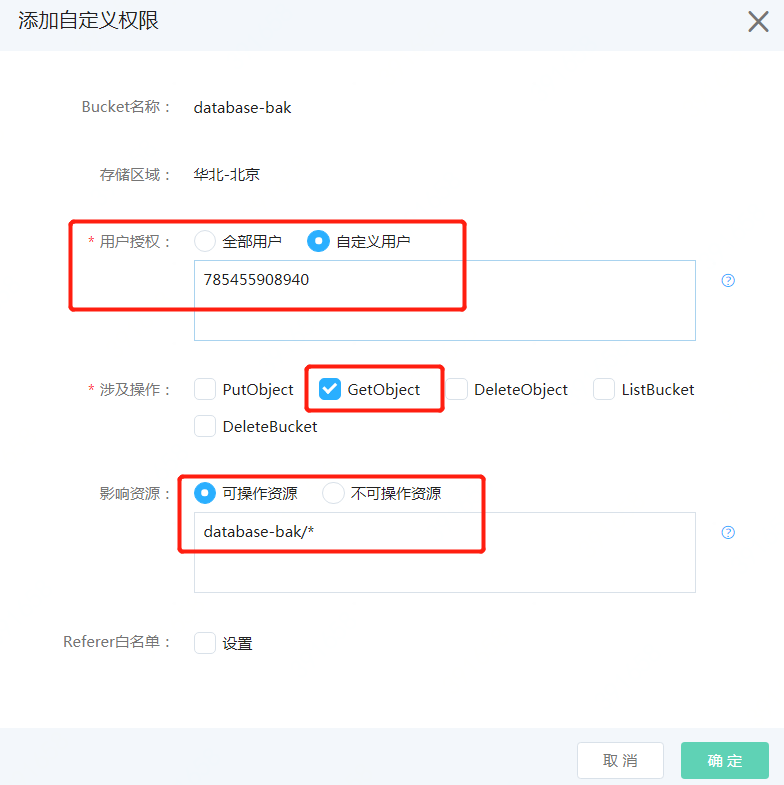

# Backup Uploading and Permissions
This document will introduce how to upload backup files to OSS and set appropriate permissions so that SQL Server service can access backup files properly and import such backups to JCS for SQL Server.

#### 1. Enter the OSS Space Management page

Enter **Object Storage Service** in the Console, click **Space Management**

#### 2. Select Object Storage Service
Click the name of bucket to enter the bucket of the file to be uploaded

#### 3. Upload file
Select **Object Management** page, click **Upload** or **Create Folder** as required**

>> **Note: The maximum size of single file to be uploaded to the Console is 5GB. If you want to upload larger files, please use [SDK](https://docs.jdcloud.com/en/object-storage-service/multipart-upload-s3) provided by JD Cloud Object Storage Service**

#### 4. Permissions for backup files
>> **Recommendation: We recommend you to separately create an OSS space for uploading the backup files to be imported, and permit the backend system account to read the entire Bucket**

Click to enter the space where backup files are located, select **Space Settings**-**[Add Custom Permission]**, and enter the Permission Settings page

- Select **Custom User** and add User ID: **785455908940**. (**Note: The ID 785455908940 is a backend system ID and thus cannot be changed**) 
- Operations of clicking **GetObject** and **ListBucket** are involved.**
- Others remain unchanged
- Click **[OK]** to save the setting

**Note: Do not set any parameters on the "Static Website Hosting" page under "Space Settings" in this Bucket. Otherwise, it may be failed to read backup files.**
